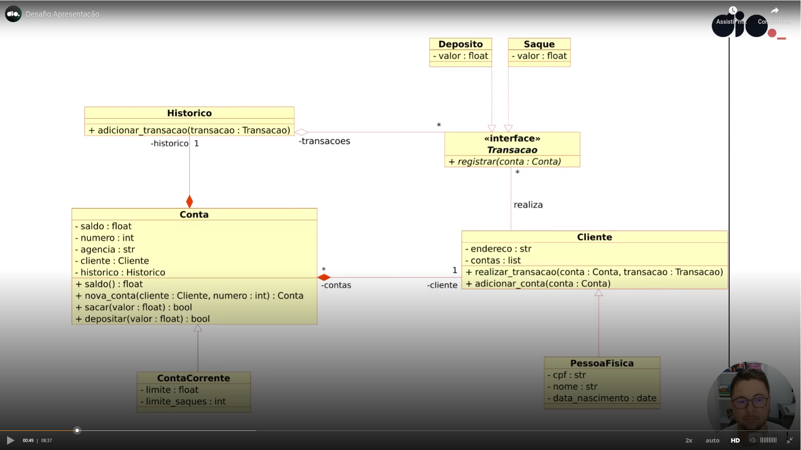

# 6 .Modelando o Sistema Bancário em POO com Python
## Sumário 
- [Apresentação do desafio](#1apresentação-do-desafio---modelando-o-sistema-bancário-em-poo-pthon)
  - [Objetivo geral](#11-objetivo-geral)
  - [Definição do desafio](#12-desafio)
  - [Desafio extra](#13-desafio-extra)
---
## 1.Apresentação do desafio - Modelando o sistema bancário em POO Pthon
### 1.1 Objetivo Geral 
Iniciar a modelagem do sistema bancário em POO. Adicionar classes para cliente e as operações bancárias: depósito e saque
### 1.2 Desafio
Atualizar a implementação do sistema bancário, para armazenar os dados de clientes e contas bancárias em objetos ao invés de dicionários. O código deve seguir o modelo de classes UML a seguir:  

<table style="text-align: center; width: 100%;"> 
<tr>
    <td style="text-align: center;">
    
    </td>
</tr>
</table>

### 1.3 Desafio Extra
Após concluir a modelagem das classes e a criação dos métodos. Atualizar os métodos que tratam as opções do menu, para funcionarem com as classes modeladas.  

__Entendendo o Desafio__  
 
Agora é a sua hora de brilhar e construir um perfil de destaque na DIO! Explore todos os conceitos explorados até aqui e replique (ou melhore, porque não?) este projeto prático. Para isso, crie seu próprio repositório e aumente ainda mais seu portfólio de projetos no GitHub, o qual pode fazer toda diferença em suas entrevistas técnicas 😎
 
Neste repositório, insira todos os links e arquivos necessários para seu projeto, seja um arquivo de banco de dados ou um link para o template no Figma.
 
Dica: Se o expert forneceu um repositório Github, você pode dar um "fork" no repositório dele para organizar suas alterações e evoluções mantendo uma referência direta ao código-fonte original.
 
__Repositório Git__  
 
O Git é um conceito essencial no mercado de trabalho atualmente, por isso sempre reforçamos sua importância em nossa metodologia educacional. Por isso, todo código-fonte desenvolvido durante este conteúdo foi versionado no seguinte endereço para que você possa consultá-lo a qualquer momento:
 
[Repositório dio](https://github.com/digitalinnovationone/trilha-python-dio/blob/main/01%20-%20Estrutura%20de%20dados/desafio.py)
 
---
A resolução do desafio se encontra [aqui](https://github.com/thierryLchaves/Desafios-Python-DIO/tree/Modelagem_POO/Modelando%20o%20sistema%20POO)

--- 
### Links Uteis
- [Trilha no git](https://github.com/digitalinnovationone/trilha-python-dio)

---
<table style="text-align: center; width: 100%;"> 
<caption><b> Skils do projeto </b></caption>
<tr>
    <td style="text-align: center;">
    
    </td>
    <td style="text-align: center;">
    
    </td>
    <td style="text-align: center;">
    
    </td>
<tr> 
</table>

---
Titulo: 6 .Modelando o Sistema Bancário em POO com Python 

Autor: Thierry Lucas Chaves

Data criacao: 01/07/2025

Data modificacao: 02/09/2025

Versao: 1.0  

---