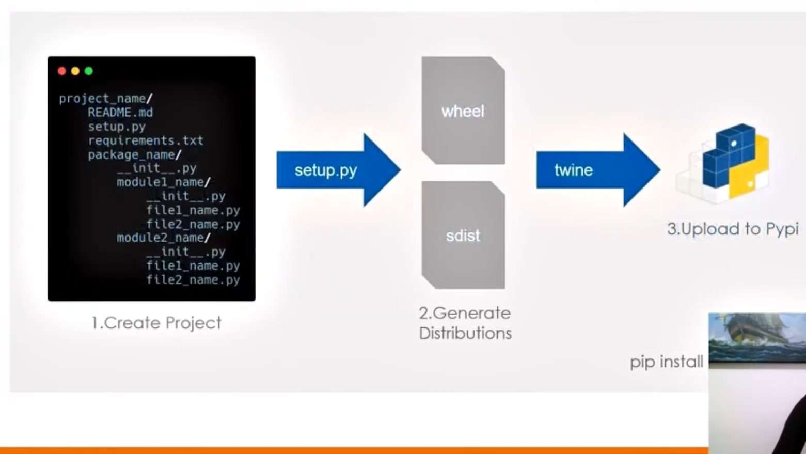
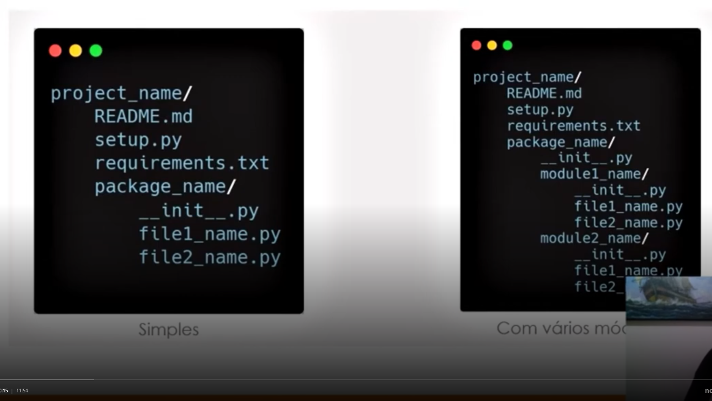
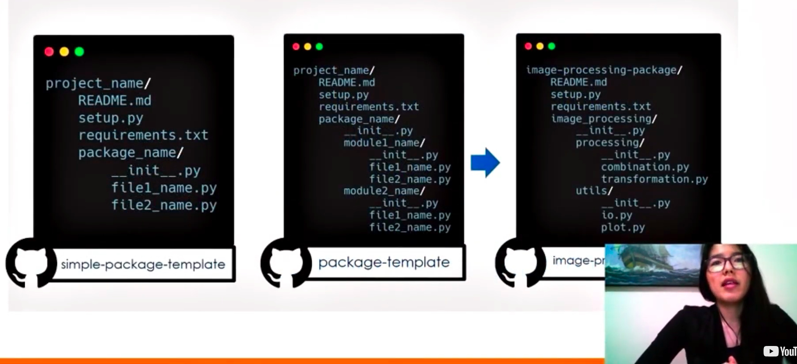

# 7 .Criando um Pacote de processamento de Imagens com Python
## Sumário 
- [Criação de pacotes em python](#1-descomplicando-a-criação-de-pacotes-em-python)
- [segundo indice](#2-nome-2)
---
## 1. Descomplicando a criação de pacotes em Python
### Objetivo Geral 
1. Entender os conceitos relacionados aos pacotes
2. Atualizar o projeto e gerar as distribuições 
3. Publicar o pacote

### Introdução e conceito
#### Módulo VS Pacote
__Módulo :__  Objeto que serve como unidade organizacional do código que é carregado pelo comando de import, ou seja até um arquivo `.py`  são módulos.

__Pacote :__ COleção de módulos com hierarquia. Eles podem ser facilmente compartilhados, quando é criado uma distribuição, e quando está é compartilhada esse será o seu pacote. 

#### Modularização
Vantagens da modularização:
- Legibilidade
- Manutenção
- Reaproveitamento de código.

Vantagens de pacotes em python:
- Facilidade de compartilhamento 
- Facilidade de instalação

#### Conceitos
- __Pypi :__  Repositório público oficial de pacotes em python
- __Wheel e Sdist :__ Dois tipos de distribuições 
- __Setuptools :__  Pacotes usados em setup.py para gerar as distribuições
- __Twine :__  Pacote usado para subir as distribuições no repositório Pypi

<table style="text-align: center; width: 100%;"> 
<tr>
    <td style="text-align: center;">
    
    </td>
</tr>
</table>

Então em resumo o processo de criação/distribuição de um pacote segue a ordem abaixo:
1. Criar o projeto 
  - Onde dentro desse deverá conter alguns arquivos a serem criados que caracterizam esse projeto como um pacote,sendo o principal desse arquivos o arquivo de `setup.py`, dentro desse será utilizado o `Setuptools`
2. Gerar as distribuições 
  - Após criado o arquivo do setup.py com o Setuptools, será possível criar as distribuições a partir desse arquivo com as distribuições que serão referencias para o projeto, onde as referidas distribuições são as `whell` e `Sdist`
    - `wheel` - Corresponde a distribuição binária 
    - `Sdist` - Corresponde a distribuição de código de código fonte
3. Com os 2 passos acima realizados e com as duas distribuições geradas, e feito o upload no Pypi, por intermédio do `Twine`

---
## 2.Criar o projeto e gerar as distribuições 
### Exemplos de estruturas 
<table style="text-align: center; width: 100%;"> 
<tr>
    <td style="text-align: center;">
    
    </td>
</tr>
</table>

Quando se trabalha com pacotes, é de suma importância no inicio, saber que tipo de estrutura será utilizada. Ou seja se o pacote em questão necessitará de mais ou menos módulos devem ser feitos diferentes tipos de estruturação de projetos
Para melhor exemplificar vamos abordar abaixo uma estrutura de pacotes simples
```tree

Project_name/
├─ README.MD
├─ setup.py
├─ requirements.txt
├─ package_name/
│   ├─ __init__.py
│   ├─ file1_name.py
│   ├─ file2_name.py

```
Descrevendo melhor a estrutura acima, no inicio de tudo teremos o nome do projeto propriamente dito, e dentro desse diretório alguns arquivos padrões para seu funcionamento, sendo eles `README.MD, setup.py e requirements.txt`, todos esses arquivos devem ficar na raiz do projeto, posteriormente teremos um outro módulo que no exemplo supracitado foi nomeado de `package_name`, que por sua vez conterá sub-módulos nomeados de `file1_name e file2_name`, mas por que package_name é denominado um módulo pois quando é criado um arquivo `__init__.py` dentro do do package_name possibilita a invocação do mesmo no módulo.  
Agora como realizamos a _"invocação"_ de um módulo para o seu código, esse pode ser realizado das seguintes maneiras abaixo. 

```py
# 1º forma
# A maneira escrita abaixo também é conhecida como import absoluto, para invocar o arquivo
import package_name.file1_name

# 2º forma
from package_name import file1_name
```
Os exemplos acima caracterização imports de estruturas de pacotes _"simples"_ agora quando o projeto detém mais de um tipo de importação como tal processo é realizado, abaixo segue um modelo de uma estrutura com vários módulos. 
```tree

Project_name/
├─ requirements.txt
├─ setup.py
├─ README.MD
├─ package_name/
│  ├─ __init__py
│  ├─ module1_name/
│  │  ├─ __init__.py
│  │  ├─ file1_name.py
│  │  ├─ file2_name.py
│  ├─ module2_name/
│  │  ├─ __init__.py
│  │  ├─ file1_name.py
│  │  ├─ file2_name.py

```
Assim como visualizamos na estrutura tida como simples também teremos uma estrutura raiz padrão contendo o nome do projeto como raiz do projeto e seus arquivos 
`README.MD, setup.py e requirements.txt`, ainda teremos também o módulo `package_name` que conforme dito é caracterizado como um módulo pela existência do arquivo `__init__.py`, porém o ponto de divergência principal é a presença de outros 2 módulos nomeados de `module1_name e module2_name`, divergindo assim do primeiro modelo onde temos os arquivos diretamente no `package_name`, e assim como no package os 2 outros módulos são caracterizados também pela existência do arquivo `__init__.py`. Nesse exemplo podemos visualizar um modelo de pacote com maior hierarquia de pacote.  
Já no processo de realizar a chamada desse módulos podemos realiza-los das seguintes formas:  

```py
# 1º forma

import package_name.module1_name.file1_name

# 2º forma
from package_name.module1_name import file1_name
```
As duas maneiras são chamadas tidas como absolutas para fazer o import desse arquivo. 

### Passos para criar o projeto
1. Fork do template
2. Adição do conteúdo dos módulos do projeto
3. Edição do arquivo setup.py
4. Edição do requirements.txt
5. Edição do READMe.md

<table style="text-align: center; width: 100%;"> 
<tr>
    <td style="text-align: center;">
    
    </td>
</tr>
</table>


<div style="border-left: 4px solid red; background-color:rgb(22, 23, 24); padding: 10px;">
  <strong style="color: red;">IMPORTANTE!</strong>
   <p> Quando realizado a criação de um pacote, é de boa prática realizar a nomeação do pacote , 
   que conterá os módulos que esse tenha o nome do pacote que se deseja realizar o import </br>
   Pois quando é realizado um import esse import tenha o mesmo nome que será passado para as </br>
   configurações
   </p>
</div>

Após o fork e o clone localmente, a estrutura do projeto ficou da seguinte maneira:
```tree
├── IMAGE-PROCESSING-PACKAGE
│   ├── image_processing
│   │   ├── __init__.py
│   │   ├── processing
│   │   │   ├── combination.py
│   │   │   ├── __init__.py
│   │   │   └── transformation.py
│   │   └── utils
│   │       ├── __init__.py
│   │       ├── io.py
│   │       └── plot.py
│   ├── README.md
│   ├── requirements.txt
│   └── setup.py
```
Sobre a estrutura do projeto em questão vale discorrer um pouco sobre o motivo dessa estrutura como por exemplo, por qual motivo o pacote em questão adota um modelo com várias estruturas e não um estrutura simples, pois a ideia do projeto seria pensar em um processo de divisão de escopo, onde teremos funções / classes etc.. que serão mais voltadas para parte de processamento, porém ainda teremos partes onde teremos funções auxiliares. 
Então dentro do pacote denominado de processing a ideia e que tudo que seja relacionado ao processamento das imagens esteja presente nesse módulo, onde por exemplo o módulo `combination.py`, será utilizado para tratar as combinações de mais de uma imagem já o pacote `transformation.py`  ficará responsável por transformar em uma imagem.  
Agora quando falamos do pacote denominado de utils, nesse pacote teremos os pacotes ou funções auxiliares que serão utilizadas, sendo `io.py` utilizada para leitura e escrita `plot.py`utilizada para plotar imagens. 
os códigos em questão são funções básicas e não foram descritos afinco as funcionalidades e o motivos pelos os quais estão sendo inseridas no código, pois o objetivo do módulo é entender a funcionalidade de aplicação de pacotes, e suas funcionalidades e dependências. 

### Aquivo setup
O arquivo `setup.py`é usado para especificar como o pacote deve ser construído, e este a ser construído está embasado na documentação, [disponível em](https://setuptools.readthedocs.io/en/latest/setuptools.html)

Mas por que usar o arquivo de setup ?  Esse é o arquivo principal de configurações do pacote, sendo feito por intermédio desse arquivo que será especificado como  o arquivo será construído, abaixo seguirá um modelo _(meramente ilustrativo)_ desse arquivo 
```py
from setuptools import setup, find_packages

with open("README.md", "r") as f:
    page_description = f.read()

with open("requirements.txt") as f:
    requirements = f.read().splitlines()

setup(
    name="package_name",
    version="0.0.1",
    author="my_name",
    author_email="my_email",
    description="My short description",
    long_description=page_description,
    long_description_content_type="text/markdown",
    url="my_github_repository_project_link"
    packages=find_packages(),
    install_requires=requirements,
    python_requires='>=3.8',
)
```
Sobre o modelo acima podemos discorrer melhor sobre algumas das configurações/parâmetros etc..  
O arquivo inicialmente realiza o import do pacote setuptools importante diretamente 2 funções sendo eles 
1. `setup`
2. `find_packages`

O pacote setup é de suma importância para o correto funcionamento do projeto, pois é através dessa função que iremos realizar a passagem da maioria dos parâmetros relacionados a configuração do pacote. 
```py
setup(
    name="package_name",
    version="0.0.1",
    author="my_name",
    author_email="my_email",
    description="My short description",
    long_description=page_description,
    long_description_content_type="text/markdown",
    url="my_github_repository_project_link"
    packages=find_packages(),
    install_requires=requirements,
    python_requires='>=3.8',
)
```
No trecho acima temos alguns parâmetros que estão sendo atribuído valores sendo eles :  
**1.`name`** -  É utilizado para definir qual será o nome do pacote 
  - __E VALIDO RESSALTAR QUE O NOME A SER ATRIBUÍDO PARA ESSE PARÂMETRO SEJA COERENTE COM O NOME DA ESTRUTURA DO PACOTE CRIADO, PARA QUE QUANDO SE REALIZE O COMANDO DE `PIP INSTALL` SEJA O MESMO NOME A SER FEITO NO IMPORT__

**2.`version`** -  É utilizado para definir qual é a versão do pacote, apesar de simples entendimento e de suma importância que seja definido pois quando realizamos o upload de uma versão não é possível realizar mais de 1 upload para mesma versão, também e importante ressaltar que ao se definir uma versão de um número muito grande, não é possível realizar um downgrade de versão a não ser que seja deletado a versão anterior, 
  - __E uma boa prática realizar o versionamento dos pacotes numerando-os assim como preconiza a PEP obedecendo a estrutura de N.N.N__

**3.`author`** -  É utilizado para definir qual o nome do autor/criador do pacote a ser criado que é passado em formato de string.  
**4.`author_email`** - É utilizado para definir qual o E-mail do autor/criador daquele pacote.  
**5.`description`**  - É utilizado para atribuir uma descrição __curta__ sobre o pacote, como por exemplo o objetivo e ou situação que aquele pacote será aplicado, sempre de forma resumida.   
**6.`long_description`** - É utilizado para definir para atribuir uma descrição __mais detalhada__ sobre o pacote, podendo/ devendo ter informações sobre o que o pacote em questão faz.   
  - __Como sugestão podemos utilizar a atribuição desse parâmetro o valor a variável de `page_description`, ao faze-lo estaremos atribuindo a essa descrição a partir do conteúdo do `README.md`, o que por sua vez esse documento será utilizado para descrever informações sobre o pacote.__

**7.`long_description_content_type`** -  É utilizado quando utilizamos por exemplo a atribuição do parâmetro `log_description` a partir do `README.md`, pois quando inferimos esse valor no parâmetro devemos informar também qual é o tipo do conteúdo do documento a ser utilizado.   
**8.`url`** -  É utilizado para definir uma URL como por exemplo o link/url do projeto no [github](https://github.com/)  
**9.`packages`** -  É utilizado para especificar todos os módulos e submódulos do projeto que serão utilizados para compor o pacote. 
  - __A recomendação para atribuição de valor a esse parâmetro e que esse valor não seja atribuído `MANUALMENTE`, pois a depender da complexidade do projeto a ser construído pode acarretar em dificuldades, por esse motivo foi realizado o import da função `find_packages()` que é uma funcionalidade especifica para realizar a busca desse módulos e submódulos de um projeto.__

**10.`install_requires`** -  É utilizado quando o pacote a ser criado contém alguma dependência de outros pacotes, em sintaxe caso o seu pacote a ser criado contenha o import de outros pacotes.   
  - __Esse parâmetro somente deverá ser utilizado caso o pacote construído contenha dependências de outros pacotes__

**11.`python_requires`** -  É utilizado para definir qual é a versão do python na qual esse pacote construído precisa ter para ser executado.  

### Aquivo requirements.txt
Esse arquivo é utilizado para passar as dependências que devem ser instaladas com o seu pacote. Opcionalmente, podem ser especificadas as versões.  
É valido ressaltar que nesse projeto em questão esse arquivo está sendo utilizado no arquivo de `setup.py` e que esse arquivo em questão é um requirement do pacote e não do projeto, ou seja nele deve haver idealmente apenas as dependências de importações do pacote.   
<div style="border-left: 4px solid red; background-color:rgb(22, 23, 24); padding: 10px;">
  <strong style="color: red;">IMPORTANTE!</strong>
   <p> Quando realizado o processo de confecção do requirements é sempre bom se ater ao fato de que ao ser atribuído valores sobre versões, pode haver uma restrição não desejada, pois quando utilizamos por exemplo mathplotlib == 2.3, isso irá obrigar a quem for utilizar o pacote que essa biblioteca de dependência esteja <b> necessariamente a versão especificada </b>  </p>
</div>

### Aquivo README.md
Será exibido como documentação na página do Pypi do seu pacote, no caso em questão será exibido no Pypi esse arquivo conforme atribuído pelo parâmetro `long_description`. 
Neste arquivo deve conter tanto as informações mais descritivas, tais como módulos existentes no(s) pacote(s), bem como módulo de instalação, dicas de utilização nome do autor e licença de utilização. 

### Distribuições 
Para subir o pacote, criar uma distribuição binária `wheel`ou distribuição de código fonte. As versões mais recentes do pip instalam primeiramente a binária e usam a distribuição de código fonte, apenas se necessário.  
De qualquer forma, iremos criar ambas distribuições. 

#### Passos para gerar as distribuições 
1. Acessar a raiz do projeto 
2. Comandos de instalação. 
3. Comando para criar a distribuição.

__Comandos de instalação__
```bash
python -m pip install --upgrade pip 
python -m pip install --user twine
python -m pip install --user  setuptools
```
<div style="border-left: 4px solid red; background-color:rgb(22, 23, 24); padding: 10px;">
  <strong style="color: red;">IMPORTANTE!</strong>
   <p> os comandos de instalações e atualizações aqui listados somente funcionam em caso de execuções em Windows. 
   Para executar o processo dentro de um S.O linux deve-se
   1. Criar um ambiente virtual 
   2. Ativar o ambiente virtual criado. 
   3. Retirar o argumento de <b> --user </b> dos comandos de instalação dos pacotes
   </p>
</div>

Com as ferramentas devidamente baixadas e instaladas, daremos continuidade no processo.   
__Comandos para criar distribuições__ 
```bash
python setup.py sdist bdist_wheel
```
### Publicando o pacote
Após criar o pacote tanto dos arquivos binários quanto o código fonte, o projeto em questão tor-se apto para sua publicação no `Pypi`. Para que possamos realizar esse passo devemos nos ater aos passos abaixo:

#### Passos para subir o pacote. 
1. Criar conta no Test Pypi
2. Publicar no Test Pypi
3. Instalar pacote usando Test Pypi
4. Testar pacote
5. Criar conta no Pypi. 
6. Publicar no Pypi
5. Instalar pacote usando Pypi

E uma boa prática realizar testes de publicação utilizando o `Test Pypi`, outra ponto que é valido de ser ressaltado é de que o `Test Pypi`e o  `Pypi`propriamente dito são "repositórios diferentes", e por esse motivo uma boa prática a ser adotada, e de se criar um usuário e senha igual em ambos. Caso não deseje realizar os passos de 1 a 4 por mais recomendado que sejam, pode ser feito, entretanto sempre é valido ressaltar a importnância do teste, mesmo que esse teste seja realziado localmente. 

#### Criando contas no Pypi
[Pypi](https://pypi.org/account/register/)
[Test Pypi](https://test.pypi.org/account/register/)

Após criar as contas no Pypi, deveremos realizar a publicação desse pacote no repositório. Para tal utilizamos o comando. 
```bash
python -m twine upload --repository-url https://test.pypi.org/legacy/ dist/*
```

<div style="border-left: 4px solid red; background-color:rgb(22, 23, 24); padding: 10px;">
  <strong style="color: red;">IMPORTANTE!</strong>
   <p> Quando criado autenticação de 2 fatores, também deverá ser incluso o token de api. 
   para tal dentro dos sites, acessar a parte de configurações da conta. e criar token api.
   </p>
</div>

Pós a publicação criada com exito. poderemos realizar o passo de instalar o pacote de teste, para tal utilizaremos o seguinte comando 
```bahs
pip install -i https://test.pypi.org/simple/ image-processing-package-tlchaves
```
Com exito de todos os comando iremos enfim resolver a publicação diretamente no pypi. E para tal devemos realizar a o seguinte comando:
__Comando para instalação__

```bash
python -m twine upload --repository-url https://upload.pypi.org/legacy/ dist/*
```

por fim a instalação desse pacote que foi subido no Pypi  segue o seguinte comando 
```bash
pip install image-processing-package-tlchaves==0.0.1
``` 
A grande diferença desse processo para o anterior se da no argumento -i de instalação entre o teste e pypi.

Por fim para utilizar esse pacote podemos realizar um teste de utilização 
```py
from image-processing-package-tlchaves.utils import io, plot
from image-processing-package-tlchaves.processing import combination, transformation
img1 = io.read_image (paht_rooth, nm_image1)
img2 = io.read_image (paht_rooth, nm_image1)

plot.plot_image(img1)
plot.plot_image(img2)

result_image = comabination.transfer_histogram(img1, imag2)
plot.plot_result(img1, img1,result_image )

```

--- 
### Links Uteis
- [Trilha no git](https://github.com/digitalinnovationone/trilha-python-dio)
- [Pypi](https://pypi.org/account/register/)
- [Test Pypi](https://test.pypi.org/account/register/)
- [Documentação do Setuptools](https://setuptools.readthedocs.io/en/latest/setuptools.html)
- [Teste atutomatizados:](https://docs.pytest.org/en/latest/goodpractices.html)
- [Uso do Tox](https://tox.readthedocs.io/en/latest/)

---
<table style="text-align: center; width: 100%;"> 
<caption><b>Skils do projeto </b></caption>
<tr>
    <td style="text-align: center;">
    
    </td>
    <td style="text-align: center;">
    
    </td>
    <td style="text-align: center;">
    
    </td>
<tr> 
</table>

---
Titulo: 7 .Criando um Pacote de processamento de Imagens com Python 

Autor: Thierry Lucas Chaves

Data criacao: 03/06/2025

Data modificacao: 05/09/2025

Versao: 1.0  

---