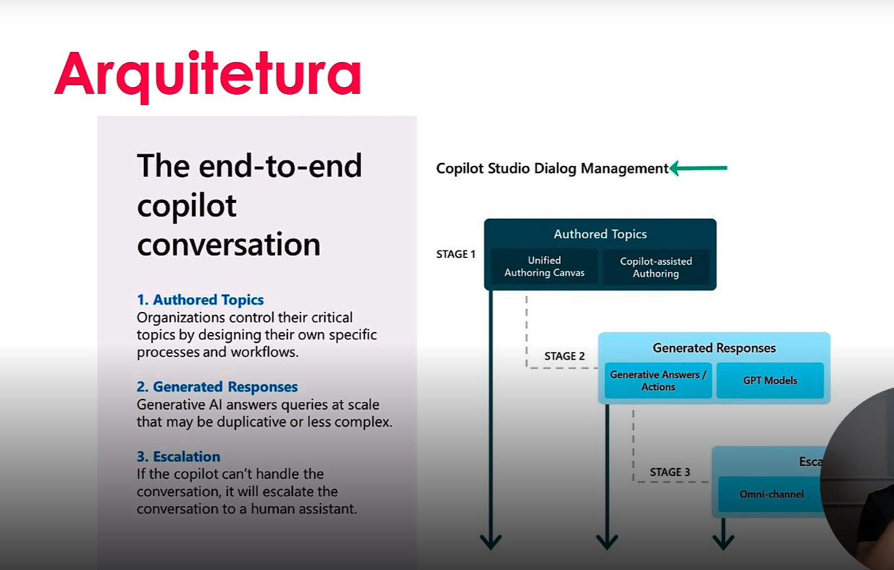

# 1 .Conhecendo o Microfost Copilot Studio 
## Sumário 
- [Introdução](#1-introdução)
  - [Objetivo Geral](#11-objetivo-geral)
  - [Pré-requisitos](#12-pré-requisitos)
- [Microsoft Copilot Studio](#2-microsoft-copilot-studio)
- [Ciclo](#3-ciclo)
- [Arquitetura](#4-arquitetura)
- [Microsoft Power Plataform](#5-microsoft-power-plataform)
- [Conectores](#6-conectores)
- [A importância da IA](#7-a-importância-da-ia)
- [Licenciamento](#8-licenciamento)
- [Tipos de Copilot](#9-tipos-de-copilot)
- [links](#links-uteis)
---
## 1. Introdução 
SObre o curso será focado nas ferramentas de Low-Code da Microssoft 

### 1.1. Objetivo Geral 
Aprender e se capacitar com a nova ferramenta de inteligência Artificial da Microsoft.  
Você será capaz de criar o seu próprio GPT com seus dados e da sua empresa. Ao final dessa formação, você terá uma visão geral dos benefícios do Copilot Studio.

### 1.2. Pré-requisitos 
- Ter acesso a uma conta Microsoft 365
- Nenhum conhecimento técnico é exigido
- Ter computador

---
## 2. Microsoft Copilot Studio
O Microsoft Copilot Studio, inicialmente foi idealizada para criação de chatbots de I.A, para facilitar o fluxo de automação de perguntas e respostas, onde seria adicionado uma especie de conhecimento "de leve" para embasar as respostas a serem geradas. Anteriormente o era nomeado de Power Vitual Agent's, o principal motivo da criação dessa ferramenta pela Microsoft seria de revolucionar a criação de ferramentas de I.A, e seu foco seria de auxiliar usuários de negócio com uma plataforma __NOCODE__, e que no decorrer de seu desenvolvimento e consolidação de mercado a ferramenta em questão transformou-se em __LOWCODE__.   
Dentro da plataforma atual temos funcionalidades do `Microsoft Copilot Studio` similares a outra ferramenta consolidada da empresa o `Excel`, onde as expressões dessa plataforma são aplicadas em uma especie de formulas.  
Outro ponto a ser ressaltado é que o `Copilot Studio` não será a ferramenta final a ser disponibilizada ao usuário final, ele serve tal qual uma `API` em uma aplicação prática podemos citar como exemplo o seguinte cenário, o usuário final terá contato com alguma ferramenta (Whatsapp, Microsoft Teams ou Algum site proprietário), esse usuário por sua vez irá mandar alguma requisição/mensagem ao seu agent, esse agent irá se conectar com `Microsoft Copilot Studio` que por sua vez irá fazer todo o processamento das informações e ira ratonar a resposta, funcionando como um orquestrador do processo de I.A.

---
## 3. Ciclo
<table style="text-align: center; width: 100%;"> 
<tr>
    <td style="text-align: center;">
    
    </td>
</tr>
</table>

O ciclo de vida dessa plataforma conforme ilustrado acima, segue o seguinte padrão. 
1. É criado um agente de I.A
2. Esse agente criado terá acesso a uma base de conhecimento determinada. Onde nesse passo pode ser adicionado alguns parâmetros como por exemplo determinar se a o chat será aplicado em um site publico ou um site institucional, e se por exemplo essa base de conhecimento a ser aplicada será com base um um FAQ desse site, mas também pode ser conectado por exemplo ao um banco de dados, um site no sharepoint etc...
3. Caso essa aplicação não seja o suficiente, podemos melhorar esse fluxo para tópicos específicos para treinar esse agent em respostas especificas, esse ponto é nomeado de tópicos, o que em geral serão as conversas dentro desse agent. 
4. Posteriormente temos o passo de ações e plugins que é um passo para que possamos conectar e melhorar a interação com esse chat com usuário final, como por exemplo uma extensão para conectar ao uma planilha em excel etc.. 
5. Em seguida temos algumas opções de canais de publicação, onde sua vantagem em relação aos outros agents e que quando há a necessidade de qualquer alteração para a conversa apresentação etc, quando essa é feita após salvar em até __30__ minutos essa alteração e replicada. 
6. Outro ponto é de monitoramento e melhora, então dentro desse processo temos uma ferramenta de pesquisa de satisfação, onde através desse podemos monitorar e rastrear a satisfação do nosso usuário final de acordo com a conversa. 
7. Outro ponto é que podemos entender esse modelo para plataforma do Azure para que possamos utilizar outras ferramentas como GPT etc.. 

---
## 4. Arquitetura
<table style="text-align: center; width: 100%;"> 
<tr>
    <td style="text-align: center;">
    
    </td>
</tr>
</table>

Por padrão a arquitetura padrão do Microsoft Copilot está divida em três estágios, sendo elas:

1. Conversas padrões, ao ser criado um novo agente, tal qual modos de saudações, opções etc..
2. Respostas generativas, são respostas automáticas , com base na base de conhecimentos carregadas e com base em modelos GPT automaticamente pré carregados da internet. 
3. A ultimo estágio e com a escalabilidade para o contato humano. 

---
## 5. Microsoft Power Plataform
<table style="text-align: center; width: 100%;"> 
<tr>
    <td style="text-align: center;">
    
    </td>
</tr>
</table>

Basicamente a Power Plataform e um conjunto de ferramentas disponibilizadas pela Microsoft com foco nas até então chamadas de `Pessoas  de negocio` para que estas consigam implantar e entregar soluções, sem maior necessidade de maiores intervenções da área de T.I. No que diz respeito a primeira ferramentas disposta na imagem acima o Power apps é utilizado para: criações de aplicações de negócio, como aplicativos para tablet celular computador etc..   
Já a segunda ferramenta o `power automate` é utilizado para automatização de processos sendo divididos em processos online e processos locais, por vezes essa denominação poderá ser encontrada como online = `cloud flows` processo locais = `fluxos de desktops`, é valido também saber quando as utilizar os clod flows quando se tem fluxos online como aws, api etc, já no outro processo podemos usar quando tivermos que realizar fluxos rotineiros nas máquinas.   
Já a terceira ferramenta `power bi` é utilizado para criação de dashboards e relatório, por fim temos o `power pages` que é uma ferramenta utilizada para criar portais tando utilizando programação quando o processo de lowcode. Isso na visão macro, porém também possuímos outros serviços disponíveis para trabalhar com a power plataform, tais como:  
1. Data Connectors, que é uma ferramenta utilizada para conectar dados, sendo utilizada não somente para buscar informações, mas também tomar ações.Exemplos de utilização:  
  - Envio de email 
  - Leitura de alguma linha de um excel 
2. AI Builder é uma ferramenta de Inteligência artificial, que pode ser utilizada por exemplo para extração de documentos, analise de documentos etc..
3. Microsoft Dataverse é a ferramenta base de "back-end" onde por exemplo ao se utilizar o Microsoft Copilot Studio, essas conversas são salvas no Ms Dataverser, é como se fosse um Banco de dados geral da MS PowerPlataform
4. Power FX é uma ferramenta de expressões lógicas, utilizados para meio que substituir a programação ou fórmulas como as que são utilizadas no Excel 
5. Ambientes é uma ferramenta utilizada para realizar a movimentação dessas aplicações. 

---
## 6. Conectores
Conecte em mais de +1.400 servições com conectores pré-construídos de diversas ferramentas, desde Adobe até Zendesk, e serviços on-premises. 
Estenda seu colitot e construa o seu próprio conector 

---
## 7. A importância da IA
- __Eficiência:__ Fazer tarefas repetitivas
- __Gestão da informação:__ Organizar e buscar informações rapidamente
- __Serviço ao Cliente:__ Permitir um suporte  24/7
- __Análise de dados:__ Analisar grande quantidade de dados para providenciar insights
- __Assistente pessoal:__ Gerenciar vários aspectos da sua vida pessoal 

Agora quando falamos propriamente dito do Microsoft Copilot Studio, estamos tratando de uma ferramenta lowcode que auxilia na aceleração dessas automatizações. 

---
## 8. Licenciamento

| | | | | |
| -- | -- | -- | -- | -- |
| Copilot Studio for teams |  Copilot Studio  Premium | Copilot Studio  in Copilot for M365 | Pay-as-you-go|
| Licença gratuita no M365 | 25.00 mensagens por mês  | Pubilcações no Copilot for M365 | Pagamento por uso no azure |
| Publicações no Teams | Uso de Gen AI | Uso de Gen AI | Uso de Gen AI|
| Sem uso de GenAI | Todos canais disponíveis | Licença gratuita no Copilot | Todos canais disponíveis |
| Inclusa no M365 | $200 por mês/ambiente | Incluída no Copilot for M365 | Pagamento por USO |
---
## 9. Tipos de Copilot
<table style="text-align: center; width: 100%;"> 
<tr>
    <td style="text-align: center;">
    
    </td>
</tr>
</table>

---

### Links Uteis
- [Mirosoft Learn](https://learn.microsoft.com/pt-br/microsoft-copilot-studio)
- [Romão's Learn](https://romaos.com.br/learn)
- [Microsoft Power Plataform](https://www.microsoft.com/pt-br/power-platform)

---
As respostas da aula 1 estão [aqui](imgs/prova/)

---
<table style="text-align: center; width: 100%;"> 
<caption><b>Skils do projeto </b></caption>
<tr>
    <td style="text-align: center;">
    
    </td>
    <td style="text-align: center;">
    
    </td>
<tr> 
</table>

---
Titulo: 1 .Conhecendo o Microfost Copilot Studio  

Autor: Thierry Lucas Chhaves

Data criacao: 05/09/2025

Data modificacao: 10/09/2025

Versao: 1.0  

---