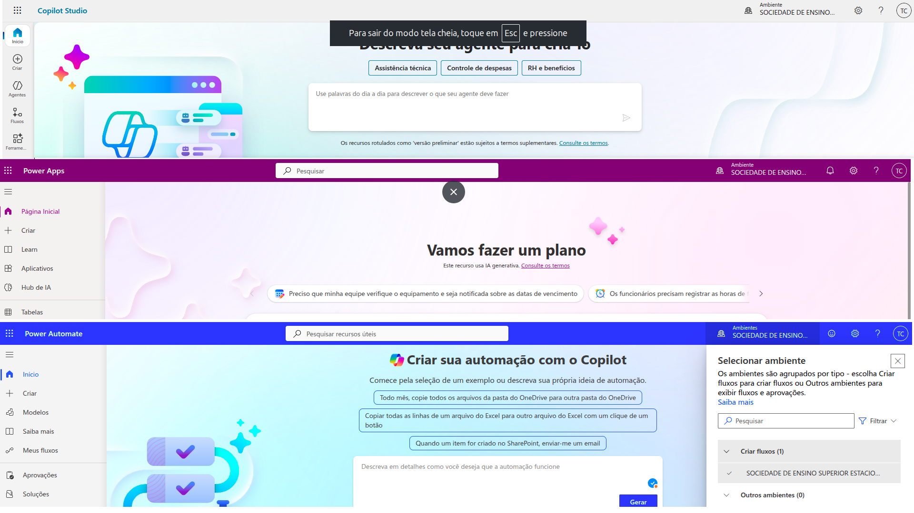
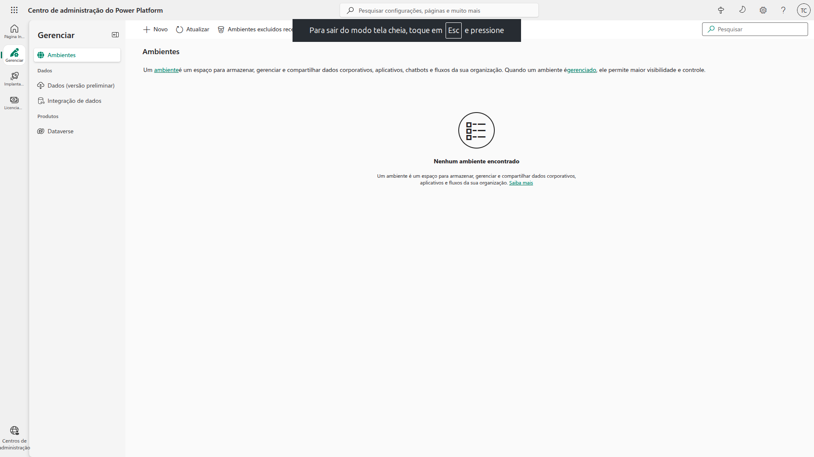
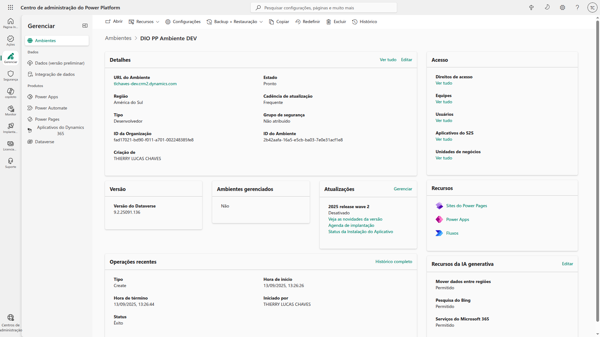
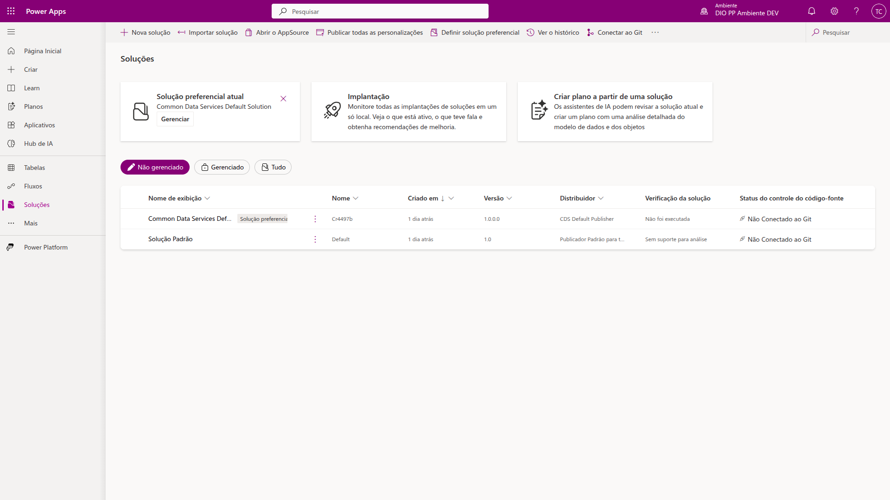
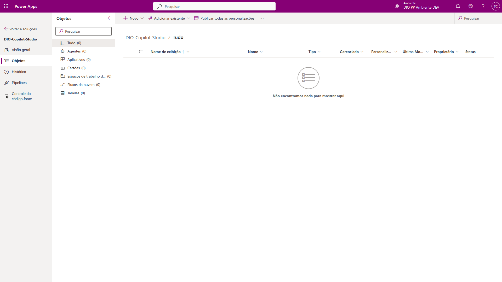
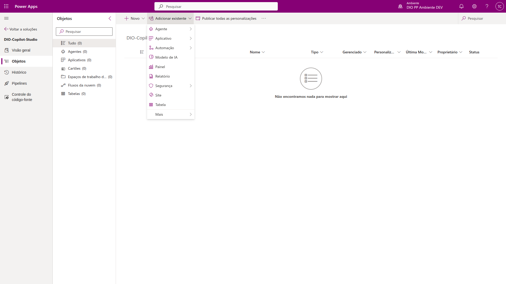

# 2 .Trabalhando com Ambientes no Microfost Copilot Studio
## Sumário 
- [Introdução](#1-introdução)
- [Ambientes](#2-ambientes-na-power-plataform)
- [Criando um novo ambiente](#3-criando-um-novo-ambiente)
- [Soluções](#4-soluções)
- [Criando uma nova solução](#5-criando-uma-nova-solução)
- [Power Plataform Pipilenes](#6-power-plataform-pipelines)
---
## 1. Introdução 
Nesse módulo veremos um pouco mais sobre a questão de ambientes dentro da MS Power Plataform, a MS tem trabalhado a questão de ambientes para facilitar ao usuário final usa utilização, e a cada dia tem mais pessoas utilizando desse conceito entretanto dessa vez com o conceito correto que se trata da questão de conseguir mover algo de um lugar para o outro de forma correta, fácil e rápida.  
Ao ser criado a Power Plataform com o conceito de lowcode, onde seu principal objetivo era emponderar o usuário de conseguir conectar as coisas e customizar suas soluções para outros cenários outros clientes, por isso foi implantando a questão de ambientes. 

---
## 2. Ambientes na Power Plataform
Para acessar o contexto de ambientes citados temos três opções a 1ª opção é através do [Copilot Studio](https://copilotstudio.microsoft.com/environments/Default-da49a844-e2e3-40af-86a6-c3819d704f49/home) e a 2ª opção e através do [Power apps](https://make.powerapps.com/environments/Default-da49a844-e2e3-40af-86a6-c3819d704f49/home) e a 3ª opção e através do [Power automate](https://make.powerautomate.com/environments/Default-da49a844-e2e3-40af-86a6-c3819d704f49/home), em ambas as opção será possível realizar a manipulação dos ambientes da plataforma que fica localizada no canto superior direito 
<table style="text-align: center; width: 100%;"> 
<tr>
    <td style="text-align: center;">
    
    </td>
</tr>
</table>

Por padrão é utilizado o ambiente default em ambas plataformas, porém a adoção desse ambiente padrão pode-se considerar um adoção incorreta devido ao fato do futuro problema em governança de projetos e etc... Agora para modificar a administrar os ambientes devemos acessar a [plataforma de administração](https://admin.powerplatform.microsoft.com/), apenas para elucidar o conceito de ambientes que é empregado pela Microsoft, ambientes para empresa é um local onde é possível replicar as mesmas coisas que se esta trabalhando em um local para outro local, agora no cenário do desenvolvimento vamos supor que estamos trabalhando em um projeto complexo com N aplicações (copilot studio, power atuomate dataverse etc..), em uma utilização corriqueira o que é feito é _"liberar o link"_ daquela aplicação que se estava sendo trabalhada ou daquele ambiente para todos os usuários, porém isso não é a melhor prática ou melhor cenário. O conceito descrito acima é como é feito em outras aplicações na qual temos um "_ambiente_" de desenvolvimento um de aplicação principal etc..
Sobre o deploy dessas aplicações existem 2(duas) maneiras de serem realizadas, a primeira de forma mais manual, seria a de realizar o processo de exportação e importação de um ambiente para outro, já a segunda forma é através do `Azure Devops`, onde através dessa plataforma temos o conceito de `pipeline/release`, onde é possível criar uma nova release para fazer esse processo em ambientes diferentes. E outro cenário é o `Power Plataform Pipelines`  onde é possível  selecionar os ambientes dentro da organização e migrar de um ambiente para outro uma solução, com o beneficio temos o quesito de controle de acesso sobre essas soluções. 
Para realizar esse processo dentro da [plataforma de administração](https://admin.powerplatform.microsoft.com/), na barra lateral esquerda teremos a opção de  gerenciar, e ambientes ou environments, onde será possível realizar a criação administração desses ambientes. 

<table style="text-align: center; width: 100%;"> 
<tr>
    <td style="text-align: center;">
    
    </td>
</tr>
</table>

---
## 3. Criando um novo ambiente
Dentro da `plataforma de administração` será listado todos os ambientes no qual o usuário tem acesso, porém antes de criar novos ambientes vamos entender sobre os ambientes.  
Na lista de ambientes temos algumas informações sobre os ambientes em questão, sendo elas:
1. O nome do ambiente.
2. O tipo de ambientes (desenvolvimento, default, produção etc..)
3. O estado de execução/utilização do ambiente
4. Se possui `dataverse` 
5. Se o ambiente em questão é gerenciável
6. A localidade/ região de implementação do ambiente. 
7. Qual o padrão atualizações daquele ambiente. 

Sobre os tipos de ambientes, vamos discorrer um pouco sobre os principais tipos de ambientes.
1. Trial = Seria com um ambiente de teste, e um ambiente no qual teremos um tempo de expiração, que comumente é criado apenas para garantir a uma nova funcionalidade versão ou validação, por padrão esse tipo de ambiente tem uma data de validade, ao se atingir esse tempo esse ambiente irá expirar e será deletado automaticamente. 
2. Developer = Esse ambiente comumente é utilizado para o desenvolvimento de soluções, ou seja quando se é preciso criar uma solução/ produto novo. Esse ambiente po padrão já vem pre-configurado com data-verse, para criar tabelas, sendo que a ideia principal desse ambiente ser de ter um ambiente desse para cada desenvolvedor ou time. 
3. Sandbox = Esse ambiente seria com um ambiente de validação do cliente, num fluxo recomendado pela Microsoft é desejável que tenhamos 3 tipos de ambientes _`1 de desenvolvimento, 1 de validação, 1 de produção ou ambiente final`_ , esse ambiente descrito serve para validação do cliente final, diferentemente do ambiente trial ele será um ambiente de longa duração, e funcionária como um intermediário entre o desenvolvimento e a produção. 
4. Production = Esse é o ambiente seria o ambiente final, onde as soluções criadas devem estar em estado final e validado, outro ponto a ser ressaltado sobre esse ambiente é que a Microsoft somente atualiza alguma funcionalidade dentro desse tipo de ambiente quando as novas funcionalidades estão devidamente validas, e sua atualização também não participará do fluxo padrão de atualizações. 

Como recomendação para criação desses ambientes, é aconselhável que tenhamos 3 ambientes, sendo 1 ambiente de desenvolvimento utilizando o tipo de Sandbox, um ambiente de validação interna dos clientes também utilizando o sandbox, e um ambiente de produção.  

Agora sobre a criação de novos ambientes, iremos seguir os seguintes passos:  
Dentro do menu de gerenciamento em ambientes teremos o "botão" de novo onde será apresentado as seguintes opções
- Nome, região, tipo, descrição de  finalidade, armazenamento via dataverse, e pagamento conforme utilização. 
- Sobre o nome do ambiente, é uma boa prática que esse ambiente seja nomeado com nome do projeto ou departamento, e o tipo de ambiente. Entretanto essa nomenclatura irá depender da empresa. 
- Sobre a Região, assim com em outras plataformas de nuvem é de suma importância se atentar as localidades de implantação, tanto pelo fato latência da aplicação como um todo, como também pelas implementações de atualizações, uma vez que definimos por exemplo o ambiente na região de America do sul, teremos um ciclo de atualizações e novas soluções com um tempo maior de implementação diferentemente do que o ocorre para aplicações com definição de localidade nos estados unidos. 
- Sobre a descrição de finalidade, assim conforme o nome esse campo e de suma importância para termos uma breve descrição do motivo pelo qual aquele ambiente está sendo criado. 
- Sobre a opção de armazenamento via dataverse, essa opção somente ficará ativa em caso de ambientes de produção e/ou de sandbox, em ambientes de desenvolvimento essa opção sempre será marcada. __Quando criado projetos de copilot studio, sempre devemos marcar essa opção, pois o mesmo exige o armazenamento de informações e/ou criações de tabelas__   
- Temos também a opção de definição de idioma da aplicação e da moeda corrente
- Temos também a opção de customização de URL. 
- E por fim a opção de disponibilização de aplicativos de demonstração. 
Sobre a criação desses ambiente, é valido ressaltar que por padrão a criação de um novo ambiente requer 1 GB de armazenamento para implantação, e não é raro que ao ser criado um novo ambiente seja exibido alguma mensagem de erro. 
Após ser criado o ambiente teremos acesso ao mesmo através da plataforma ficando da seguinte maneira. 

<table style="text-align: center; width: 100%;"> 
<tr>
    <td style="text-align: center;">
    
    </td>
</tr>
</table>

Nessa parte é possível visualizar informações do ambiente com um todo, assim como também é possível realizar backups do ambiente.

---
## 4. Soluções
Após criação do ambiente e sua configuração daremos inicio a criação de soluções, para temos uma forma mais simples de criação que é de mais fácil implementação através do [Power apps](https://make.powerapps.com/environments/Default-da49a844-e2e3-40af-86a6-c3819d704f49/home), nessa plataforma selecionaremos no canto superior direito o ambiente recém criado, e na barra lateral esquerda teremos a opção de soluções conforme abaixo:
<table style="text-align: center; width: 100%;"> 
<tr>
    <td style="text-align: center;">
    
    </td>
</tr>
</table>

Essa soluções nesse contexto são como _"pastas"_ organizadoras dentro de cada ambiente, fazendo uma analogia para melhor entendimento, um ambiente está para aplicação como um usuário está para S.O Windows, e as soluções está para a aplicação como as pastas estão para esses usuários. E a importância do gerenciamento da utilização dessas soluções da-se ao fato da facilidade da movimentação das soluções entre ambientes. Ou seja o que será movimentado dentro dos ambientes não será o ambiente complexo, pois por vezes dentro de um ambiente não teremos apenas 1 projeto, e por vezes não será desejado a movimentação desses vários projetos e apenas de 1.  
Ainda nesse âmbito, temos algumas características que são dignas de serem descritas, uma delas seria a possibilidade de exportação dessa solução como um arquivo `ZIP`, nessa exportação temos o passo de definição de versão, como recomendação de numeração podemos seguir a boa prática descrita. 
1. O primeiro número será incremental, correspondendo a fase do projeto.
2. O segundo  número é utilizado para descrever o mês do desenvolvimento/ exportação
3. O terceiro número costuma-se utilizar o ano
4. O ultimo número será a versão do projeto que está sendo trabalhado. Então em cenários de correção de bug, uma nova funcionalidade, atualização da Power Plataform, esse número será incrementado. 
Com essa prática adotada,o entendimento sobre a atualização e de temporalidade da mesma torna-se de melhor compreensão. 
Ainda sobre a exportação temos a opções de gerenciável ou não gerenciável, quando marcado a primeira opção ao ser utilizada a aplicação é mantida como em modo de leitura se assim podemos dizer, não sendo possível realizar a edição daquela solução e a segunda opção e o contrário. 
E quando utilizamos a processo de importação, o passo e buscar aquele arquivo e realizar o import para o ambiente. Quando trabalhamos com um processo de uma solução própria é possível realizar a sobrescrita daquela solução.  
Ainda dentro dessa processo de soluções possuímos também a opção de histórico das soluções. 

---
## 5. Criando uma nova solução
Para se criar uma nova solução o processe segue os seguinte passos. 

Dentro do ambiente do `Power Apps`, teremos a opção nova solução, ao clicar nessa opção será apresentado uma tela na parte esquerda da tela, onde devemos:  
1. Inserir o nome de exibição da solução.
2. O nome da solução internamente, podendo ser ou não mesmo nome do display
3. Fornecedor/Publicador, e possível utilizar os publicadores padrões disponíveis pela plataforma, como também poderemos criar um novo publicador
  3.1 Ao criar um novo publicador, informaremos o nome de exibição o nome interno 
  3.2 Também podemos criar um pré-fixo, em todas solução será exibido o nome mais essa descrição
  3.3 Ainda é possível inserir informações de contato sobre esse publicador, número, e-mail,  localidade etc..
4. Após a solução podemo inserir uma descrição daquela solução ou um link
Após salvar essa criação teremos a seguinte visualização: 

<table style="text-align: center; width: 100%;"> 
<tr>
    <td style="text-align: center;">
    
    </td>
</tr>
</table>

Dentro dessa solução temos diversas opções de criação, como agents do copilot, um aplicativo (aplicativo de tela ou de modelo),fluxos tanto do power automate quanto locais, tabelas etc..
Ainda podemos importar algumas dessas opções dispostas 

<table style="text-align: center; width: 100%;"> 
<tr>
    <td style="text-align: center;">
    
    </td>
</tr>
</table>

Para que seja importado essa soluções desde que essa já estejam criadas, basta selecionar qual aplicação desejada, e importa-la.

---
## 6. Power Plataform Pipelines
Dentro do ambiente de soluções temos disposto na barra lateral esquerda a opção de pipelines, e para o que serve essa opção? basicamente essa pipelines são formas de conseguir realizar a movimentação de projetos, execução de comandos e mover coisas de um lugar pro outro, para que possa acelerar esse processo sem que haja a necessidade de conhecimento sobre quais são os _"códigos por trás desse processo"_
Nesse processo definimos o nome dessa pipilene, e definimos qual será o ambiente de movimentação, após a criação definimos o horário do deploy, podendo ser agendado ou de imediato. 
Ao ser finalizado esse processo essa solução poderá ser visualizada no outro ambiente.  
Outro ponto e que durante esse processo caso sua solução tenha conexões feitas, será questionado se deseja realizar a modificação dessas conexões. Outro ponto e que dentro da plataforma temos a opção de Environment variable, ou variáveis de ambiente que funciona como ponto de conexão padrão tal qual é feito com o Docker. 

--- 
### Links Uteis
- [Copilot Studio](https://copilotstudio.microsoft.com/environments/Default-da49a844-e2e3-40af-86a6-c3819d704f49/home)
- [Power apps](https://make.powerapps.com/environments/Default-da49a844-e2e3-40af-86a6-c3819d704f49/home)
- [Power automate](https://make.powerautomate.com/environments/Default-da49a844-e2e3-40af-86a6-c3819d704f49/home)
- [Plataforma de administração](https://admin.powerplatform.microsoft.com/)
---
As respostas da aula 2 estão [aqui](imgs/prova/)

---
<table style="text-align: center; width: 100%;"> 
<caption><b>Skils do projeto </b></caption>
<tr>
    <td style="text-align: center;">
    
    <td style="text-align: center;">
    
    </td>
<tr> 
</table>

---
Titulo: 2 .Trabalhando com Ambientes no Microfost Copilot Studio 

Autor: Thierry Lucas Chhaves

Data criacao: 05/09/2025

Data modificacao: 13/09/2025

Versao: 1.0  

---