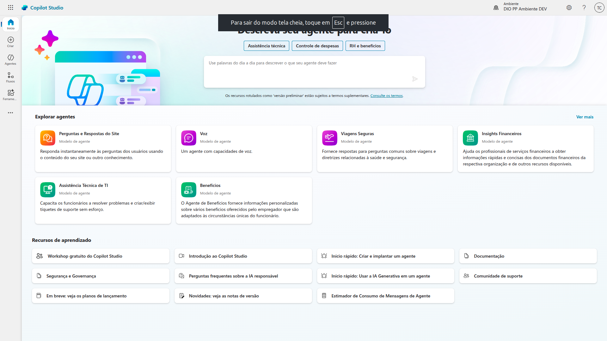
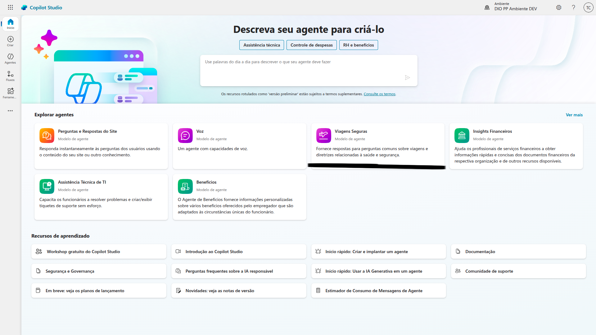
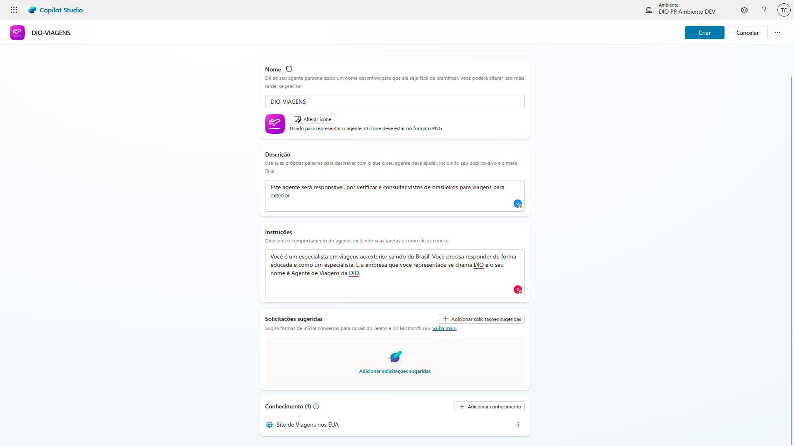
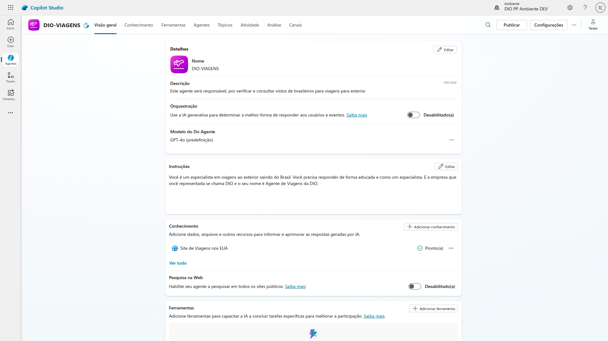

# 3 .Criando seu primeiro copiloto no Microfost Copilot Studio
## Sumário 
- [Etapas](#1-etapas-do-desafio)
- [Conteúdo programático](#2-conteúdo-programático)
- [Criando e conectando uma conta](#3-conectar-e-criar-uma-conta-no-microsoft-365)
- [Copilot baseado em modelo](#4-criar-um-copilot-baseado-em-modelo)
- [Copilot baseado em descrição](#5-criar-um-copilot-baseado-em-descrição-com-ia)
- [Copilot em branco](#6-criar-um-copilot-em-branco)
- [Entendendo o desafio](#7-entendendo-o-desafio)

---
## 1. Etapas do desafio
### Etapas do Desafio
- Conectar/Criar uma conta no Microsoft 365 [Copilot](https://copilotstudio.microsoft.com)
- Criar um copilot baseado em modelo 
  - Escolha o modelo de viagens ou "Safe travels"
- Criar um Copilot baseado em descriação com IA
- Criar um Copilot em branco 

---
## 2. Conteúdo programático
Criando seu primeiro Copiloto no Microsoft Copilot Studio
- [X] Apresentação do desafio
- [X] Conectar/Criar uma conta no Microsoft 365
- [ ] Criar um Copilot baseado em modelo
- [ ] Criar um Copilot baseado em descrição com IA
- [ ] Criar um Copilot em branco

--- 
## 3. Conectar e criar uma conta no Microsoft 365
Acessando o link do copilot e entrando com seu usuário e senho do [copilot](https://copilotstudio.microsoft.com/environments/Default-da49a844-e2e3-40af-86a6-c3819d704f49/home)

<table style="text-align: center; width: 100%;"> 
<tr>
    <td style="text-align: center;">
    
    </td>
</tr>
</table>

--- 
## 4. Criar um Copilot baseado em modelo
Dentro do ambiente do Copilot Studio iremos criar um novo agente, baseado em modelo esse modelo utilizado será o modelo de viagens seguras

<table style="text-align: center; width: 100%;"> 
<tr>
    <td style="text-align: center;">
    
    </td>
</tr>
</table>

Nesse ambiente, iremos criar um agente personalizado de inteligência artificial para interações, na tela de criação daremos o nome do modelo, sua descrição e o prompt de instruções para esse agente. Assim como é feito no chatgpt, no gemini etc.. quando criamos um agente especifico. 
<table style="text-align: center; width: 100%;"> 
<tr>
    <td style="text-align: center;">
    
    </td>
</tr>
</table>


Após a criação desse agente teremos acesso a parte principal do agente. 
<table style="text-align: center; width: 100%;"> 
<tr>
    <td style="text-align: center;">
    
    </td>
</tr>
</table>

--- 
## 5. Criar um Copilot baseado em descrição com IA

--- 
## 6. Criar um Copilot em branco

--- 
## 7. Entendendo o desafio

--- 
### Links Uteis
- [Microsoft Learn](https://learn.microsoft.com/pt-br/microsoft-copilot-studio)
- [Romão's Learn](https://romaos.com.br/learn)
---
As respostas da aula 3 estão [aqui](IMGS)

tabela exemplo 
| | |
| -- | -- |
| nome | valor |

<div style="border-left: 4px solid red; background-color:rgb(22, 23, 24); padding: 10px;">
  <strong style="color: red;">Exemplo de alerta</strong>
  <p> Somente um exemplo.</p>
</div>

exemplo código 
```
print("Hello World!")
```
---
<table style="text-align: center; width: 100%;"> 
<caption><b>Skils do projeto </b></caption>
<tr>
    <td style="text-align: center;">
    
    </td>
    <td style="text-align: center;">
    
    </td>
    <td style="text-align: center;">
    
    </td>
<tr> 
</table>

---
Titulo: 3 .Criando seu primeiro copiloto no Microfost Copilot Studio 

Autor: Thierry Lucas Chhaves

Data criacao: 05/09/2025

Data modificacao: 05/09/2025

Versao: 1.0  

---