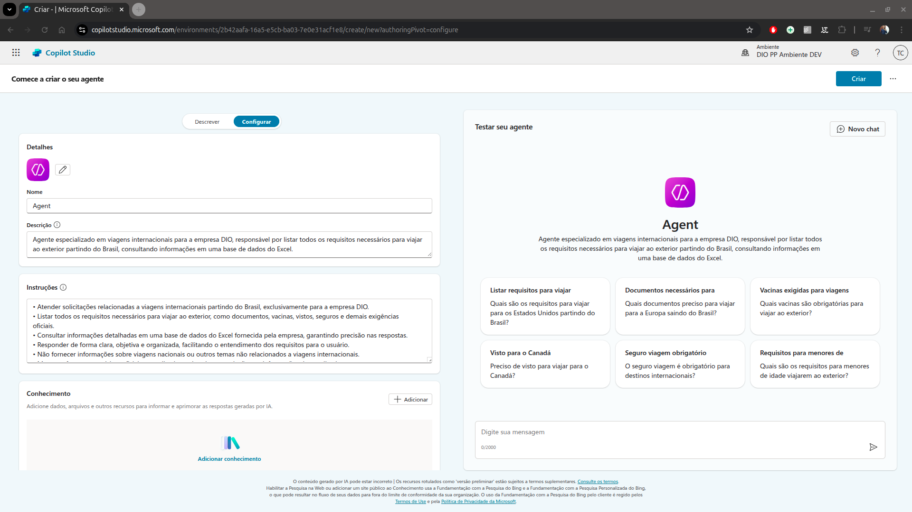
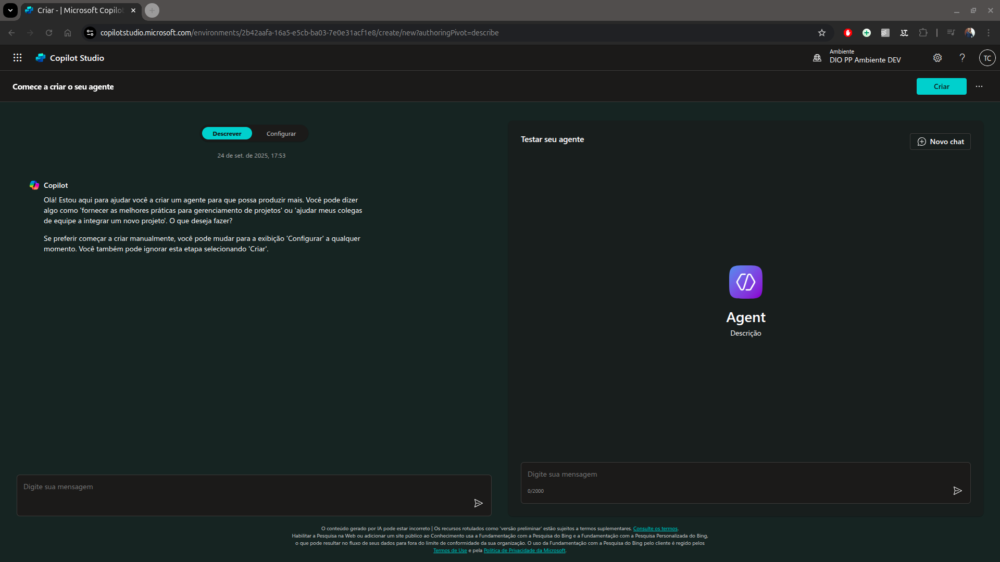
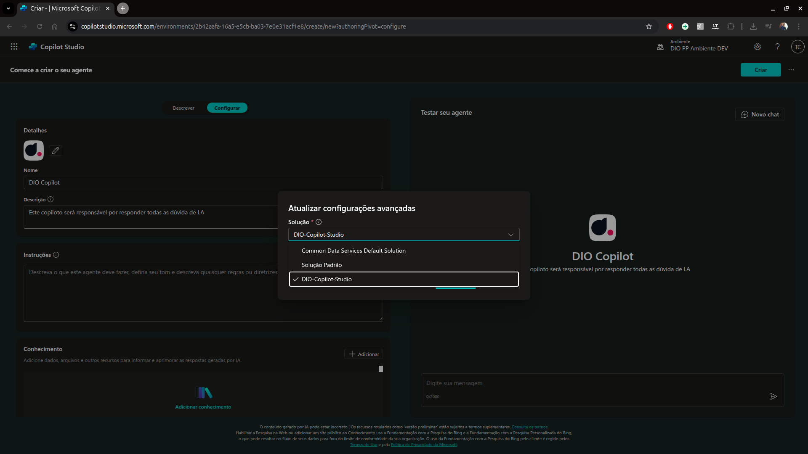

# 3 .Criando seu primeiro copiloto no Microfost Copilot Studio
## Sumário 
- [Etapas](#1-etapas-do-desafio)
- [Conteúdo programático](#2-conteúdo-programático)
- [Criando e conectando uma conta](#3-conectar-e-criar-uma-conta-no-microsoft-365)
- [Copilot baseado em modelo](#4-criar-um-copilot-baseado-em-modelo)
- [Copilot baseado em descrição](#5-criar-um-copilot-baseado-em-descrição-com-ia)
- [Copilot em branco](#6-criar-um-copilot-em-branco)
- [Entendendo o desafio](#7-entendendo-o-desafio)

---
## 1. Etapas do desafio
### Etapas do Desafio
- Conectar/Criar uma conta no Microsoft 365 [Copilot](https://copilotstudio.microsoft.com)
- Criar um copilot baseado em modelo 
  - Escolha o modelo de viagens ou "Safe travels"
- Criar um Copilot baseado em descriação com IA
- Criar um Copilot em branco 

---
## 2. Conteúdo programático
Criando seu primeiro Copiloto no Microsoft Copilot Studio
- [X] Apresentação do desafio
- [X] Conectar/Criar uma conta no Microsoft 365
- [X] Criar um Copilot baseado em modelo
- [X] Criar um Copilot baseado em descrição com IA
- [X] Criar um Copilot em branco

--- 
## 3. Conectar e criar uma conta no Microsoft 365
Acessando o link do copilot e entrando com seu usuário e senho do [copilot](https://copilotstudio.microsoft.com/environments/Default-da49a844-e2e3-40af-86a6-c3819d704f49/home)

<table style="text-align: center; width: 100%;"> 
<tr>
    <td style="text-align: center;">
    
    </td>
</tr>
</table>

--- 
## 4. Criar um Copilot baseado em modelo
Dentro do ambiente do Copilot Studio iremos criar um novo agente, baseado em modelo esse modelo utilizado será o modelo de viagens seguras

<table style="text-align: center; width: 100%;"> 
<tr>
    <td style="text-align: center;">
    
    </td>
</tr>
</table>

Nesse ambiente, iremos criar um agente personalizado de inteligência artificial para interações, na tela de criação daremos o nome do modelo, sua descrição e o prompt de instruções para esse agente. Assim como é feito no chatgpt, no gemini etc.. quando criamos um agente especifico. 
<table style="text-align: center; width: 100%;"> 
<tr>
    <td style="text-align: center;">
    
    </td>
</tr>
</table>


Após a criação desse agente teremos acesso a parte principal do agente. 
<table style="text-align: center; width: 100%;"> 
<tr>
    <td style="text-align: center;">
    
    </td>
</tr>
</table>

--- 
## 5. Criar um Copilot baseado em descrição com IA
Dentro do Copilot Studio iremos inserir um prompt diretamente na tela principal conforme ilustrado abaixo. 

<table style="text-align: center; width: 100%;"> 
<tr>
    <td style="text-align: center;">
    
    </td>
</tr>
</table>

Onde está descrito como _"Descreva seu agente para criá-lo"_, iremos inserir o texto para que o copilot crie um novo agente dentro do Copilot Studio. 
```
Crie um agente de viagens para a empresa DIO, esse agente será responsável por listar todos os requisitos para viajar ao exterior partindo do Brasil. 
Esse agente irá consultar as informações de uma base de dados do Excel.
```
Após e inserção do prompt, podemos realizar o ato de criação esse que pode ser feito através do ícone de _"avião"_, ou apertando a tecla enter. 
Em sequência teremos a tela de configuração do agent em questão, com algumas configurações já pre-definidas via o prompt conforme ilustrado abaixo.

<table style="text-align: center; width: 100%;"> 
<tr>
    <td style="text-align: center;">
    
    </td>
</tr>
</table>

--- 
## 6. Criar um Copilot em branco
Quando falamos de criação de agent's em branco ou seja sem o auxilio de um modelo, ou do copilot propriamente dito devemos acessar a barra lateral a esquerda sobre o ícone de criar, onde teremos em sequência o botão de `novo agente`, conforme descrito pelo instrutor podemos ter duas  _"aparências"_, para esse modelo de criação a padrão, como também uma por intermédio de uma conversa.

<table style="text-align: center; width: 100%;"> 
<tr>
    <td style="text-align: center;">
    
    </td>
</tr>
</table>

Através da opção de `configurar` disponível durante a criação do projeto, é possível também adicionar base de conhecimentos, seja sites públicos ou do Sharpoint, porém não é recomendável sua utilização nesta etapa, pois primeiro devemos criar uma arquitetura prévia desse agent, para posteriormente realizar seu treinamento.  
Outra configuração que é digna de se notar é as configurações avançadas, onde através dela podemos adicionar uma solução que foi criada no Power-Agent. 


<table style="text-align: center; width: 100%;"> 
<tr>
    <td style="text-align: center;">
    
    </td>
</tr>
</table>

Essa opção torna-se vantajosa, quanto a manutenibilidade quanto exportação, isso em conjunto com o processo de criação de ambientes. 

--- 
## 7. Entendendo o desafio

O objetivo deste desafio é criar seu primeiro Copiloto no Microsoft Copilot Studio.

__O que fazer?__  

Explore a demonstração apresentada no conteúdo prático e faça um resumo do que aprendeu neste conteúdo. Em seguida armazene em um repositório no GitHub e compartilhe o link na entrega do desafio.

Orientações para Entrega
Crie um repositório no GitHub.
Envie em "Entregar Projeto", o link do seu repositório no GitHub.

Bons estudos 😉

--- 
### Links Uteis
- [Microsoft Learn](https://learn.microsoft.com/pt-br/microsoft-copilot-studio)
- [Romão's Learn](https://romaos.com.br/learn)
---

<table style="text-align: center; width: 100%;"> 
<caption><b>Skils do projeto </b></caption>
<tr>
    <td style="text-align: center;">
    
    </td>
    <td style="text-align: center;">
    
    </td>
<tr> 
</table>

---
Titulo: 3 .Criando seu primeiro copiloto no Microfost Copilot Studio 

Autor: Thierry Lucas Chhaves

Data criacao: 05/09/2025

Data modificacao: 24/09/2025

Versao: 1.0  

---