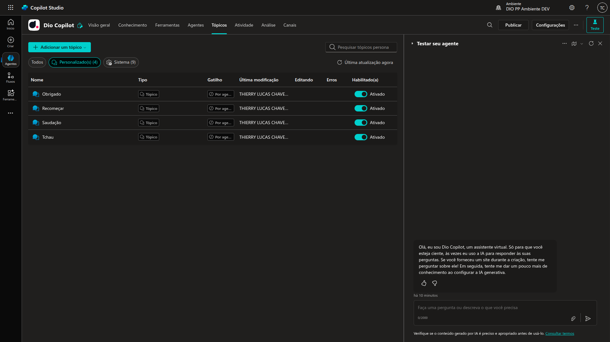
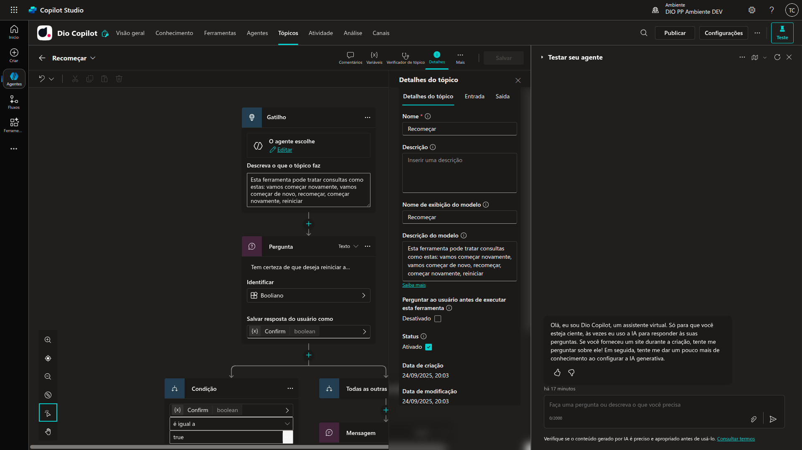
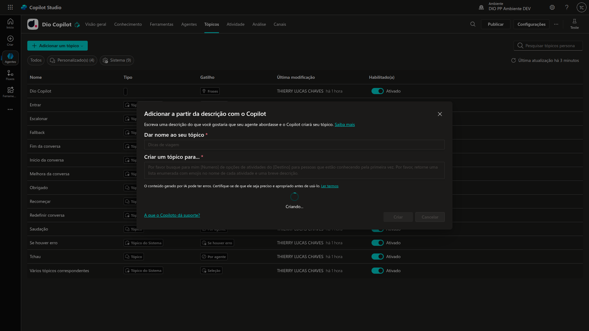

# 4 .Introdução aos tópicos no Microfost Copilot Studio
## Sumário 
- [Tópicos](#1-tópicos)
- [Principais conceitos](#2-principais-conceitos-de-um-tópico)
  -[Detalhes dos tópicos](#21-detalhes-dos-tópicos)
- [Criando um tópico com descrição](#3-criando-um-tópico-com-descrição)
- [Modelos de prompts para criação de tópicos](#4-modelos-de-prompts-para-criação-de-tópicos)
- [Melhores práticas do tópico](#5-melhores-práticas-do-tópico)
---
## 1. Tópicos
O que são tópicos, em resumo são ramificações das conversas que teremos com a I.A
- São conversas dentro de um Copilot. 
- Elas são fixas. 
- Sistemas ou customizadas. 
- Sempre têm: 
  - 1 gatilho com frases 
  - 1 ou mais ações. 

Todas as ramificações das conversas são chamadas de tópicos, pois podemos ir de "um caminho para outro" utilizando uma estrutura padronizada, porém atualmente a utilização desses tópicos tem sido mais utilizadas como gatilhos para ações, e a utilização desses tópicos serve principalmente para realizar customizações desses plugins ou dessas ações. 
Dentro desse cenário podemos definir 2 coisas, como tópicos sendo como coisas fixas, e ações e gatilhos como dinâmicas.   
Ainda sobre a égide desse cenário de tópicos temos 2 tipos os de sistemas (que são coisas que a Microsoft cria), além desses tópicos também temos os customizados que são ações que queremos customizar para tal processo. 

---
## 2. Principais conceitos de um tópico
Após a criação do nosso copiloto iremos criar os tópicos diretamente no copiloto criado, iremos acessar a área de configuração do agente, dentro da tela de configuração teremos a aba de `Tópicos`, conforme ilustrado abaixo:  

<table style="text-align: center; width: 100%;"> 
<tr>
    <td style="text-align: center;">
    
    </td>
</tr>
</table>

Através dessa parte do programa conseguimos realizar o processo de visualização, ativação/inativação, criação e deleção de tópicos.  
Nessa parte também podemos filtrar tópicos de sistema e tópicos customizados, além de fazer pesquisas de tópicos em especifico, em todos os tópicos teremos questões como por exemplo detalhes 

### 2.1 Detalhes dos tópicos 
Dentro do fluxo de detalhes do tópicos seremos apresentado a tela de configuração de um tópico, onde teremos uma tela de informações gerais dos tópicos. 

<table style="text-align: center; width: 100%;"> 
<tr>
    <td style="text-align: center;">
    
    </td>
</tr>
</table>

Nessa tela temos os campos de nome, Nome e Nome de exibição do modelo, o primeiro campo será o nome interno do tópico servindo como facilitador de gerenciamento desse tópico em questão. Para além das definições de exibição e identificação interna e de exibição, temos a possibilidade de criação sobre as possíveis entradas para esse fluxo, como as saídas possíveis. 
Essa estrutura é feita através de ramificações, onde podemos definir gatilhos para disparar certas ações, e esses tem variáveis e controles .

--- 
## 3. Criando um tópico com descrição 
__PROMPT__
```
"Por favor busque para mim [Numero] de opções de atividades do [Destino] para pessoas que estão conhecendo pela primeira vez. Por favor retorne uma lista enumerada com emojis no nome de cada atividade e uma breve descrição."
```
Através da opção de criar teremos a opção de criar com auxilio do Copilot, onde iremos nomear a descrição desse tópico inserir o prompt de exemplo, e posteriormente clicaremos em criar 

<table style="text-align: center; width: 100%;"> 
<tr>
    <td style="text-align: center;">
    
    </td>
</tr>
</table>

--- 
## 4. Modelos de prompts para criação de tópicos 
Para visualizarmos os modelos de pormpt's produzidos pela comunidade da microsoft utilizaremos o [Modelos de Prompt](https://aka.ms/power-prompts).
Através desse link podemos obter modelos de prompts feitos pela comunidade, que nos levam ao repositório do GITHUB da microsoft, não apenas sendo possível aproveitar esse prompts, como também realizar contribuições dos mesmos.

--- 
## 5. Melhores práticas do tópico

- Ter de 5-10 frases dentro de um gatilho.
- Ter nomes claros e não repetitivos.
- Ter frases de gatilho que não conflitem entre outros tópicos. 
- Ter em mente quando dividir os tópicos ou copilotos diferentes. 
- Ter opções de condições para ter no gatilho.

--- 

### Links Uteis
- [Microsoft Learn](https://learn.microsoft.com/pt-br/microsoft-copilot-studio)
- [Romão's Learn](https://romaos.com.br/learn)
- [Modelos de Prompt](https://aka.ms/power-prompts)
---
As respostas da aula 4 estão [aqui](IMGS)

---
<table style="text-align: center; width: 100%;"> 
<caption><b>Skils do projeto </b></caption>
<tr>
    <td style="text-align: center;">
    
    </td>
    <td style="text-align: center;">
    
    </td>
<tr> 
</table>

---
Titulo: 4 .Introdução aos tópicos no Microfost Copilot Studio 

Autor: Thierry Lucas Chhaves

Data criacao: 05/09/2025

Data modificacao: 24/09/2025

Versao: 1.0  

---