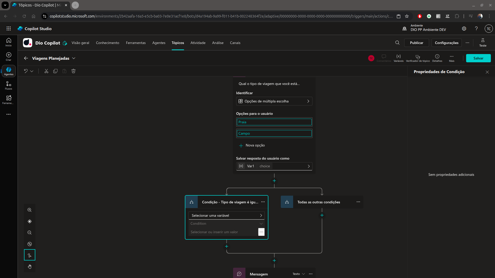
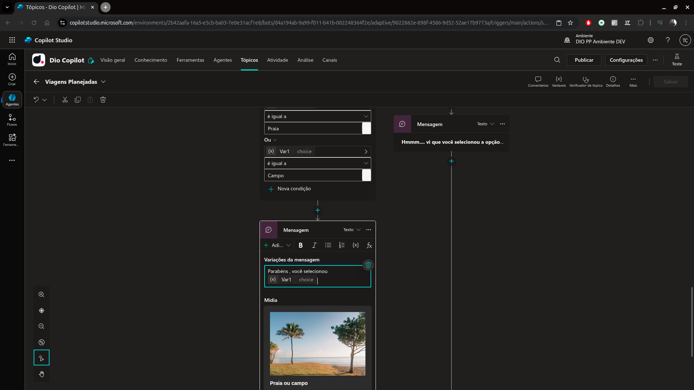
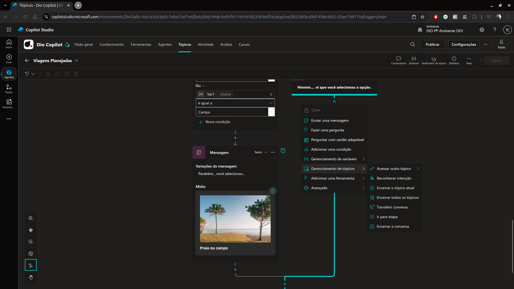
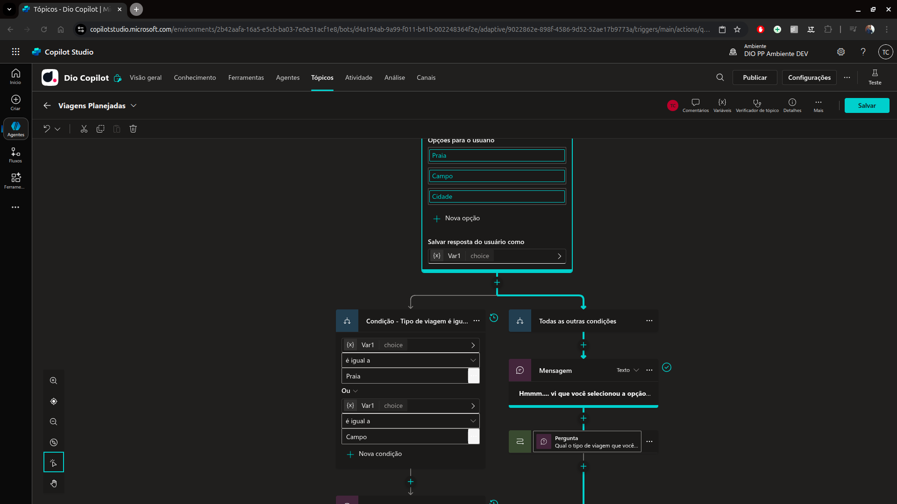
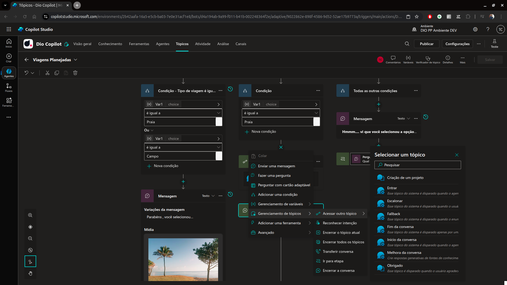
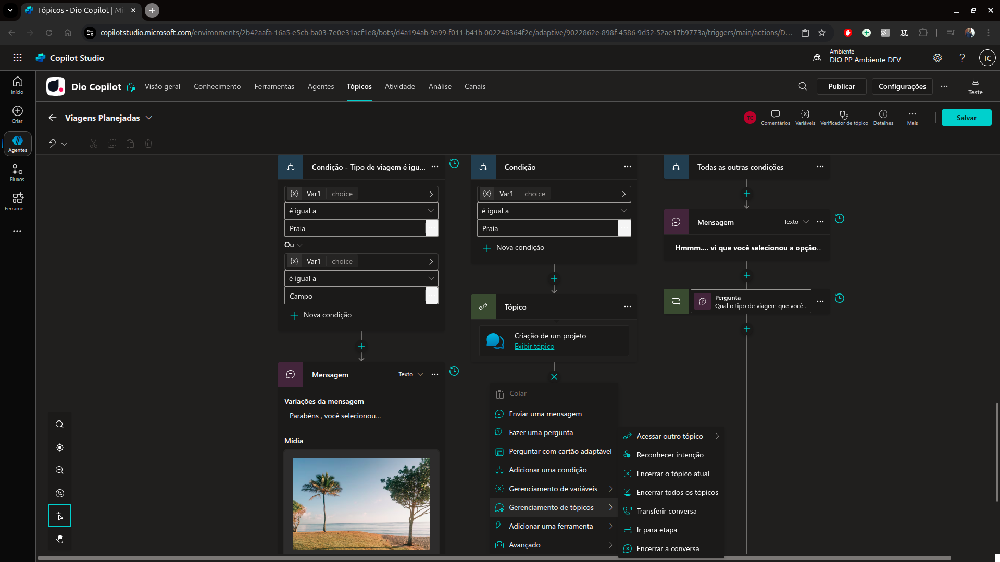

# 5 .Ramificando um tópico no Microfost Copilot Studio 
## Sumário 
- [Quando ramificar](#1-quando-ramificar-um-tópico)
- [Criando uma condição](#2-criando-uma-condição)
- [Redirecionando o fluxo](#3-redirecionando-o-fluxo-da-conversa-para-um-passo-específico)
- [Transferindo o controle](#4-transferindo-o-controle-da-conversa-para-um-novo-tópico)
- [Encerrando a conversa](#5-encerrando-a-conversa-e-o-tópico-atual)
---
## 1. Quando ramificar um tópico 
Dentro do processo de tópicos do Copilot Studio, temos a opção de ramificações por padrão qual adicionamos uma escolha para o usuário essa descrição é salva como uma variável dentro desse tópico. Ou seja sempre que temos múltiplas opções de escolha do usuário a depender da conversa devemos ramificar. 

---
## 2. Criando uma condição 
Após a criação de um fluxo de perguntas de múltipla escolha iremos realizar o passo de adição de condição, para tal basta realizar o passo de clicar sobre o ícone de _"mais"_ e escolher a opção de adicionar uma condição. 

<table style="text-align: center; width: 100%;"> 
<tr>
    <td style="text-align: center;">
    
    </td>
</tr>
</table>

É recomendado para questões de manutenibilidade, que os nomes das condições sejam feitas conforme o contexto. Porém essa notação também pode ser realizada através de um comentário. 
Assim como em outras linguagens de programação a ramificação de tópicos funciona com uma estrutura de `if/else`, nela podemos aglutinar ou destrinchar condições, bem como podemos por exemplo realizar a adição de variáveis em perguntas conforme ilustrado abaixo:

<table style="text-align: center; width: 100%;"> 
<tr>
    <td style="text-align: center;">
    
    </td>
</tr>
</table>

Um ponto válido de ser ressaltado e que em casos de por exemplo ramificações nas quais dependem de verificação de saldo/estoque, podemos realizar essa verificação dentro de um tópico. 

--- 
## 3. Redirecionando o Fluxo da conversa para um passo específico
Para redirecionamento de fluxo, basta clicar sobre o ícone de mais e escolher a opção de `Gerenciamento de tópicos` e selecionar a opção de `ir para etapa` e selecionar a etapa desejada com o mouse 

<table style="text-align: center; width: 100%;"> 
<tr>
    <td style="text-align: center;">
    
    </td>
</tr>
</table>

Ficando por fim um novo fluxo de decisão redirecionando para o fluxo desejado, _"impedindo assim"_ que o fluxo tenha que ser recriado, conforme ilustrado abaixo:

<table style="text-align: center; width: 100%;"> 
<tr>
    <td style="text-align: center;">
    
    </td>
</tr>
</table>

  <strong style="color: red;">IMPORTANTE</strong>
  
 Sempre que for feito o redirecionamento do fluxo de decisão, que no fluxo redirecionado seja selecionada a opção de propriedades  
  e acionado a opção de comportamento da pergunta 

Esse passo é de suma importância pois, através desse passo temos as opções de :  
- `Permitir que a pergunta seja ignorada`
- `Perguntar sempre` 
- `Quantos novos prompts`

é importante se atentar a essa configuração para que o chat em questão não entre em loop, pois sempre que realizamos um redirecionamento de fluxo, 
aquela opção ainda é válida.

--- 
## 4. Transferindo o controle da conversa para um novo tópico
Ainda dentro das opções de __`Gerenciamento de Tópicos`__ é possível realizar ações como redirecionamento de tópicos, ou seja conforme uma condição seja atendida para que o fluxo não seja extenso de mais ou se a opção em sí precisar de um melhor direcionamento podemos realizar o processo de direcionamento para outro tópico, conforme ilustrado abaixo:  

<table style="text-align: center; width: 100%;"> 
<tr>
    <td style="text-align: center;">
    
    </td>
</tr>
</table>

--- 
## 5. Encerrando a conversa e o tópico atual 
Além disso podemos realizar a finalização de encerramento do chat caso uma determinada condição e/ou opção selecionada dentro de um tópico seja atendida, para isso acessaremos novamente o __`Gerenciamento de Tópicos`__ e iremos escolher a opção de encerrar a conversa. 

<table style="text-align: center; width: 100%;"> 
<tr>
    <td style="text-align: center;">
    
    </td>
</tr>
</table>

Esse ponto e importante , para coleta de métricas que podemos obter através do analytics, para visualizarmos o percentual de conversas encerradas, por exemplo. 

--- 
### Links Uteis
[Microsoft Copilot Studio](https://www.microsoft.com/pt-br/microsoft-copilot/microsoft-copilot-studio)
[Tópicos no Copilot Studio](https://learn.microsoft.com/pt-br/microsoft-copilot-studio/guidance/topics-overview)

---
As respostas da aula 5 estão [aqui](imgs/prova/)

---
<table style="text-align: center; width: 100%;"> 
<caption><b>Skils do projeto </b></caption>
<tr>
    <td style="text-align: center;">
    
    </td>
    <td style="text-align: center;">
    
    </td>
<tr> 
</table>

---
Titulo: 5 .Ramificando um tópico no Microfost Copilot Studio  

Autor: Thierry Lucas Chhaves

Data criacao: 05/09/2025

Data modificacao: 25/09/2025

Versao: 1.0  

---