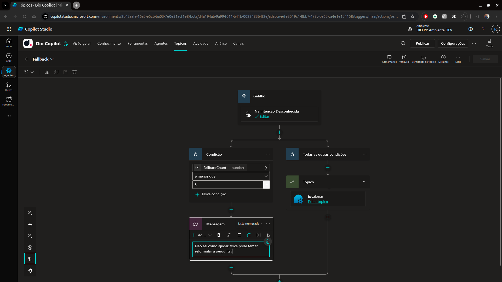

# 6 .Trabalhando com tópicos de Fallback do sistema no Microfost Copilot Studio
## Sumário 
- [Como configurar uma falha no Copilot?](#1-como-configurar-uma-falha-no-copilot)
- [Trabalhando com tópicos de Fallback do Sistema no MSCS](#2-trabalhando-com-tópicos-de-fallback-do-sistema-no-mscs)

---
## 1. Como configurar uma falha no Copilot?
Em resumo um fallback pode ser considerado como algo que não foi configurado para o chatboot, atualmente tende-se a realizar o direcionamento de um fluxo não mapeado para resposta via I.A e a segunda forma é um fallback. Esse fallback seria como um tópico de falhas. 

---
## 2. Trabalhando com tópicos de Fallback do Sistema no MSCS
Esse tópico atualmente encontra-se como um tópico padrão do sistema, ao se gerar um novo agente por exemplo. esse tópico é setado para quando algum tópico ou assunto digitado pelo usuário não seja encontrado caia nesse fallback. 

<table style="text-align: center; width: 100%;"> 
<tr>
    <td style="text-align: center;">
    
    </td>
</tr>
</table>

Esse tópico e importante , pois quando por exemplo realizamos a configuração de um agente que existe aa possibilidade de conversa humana ou que a opção desejada pelo usuário não exista dentro das opções desejadas, o mesmo poderá ser acionado através de um redirecionamento ou algo do tipo. 
Esse tópico que funciona diretamente com o escalonamento é essencial para melhorar a experiência do usuário no quesito de interação com o chat. 
Outro ponto válido de se ressaltar que a apesar de serem tópicos definidos como de sistema podemos reconfigurar algumas partes como por exemplo realizando a edição do tópico de fallback, para que caso a interação não tenha sido atendida após as 3 tentativas, podemos redirecionar para outro tópico. 
E importante também salientar que por padrão o tópico de fallback sempre irá direcionar ou buscar conforme nos tópicos existentes. 

Esse gatilho serve também para quando por algum motivo tivermos 2 tópicos conflitantes. 

---
As respostas da aula 6 estão [aqui](imgs/prova/)

---
<table style="text-align: center; width: 100%;"> 
<caption><b>Skils do projeto </b></caption>
<tr>
    <td style="text-align: center;">
    
    </td>
    <td style="text-align: center;">
    
    </td>
<tr> 
</table>

---
Titulo: 6 .Trabalhando com tópicos de Fallback do sistema no Microfost Copilot Studio 

Autor: Thierry Lucas Chhaves

Data criacao: 05/09/2025

Data modificacao: 25/09/2025

Versao: 1.0  

---