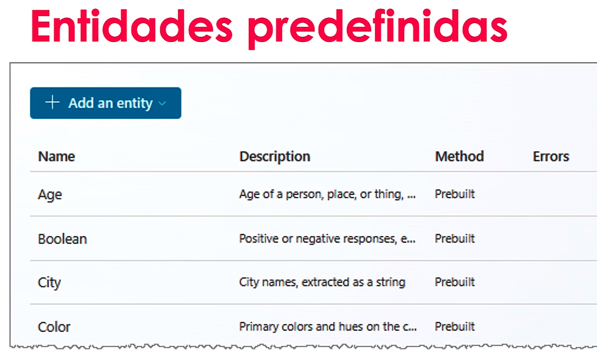
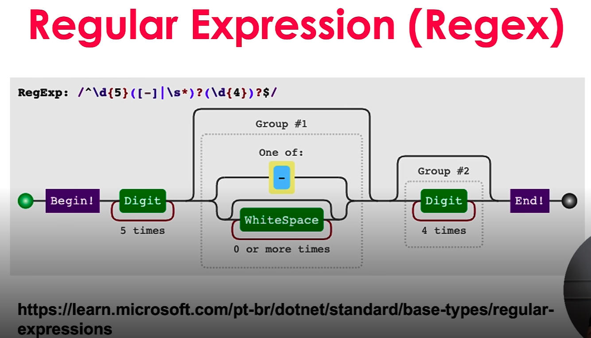
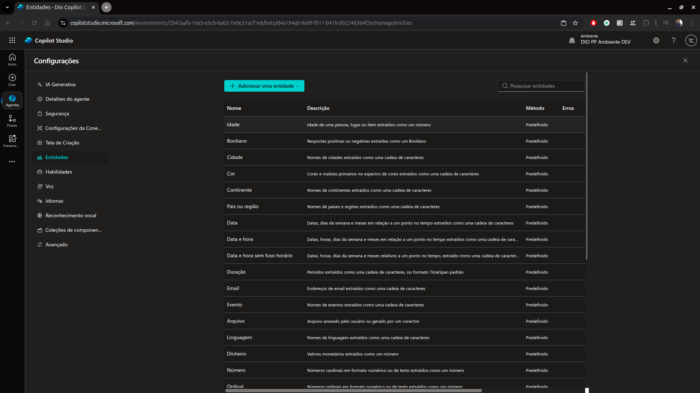

# 7 .Introdução a Entidades e variáveis no Microfost Copilot Studio
## Sumário 
- [O que são entidades](#1-o-que-são-entidades)
  - [Conceito de entidades](#11-conceito-de-entidades)
  - [Preenchimento de Slot](#12-preenchimento-de-slot)
  - [Entidades](#13-entidades)
  - [Tipos de entidades](#14-tipos-de-entidades)
  - [Resumo](#15-resumo)
- [Como usar uma entidade existente](#2-como-usar-uma-entidade-existente)
- [Diferença entre entidade e tipos de perguntas](#3-diferença-entre-entidade-e-tipos-de-perguntas)
- [O que são variáveis](#4-o-que-são-variáveis)

---
## 1. O que são entidades
### 1.1 Conceito de entidades
Uma parte significativa das conversas do copiloto no Copilot Studio é o reconhecimento de linguagem natural, que é a capacidade da IA de compreender a intenção do usuário.   
__Uma entidade__ pode ser considerada uma unidade de informação que representa um certo __tipo de assunto__.

Ou seja quando temos alguma informação que detém algum certo padrão, podemos definir essa unidade de informação como uma entidade vide exemplo CEP/Cidade etc.., ou seja coisas que tenham padrões.  

Em um cenário no qual temos um agente de viagens, temos a opção de escolha pelo usuário de qual será o seu destino,campo, praia ou cidade, onde até o presente momento tais informações estavam definidas fixamente. Entretanto poderíamos ter 2 opções uma delas sendo uma  lista pré-definida(sendo essa secionáveis)
Porém temos uma opção de escolha através de expressões lógicas, onde através dessa escolha seja possível realizar o reconhecimento de qual seria o destino
de sua viagem, através de padrões existentes com o [preenchimento de slots](#12-preenchimento-de-slot).

### 1.2 Preenchimento de slot
O preenchimento de Slot é um __conceito de reconhecimento de linguagem natural__ que significa salvar uma entidade extraída para um objeto.   
No entanto, no Copilot Studio, o preenchimento do slot significa colocar o __valor da entidade__ extraída em uma __variável__ 

### 1.3 Entidades

__Exemplo:__

    

  "Quero solicitar <b style="color: red">50</b> camisetas do <b style="color: red">Brasil</b>  
    para os meus funcionários"
    

    <strong style="color: red;">Entidades</strong> 
    <b style="color: red">Quantidade </b> - 50  
    <b style="color: red">País </b> - Brasil  

### 1.4 Tipos de entidades
__Entidades predefinidas__
- Idade
- Verdadeiro ou Falso
- etc...

__Entidades personalizadas__ 
- Closed list
- Regular expression (Regex)

<table style="text-align: center; width: 100%;"> 
<tr>
    <td style="text-align: center;">
    
    </td>
</tr>
<tr>
    <td style="text-align: center;">
    
    </td>
</tr>
</table>

Para acessar essas entidades que foram citadas, dentro do Copilot Studio, devemos acessar a parte de configuração diretamente no seu agente, após selecionar tal opção, será aberta a tela de configuração do agente, devemos selecionar a opção de entidades. 
<table style="text-align: center; width: 100%;"> 
<tr>
    <td style="text-align: center;">
    
    </td>
</tr>
</table>

### 1.5 Resumo
As entidades podem facilitar as __entradas do usuário__ sem a necessidade de usar a parte de Resposta Generativa ou AI Builder dentro do Copilot Studio para __reconhecer informações já mapeadas__.  

---
## 2. Como usar uma entidade existente
Dentro do processo de manejo/criação de um tópico quando escolhemos por exemplo uma pergunta ao usuário temos a opção de selecionar o tipo de pergunta no campo de identificar, tal qual é feito com as perguntas de múltipla escolha, porém também podemos realizar a substituição desse modelo para que a identificação seja feita através de uma entidade, conforme a lista de entidades visualizadas anteriormente, essa entidades são formas conforme dito anteriormente de identificação de inputs pelo usuário de forma mais fluida, então conforme realizamos a pergunta podemos inserir no campo de identificar  uma entidade condizente. 

--- 
## 3. Diferença entre entidade e tipos de perguntas
Quando devemos diferenciar a utilização de tipos de perguntas e entidades, em suma devemos nos ater ao seguinte:  
Quando desejamos por exemplo _"capturar"_ certas informações, e/ou ignorar algum tipo de entrada fornecida pelo usuário utilizamos entidades. 
Já quando desejamos facilitar ou melhorar a experiência do usuário devemos utilizar tipos de pergunta. 

--- 
## 4. O que são variáveis
Variáveis
---
As variáveis servem para __salvar respostas__ do usuário e __reutilizar seu conteúdo__ posteriormente na conversa.  
Também pode usar variáveis para __criar expressões lógicas__ que direcionam dinamicamente o usuário por diferentes caminhos na conversa.   

__Tipos de variáveis:__  
- Tópico (São variáveis que ficaram presentes somente na conversa, ou naquele determinado tópico)
- Variáveis globais (São variáveis de maior permanência, ou seja independente do tópico ou conversa aquele valor esteja salvo enquanto a sessão estiver ativa)
- Variáveis de sistema (São variáveis fornecidas pela fabricante, podendo ter por exemplo nome do usuário ID etc..)
- Variáveis de ambiente (São variáveis do ambiente/solução)

__Tipos de base de variáveis:__  
- Cadeia de caracteres 
- Boolean
- Número 
- Tabela
- Registros 
- DateTime
- Opção
- Em branco

--- 
### Links Uteis
- [Regex](https://learn.microsoft.com/pt-br/dotnet/standard/base-types/regular-expressions)
- [Trabalhar com variáveis](https://learn.microsoft.com/pt-br/microsoft-copilot-studio/authoring-variables)
---
As respostas da aula 7 estão [aqui](imgs/provas/)

<table style="text-align: center; width: 100%;"> 
<tr>
    <td style="text-align: center;">
    
    </td>
</tr>
</table>

---
<table style="text-align: center; width: 100%;"> 
<caption><b>Skils do projeto </b></caption>
<tr>
    <td style="text-align: center;">
    
    </td>
    <td style="text-align: center;">
    
    </td>
<tr> 
</table>

---
Titulo: 7 .Introdução a Entidades e variáveis no Microfost Copilot Studio 

Autor: Thierry Lucas Chaves

Data criacao: 05/09/2025

Data modificacao: 25/09/2025

Versao: 1.0  

---