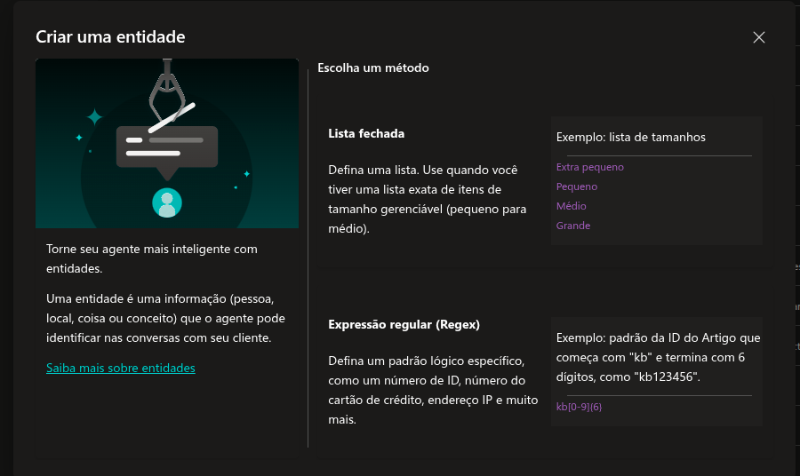
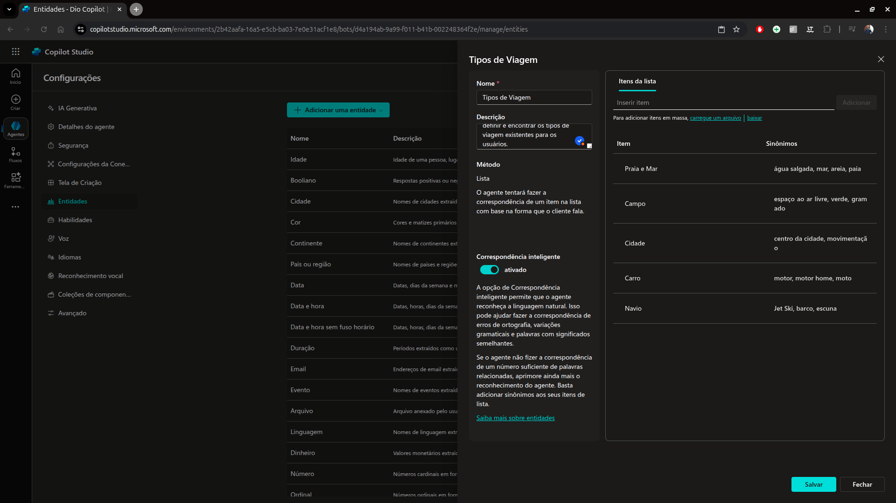
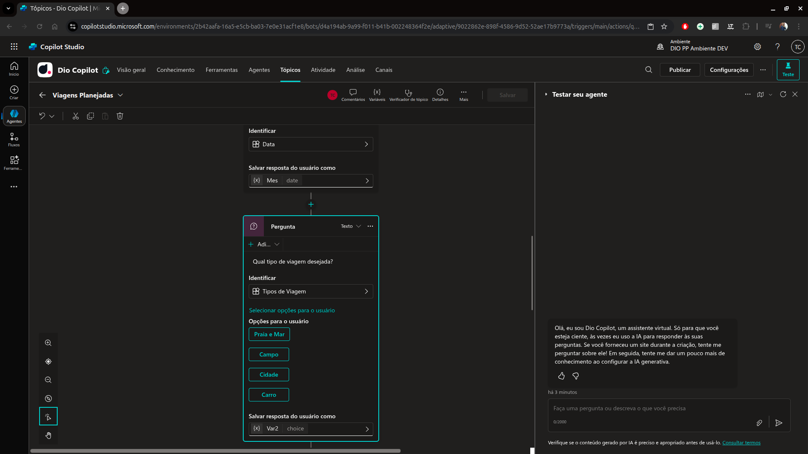
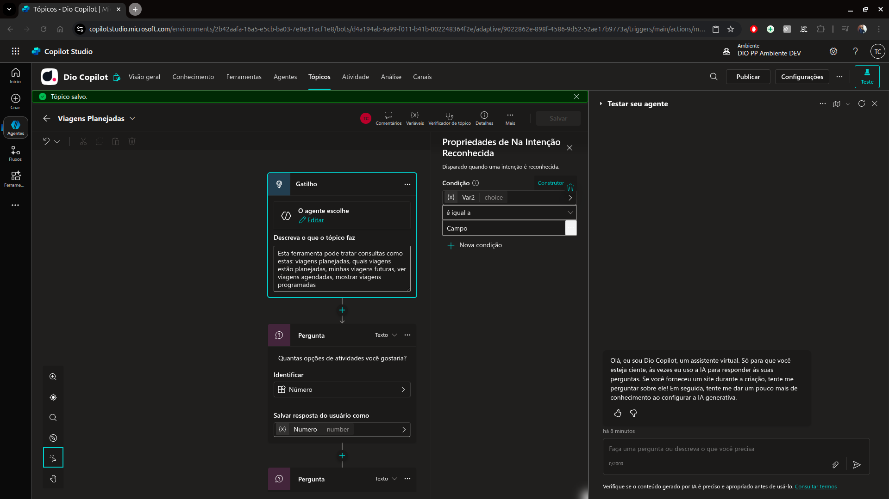
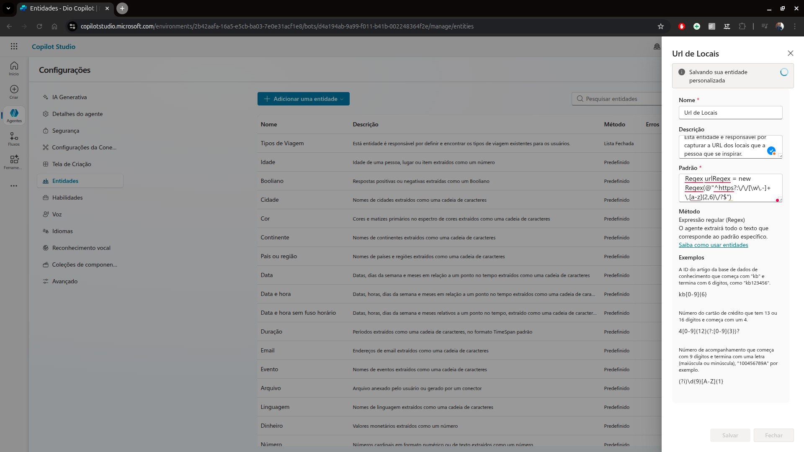

# 8 .Criando Entidades Personalizadas no Microsoft Copilot Studio
## Sumário 
- [Criando uma nova entidade](#1-criando-uma-nova-entidade)
- [Como utilizar uma entidade](#2-como-utilizar-uma-entidade)
- [Inserindo expressões regulares](#3-inserindo-expressões-regulares)
- [Melhores práticas de uma entidade](#4-melhores-práticas-de-uma-entidade)
---
## 1. Criando uma nova entidade 
Dentro das opções de entidades é possível realizar a criação de uma entidade nova a partir de uma entidade externa tais informações podem ser obtidas seguindo a documentação de [Usar entidades e preenchimento de slots em agentes](https://learn.microsoft.com/pt-br/microsoft-copilot-studio/advanced-entities-slot-filling).  

Mas iremos nos ater a como criar uma nova entidade do 0. Para isso dentro das configurações do agente, iremos em configurações e entidades e clicar em `adicionar entidade` e selecionar a opção de `nova entidade`. Ao selecionar a opção de nova entidade será mostrado o card com recomendações da Microsoft sobre a criação de novas entidades com informações que podem ser vistas como a [documentação](https://learn.microsoft.com/pt-br/microsoft-copilot-studio/advanced-entities-slot-filling).  
Conforme visto anteriormente para entidades personalizadas existem 2 tipos possíveis de entidades, sendo eles :
- Lista fechada 
- Expressões regulares.

<table style="text-align: center; width: 100%;"> 
<tr>
    <td style="text-align: center;">
    
    </td>
</tr>
</table>

Para o exemplo dessa entidade a ser criada utilizaremos a opção de lista fechada, ao ser selecionada seremos apresentado ao quadro de opções dessa nova entidade do tipo de `Lista fechada`. Assim como um padrão visualizado dentro do Copilot Studio, temos a priore um card apresentado sendo necessário o preenchimento do nome dessa nova entidade, e uma descrição que é opcional porém é uma boa prática seu preenchimento, ainda nessa mesma tela temos uma funcionalidade denominada de `Correspondência inteligente`, essa funcionalidade permite que caso haja erros de gramatica, variações de sintaxe ou algo do tipo através de recurso de linguagem natural será aplicado o processo de mapeamento das palavras para compreensão e aplicabilidade.
> é recomendado a habilitação dessa funcionalidade, pois como estamos criando um agente de I.A é uma funcionalidade de boa aplicação.  
Na parte direita do card que foi apresentado realizaremos o cadastro da lista de opções possíveis para aquela entidade, sendo possível a realização de `CRUD`. Ainda dentro dessa opção temos a funcionalidade de adição de sinônimos, que funcionaria como uma aplicação direta daquela lista para o reconhecimento de um determinado item da mesma. 


<table style="text-align: center; width: 100%;"> 
<tr>
    <td style="text-align: center;">
    
    </td>
</tr>
</table>

Após a adição dos itens da lista e de seus sinônimos podemos salvar a nova entidade 

---
## 2. Como utilizar uma entidade 
A utilização dessa nova entidade aplica-se de forma bastante similar as entidades pre-existentes do Copilot-Studio, porém como estamos falando de uma lista fechada sua única particularidade de aplicação e que após a seleção da mesma no campo de identificar, devemos selecionar as opções possíveis de seleção para o usuário. 

<table style="text-align: center; width: 100%;"> 
<tr>
    <td style="text-align: center;">
    
    </td>
</tr>
</table>

<div style="border-left: 4px solid red; background-color:rgb(22, 23, 24); padding: 10px;">
  <strong style="color: red;">Dica</strong>
  <p>Dentro da configuração do gatilho é possível realizar a adição de frases de gatilho para auxiliar a entrada de fluxos nos tópicos. </br>
  Isso pode ser feito em caso do gatilho ser feito através da condição de frases, porém podemos adicionar também condições para variáveis.</br>
  </p>
</div>

<div>
  <table style="text-align: center; width: 100%;"> 
  <tr>
    <td style="text-align: center;">
    
    </td>
  </tr>
  </table>
</div>

<div style="border-left: 4px solid red; background-color:rgb(22, 23, 24); padding: 10px;">
  <strong style="color: red;">Dica</strong>
  <p> Também é possível realizar a criação de uma nova entidade dentro da criação de fluxos, o que facilita a aplicação da mesma</p>
</div>

--- 
## 3. Inserindo expressões regulares
Dentro do contexto de entidades temos a opção de expressões regulares também ao selecionar a criação de uma nova entidade, e selecionar a opção de expressões regulares seremos apresentados ao um novo card para essa criação, conforme já visto anteriormente, as expressões regulares dentro do Microsoft Copilot Studio, seguem a notação de `REGEX` do `dotnet`, no card de criação desse tipo de entidade temos 3 campos para o preenchimento, sendo eles:  
- Nome
- Descrição 
- Padrão
```Csharp
Regex urlRegex = new Regex(@"^https?:\/\/[\w\.-]+\.[a-z]{2,6}\/?$");
```

<table style="text-align: center; width: 100%;"> 
<tr>
    <td style="text-align: center;">
    
    </td>
</tr>
</table>

porém é valido ressaltar que dentro do campo padrão somente o campo de valor da expressão regular deverá estar presente, ou seja o campo de atribuição de variável, e notação do `REGEX` __NÃO SERÁ UTILIZADO__, ficando por final a seguinte aplicação no campo `https?:\/\/[\w\.-]+\.[a-z]{2,6}\/?`

--- 
## 4. Melhores práticas de uma entidade 
Melhores práticas
---
- Definir um nome claro 
- Descrever sua entidade para outros darem a manutenção no futuro
- Definir sinônimos para garantir o mapeamento 
- Usar Regex sempre que possível para identificar padrões.
- Quando trabalhamos com entidades estamos nos referindo a padrões fixos e "imutáveis", porém a depender da estrutura do agente é recomendável utilizar uma tabela dinâmica ou uma consulta direta a um banco de dados. 

--- 

### Links Uteis
- [Usar entidades e preenchimento de slots em agentes](https://learn.microsoft.com/pt-br/microsoft-copilot-studio/advanced-entities-slot-filling).  

---
As respostas da aula 8 estão [aqui](imgs/prova/)


---
<table style="text-align: center; width: 100%;"> 
<caption><b>Skils do projeto </b></caption>
<tr>
    <td style="text-align: center;">
    
    </td>
    <td style="text-align: center;">
    
    </td>
<tr> 
</table>

---
Titulo: 8 .Criando Entidades Personalizadas no Microsoft Copilot Studio 

Autor: Thierry Lucas Chhaves

Data criacao: 05/09/2025

Data modificacao: 25/09/2025

Versao: 1.0  

---