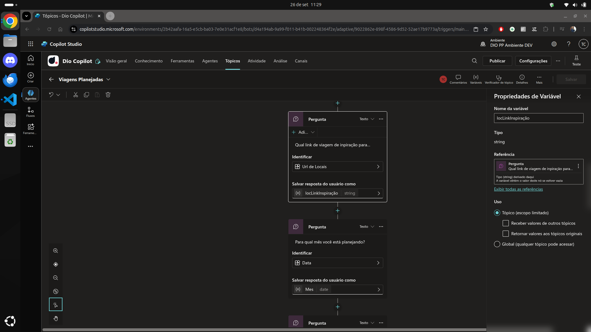
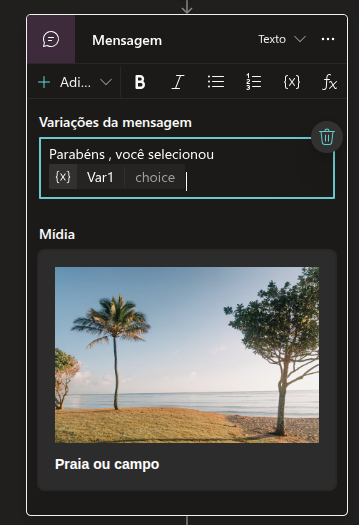
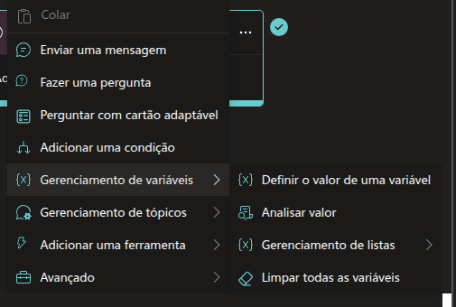
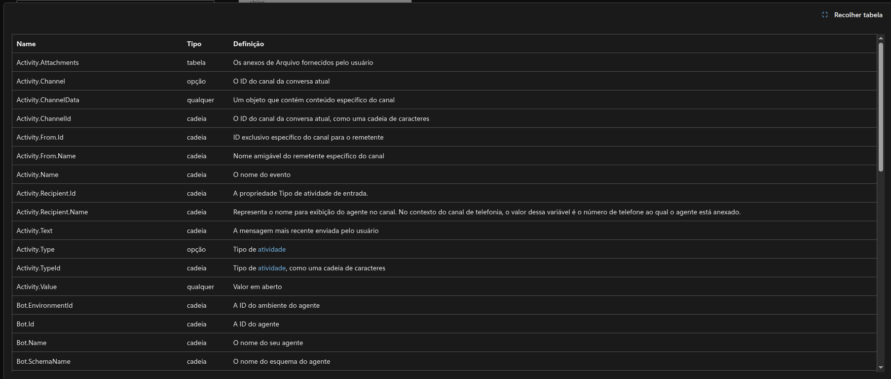
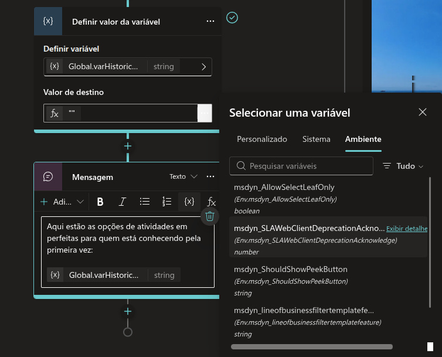
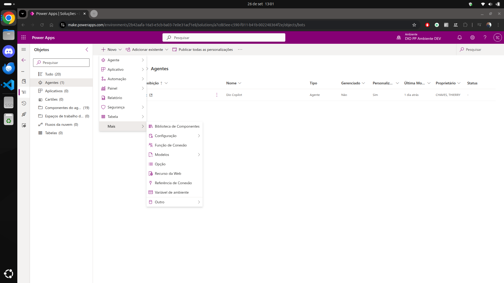
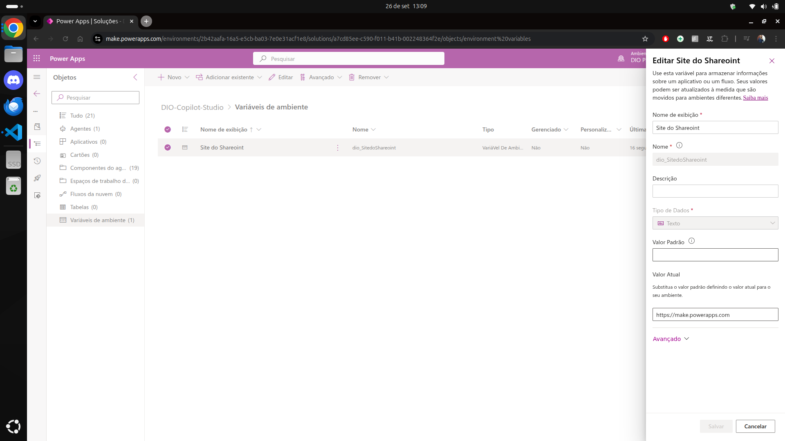
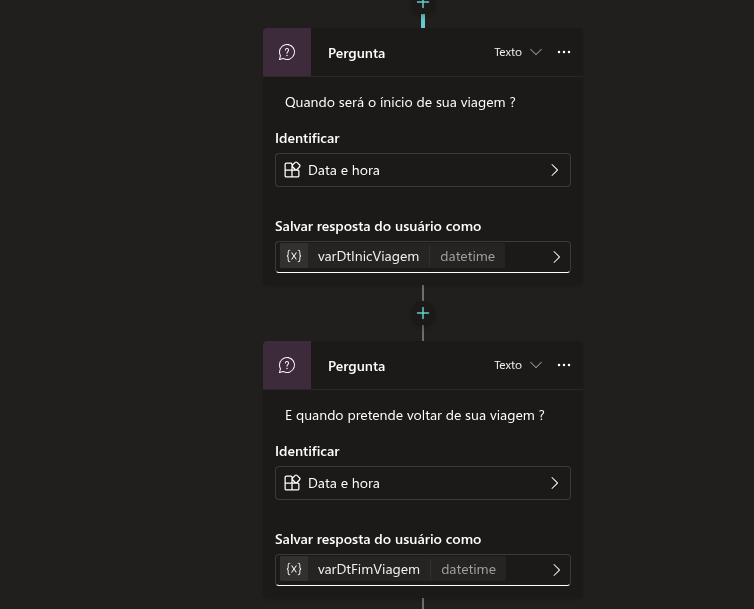
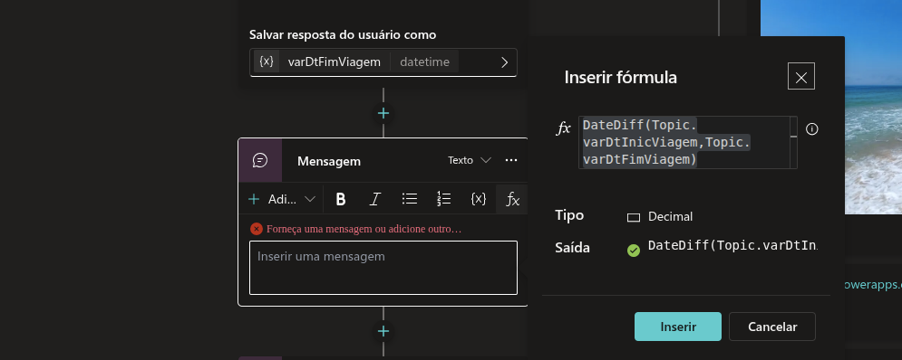
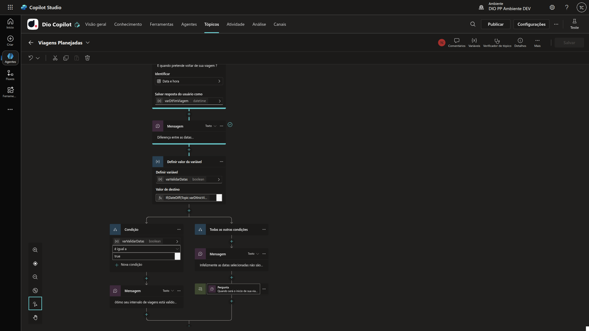

# 9 .Criando Variáveis no Microsoft Copilot Studio
## Sumário 
- [Como definir uma variável](#1-como-definir-uma-variável)
- [Entendendo o uso de varável de tópico ou Global](#2-entendendo-o-uso-de-varável-de-tópico-ou-global)
- [Testando o Uso de variáveis](#3-testando-o-uso-de-variáveis)
- [Gerenciando variáveis](#4-gerenciando-variáveis)
- [Trabalhando com cartões adaptáveis](#5-trabalhando-com-cartões-adaptáveis)
- [Variáveis de tópico e Variáveis globais](#6-variáveis-de-tópico-e-variáveis-globais)
- [Variáveis de Sistema](#7-variáveis-de-sistema)
- [Variáveis de Ambiente](#8-variáveis-de-ambiente)
- [Exemplos de casos reais](#9-exemplos-de-casos-reais)
- [Criando Fórmula para comparar datas](#10-criando-fórmula-para-comparar-datas)
- [Ajustando a fórmula para validação condicional](#11-ajustando-a-fórmula-para-validação-condicional)
- [Criando fórmula para calcular preço](#12-criando-fórmula-para-calcular-preço)
- [Cirando fórmula para salvar histórico da conversa](#13-cirando-fórmula-para-salvar-histórico-da-conversa)
---
## 1. Como definir uma variável
O primeiro ponto a se atentar e que para criação de variáveis, e necessário que esteja dentro de um tópico, ou seja uma variável sempre estará dentro de um determinado tópico.
Até o presente momento estávamos utilizando variáveis que tinham como intuito a coleta de informações fornecidas pelos usuários através de perguntas ou entidades.  
Quando utilizamos esse tipo de variáveis, podemos acessar suas propriedades clicando diretamente nela, e assim como feito em programação é uma boa prática realizar a renomeação das mesmas, vide exemplo abaixo:  

<table style="text-align: center; width: 100%;"> 
<tr>
    <td style="text-align: center;">
    
    </td>
</tr>
</table>

Outro ponto de boa prática a ser adotada, são os tipos de nomeações das variáveis, onde:  
- `var` Utilizado para variáveis globais 
- `loc` Utilizado para variáveis locais

<div style="border-left: 4px solid red; background-color:rgb(22, 23, 24); padding: 10px;">
  <strong style="color: red;">Adendo</strong>
  <p> Não foi explicitamente dito porém o padrão para nomeações segue o esquema de CamelCase.</p>
  <p> Outro ponto é que ao se renomear uma variável criada através de perguntas, e necessário verificar o escopo do fluxo, pois pode afetar as referências
  dependentes daquela variável </p>
</div>

---
## 2. Entendendo o uso de varável de tópico ou Global
Dentro do escopo de uma variável, e possível realizar a verificação das referências daquela variável, dentro da propriedade da mesma será lista quais são as referências da mesma.

<table style="text-align: center; width: 100%;"> 
<tr>
    <td style="text-align: center;">
    
    </td>
</tr>
</table>

Dentro das propriedades da variável ainda é possível realizar a funcionalidade de `não obter valor deste nó se estiver vazio`, com essa função caso essa pergunta,ou nó do fluxo não tenha um valor essa variável não terá atribuição de valor caso não seja utilizado. 

Outro ponto que podemos notar no `menu de propriedades` de uma variável, é a definição de utilização daquela variável, onde possuímos 2 opções principais, sendo referente a sua utilização.   
Aqui definimos se a variável em questão será de uso _"exclusivo do tópico"_ ou de utilização global. Dentro das configurações de variáveis globais existe a opção de `as fontes externas podem definir valores` com essa opção ativa, em caso de por exemplo o copiloto estiver dentro de um site é possível que através da URL por exemplo seja definido o valor para aquela variável. 

--- 
## 3. Testando o Uso de variáveis
Dentro de um nó de mensagem por exemplo podemos utilizar o valor capturado de uma variável para evitar alguma escrita, ou algum outro tipo de utilização da qual seja interessante utilizar a mesma. 

<table style="text-align: center; width: 100%;"> 
<tr>
    <td style="text-align: center;">
    
    </td>
</tr>
</table>

Na barra superior dentro do tópico existe a opção de variáveis, onde através desse ícone, podemos ter acessos a todas variáveis e acessar suas propriedades.   

--- 
## 4. Gerenciando variáveis
Sempre que vamos adicionar um novo`nó` dento do fluxo do tópico, temos algumas opções dentre elas temos a opção de __`gerenciamento de variáveis`__, onde através dessa funcionalidade é possível realizar algumas interações com tais variáveis. sendo elas:  

<table style="text-align: center; width: 100%;"> 
<tr>
    <td style="text-align: center;">
    
    </td>
</tr>
</table>

Uma utilização muito comum do __`gerenciamento de variáveis`__ é a opção de definir um valor de variável, um exemplo de sua utilização é para o armazenamento do histórico da conversa, isso e amplamente utilizado quando por exemplo quando for utilizado o contexto dessa conversa para uma I.A tenha todo o histórico dessa conversa ou dessa sessão do usuário para que a I.A possa entender e interpretar da melhor forma o que estava sendo tratado com o seu chatbot, ou seja ela irá acessar o contexto da conversa já feita previamente e manter aquele contexto sem a necessidade de uma nova conversação e contextualização. 
Outra utilização possível de atribuição de variável e que essa seja a partir de outra variável. Além dessas opções temos como realizar um _"parse"_ dos valores de alguma variável, ou seja atribuir um outro tipo para uma determinada variável para outra variável. 

--- 
## 5. Trabalhando com cartões adaptáveis
A utilização de um cartão adaptável , se da em um contexto quando por exemplo desejamos realizar múltiplas perguntas de uma vez, ou seja ao invés de utilizar variáveis criadas a partir de perguntas ou entidades para captura de informações, utilizamos cartões adaptáveis, onde com essa utilização temos o fluxo de in/out , ou seja além de poder utilizar as variáveis que são criadas com esse cartão adaptável para fazer alguma automação, também podemos utiliza-las como saídas que se tornam variáveis. 

---
## 6. Variáveis de tópico e Variáveis globais
Uma forma de identificação de uma variável se ela é de utilização global ou de tópico e através da descrição da mesma quando por exemplo vamos inserir essa variável dentro de uma mensagem, em vias de regra essas variáveis criadas sempre ficam na aba de personalizadas. Essa variáveis ali apresentadas são variáveis locais pertencentes aquele tópico em especifico. 

<table style="text-align: center; width: 100%;"> 
<tr>
    <td style="text-align: center;">
    
    </td>
</tr>
</table>


---  
## 7. Variáveis de Sistema
Ainda dentro do menu de variáveis, temos a aba de `sistema`, essas variáveis podem ser consultas na [documentação de variáveis do Copilot Studio](https://learn.microsoft.com/pt-br/microsoft-copilot-studio/authoring-variables?tabs=webApp), dentro de tal documentação teremos uma lista tanto de tipos de variáveis como de sua utilização, como o tipo da variável e sua utilização isso quando falamos de variáveis de sistema, conforme exemplo abaixo:

<table style="text-align: center; width: 100%;"> 
<tr>
    <td style="text-align: center;">
    
    </td>
</tr>
</table>

Em termos gerais, essa variáveis podem ser utilizadas de diferentes formas, mas o que é valido ressaltar e que como o nome diz tais variáveis são próprias do Copilot Studio.

Uma utilização digna de nota, são das variáveis para autenticação integradas, essa variáveis servem para captura de informações do usuário ativo de uma sessão como por exemplo qual o E-mail do usuário que está realizando a interação com o copilot caso esse esteja em um ambiente de utilização do Office 365 por exemplo. 

---  
## 8. Variáveis de Ambiente
Por fim dentro desse painel teremos as variáveis de ambiente, por padrão essas variáveis ficam listadas como a ultima aba 

<table style="text-align: center; width: 100%;"> 
<tr>
    <td style="text-align: center;">
    
    </td>
</tr>
</table>

Dentro dessa aba serão listadas por padrão alguma variáveis criadas pela própria Microsoft que condizem ao contexto do ambiente em sí, porém temos a opção de criar esses novos tipos de variáveis. 
<div style="border-left: 4px solid red; background-color:rgb(22, 23, 24); padding: 10px;">
  <strong style="color: red;">Dica</strong>
  <p> Como os ambientes tanto do COpilot Studio, quanto do Power Automate são compartilhados, então aconselha-se </br>
  que sua criação seja feita através do <a href="https://make.powerapps.com/"> make powerapp </a>
   </p>
</div>

Para que seja criado uma nova variável de ambiente, e de suma importância se atentar que somente será possível a confecção de tal processo caso o seu `Copilot` esteja em conjunto de uma solução. E para adição da mesma dentro do ambiente do [PowerApp](https://make.powerapps.com/), ao selecionar sua solução será exibido todo o contexto de estruturas do agente que foram criados, porém para adicionar uma nova variável de ambiente, dentro da solução deve-se clicar em novo, mais e terá uma opção de __`Variável de ambiente`__: 
<table style="text-align: center; width: 100%;"> 
<tr>
    <td style="text-align: center;">
    
    </td>
</tr>
</table>

Ao selecionar tal opção será apresentado um novo card ao lado direto da tela com 4 campos sendo eles:
- Nome de exibição
- Nome (ou seja o nome interno da variável )
- Descrição
- Tipos de dados. 

<table style="text-align: center; width: 100%;"> 
<tr>
    <td style="text-align: center;">
    
    </td>
</tr>
</table>

Quando criamos uma nova variável de ambiente é possível realizar a definição de um valor padrão para aquela variável como também um valor atual para a mesma. 

<div style="border-left: 4px solid red; background-color:rgb(22, 23, 24); padding: 10px;">
  <strong style="color: red;">Importante</strong>
  <p> Após ser criada, é possível que essa variável não seja apresentada automaticamente no Copilot Studio, então após o processo de criação da mesma no PowerApps, é recomendável que seja atualizado a pagina ! </p>
</div>

---  
## 9. Exemplos de casos reais
Para que possamos expandir nosso conhecimento, podemos e devemos utilizar de mais ferramentas disponíveis pelo Copilot Studio, algumas delas são as formulas disponíveis pelo PowerFX, que assemelham-se como formulas do Excel, e sua utilização e vital quando desejamos realizar um chatbot mais elaborado.Abaixo segue uma lista de possíveis casos de utilização.  

Exemplos de casos reais
---
- Comparar duas datas para férias 
- Customizar o nome do usuário 
- Verificar se uma data está dentro do período 
- Calcular preço com imposto 
- Verificar se tem um produto no estoque 
- Calcular a média de preço   

---
## 10. Criando Fórmula para comparar datas
Agora para exemplificar melhor a sua utilização voltaremos ao tópico criado anteriormente de dicas de viagem e iremos construir uma formula para comparar datas.   

Antes de realizar a confecção de tal formula iremos adicionar no nosso tópico 2 perguntas para obter tais variáveis, sendo a primeira para coleta da data de inicio da viagem e outra para data final 

<table style="text-align: center; width: 100%;"> 
<tr>
    <td style="text-align: center;">
    
    </td>
</tr>
</table>

Pós criação desses questionamentos, iremos realizar o processo de criação de uma formulá, e para sua exibição criaremos mais um Nó de mensagem dentro do nosso tópico e utilizaremos nessa mensagem, a opção de formula. Assim como todos os processos vistos anteriormente podemos consultas a [documentação de formulas](https://learn.microsoft.com/en-us/power-platform/power-fx/overview), disponibilizadas pela Microsoft, para melhor embasamento nessa criação. 
Porém para facilitar a criação nesse caso como desejamos realizar a comparação entre duas datas a formula a ser utilizada é:
```
DateDiff(Topic.varDtInicViagem,Topic.varDtFimViagem)
```
Dentro dessa utilização existem algumas notações importantes para sua utilização, uma delas sendo sobre a utilização das variáveis. E valido ressaltar que para cada tipo de variável (tópico, global, sistema ou de ambiente) temos que adicionar essa tipagem antes da definição dessa variável, no caso como criamos duas variáveis de tópico a notação será `Topic.`, assim como para variáveis globais utilizaremos `Global.`, ou para utilização de variáveis de sistema utilizamos `Env.`, quando utilizamos essa notação, será demonstrado uma lista de todas as variáveis disponíveis para o tipo de variável definida.  Ainda no campo das formulas será exibido na tela da formula, qual será o seu retorno e sua saída. 

<table style="text-align: center; width: 100%;"> 
<tr>
    <td style="text-align: center;">
    
    </td>
</tr>
</table>

---  
## 11. Ajustando a fórmula para validação condicional
Para realizar validações condicionais, segue-se a mesma notação de quase todas linguagens de programação com utilização de `if else`, ou seja com o ajuste listado abaixo a formula em questão passa para uma estrutura de validação lógica:  
```
If(DateDiff(Topic.varDtInicViagem,Topic.varDtFimViagem) >0,true,false)
```
Ao realizar o processo acima, automaticamente o tipo do retorno torna-se como do tipo boolean.

<table style="text-align: center; width: 100%;"> 
<tr>
    <td style="text-align: center;">
    
    </td>
</tr>
</table>

Agora como queremos tratar esse tipo de retorno um modo de se realizar pode ser através de uma estrutura de condição, porém para tal conven-se realizar uma atribuição de valor em variável para que essa nova variável receba o valor da formula, e dentro da condicional realizamos com base nessa nova variável, outro ponto e que como estamos lidando com variáveis bolanas o valor de `true or false` deve ser inserido dentro do campo formula.   
Assim teremos um fluxo para tratar nossa condição:

<table style="text-align: center; width: 100%;"> 
<tr>
    <td style="text-align: center;">
    
    </td>
</tr>
</table>

---  
## 12. Criando fórmula para calcular preço
Nessa etapa para definição de preços iremos retornar a [PowerApp](https://make.powerapps.com/), onde iremos criar uma nova variável de ambiente para definirmos um padrão de taxa.  
<div style="border-left: 4px solid red; background-color:rgb(22, 23, 24); padding: 10px;">
  <strong style="color: red;">Importante</strong>
  <p> E de suma importância atenta-se para o tipo de pontuação, quando estamos falando de países diferentes</p>
</div>

Para sua utilização e explicação direta criamos uma nova variável de tópico com um valor de serviço fixo, posteriormente adicionamos em um nó de mensagem a seguinte formula:  
```
Topic.varValorDoServico + (Topic.varValorDoServico * Env.dio_TaxadoImpostoporvenda /100)
```
onde foi calculado o valor do serviço denominado de `Topic.varValorDoServico ` vezes o valor da taxa de serviço que foi anteriormente definido na nossa variável de ambiente `Env.dio_TaxadoImpostoporvenda` e fazemos o calculo de porcentagem simples 

---  
## 13. Cirando fórmula para salvar histórico da conversa
Por fim criaremos uma fórmula para salvar nosso histórico da conversa, para tal dentro do nosso tópico então em nossa variável de conversas, podemos fazer da seguinte maneira, na atribuição de valor desta variável iremos substituir sua atribuição para um formula, lembrando que o histórico de uma conversa e o que já foi feito mais o histórico novamente.   
Então para tal podemos realizar por exemplo uma formula que também é usada no Excel que é o `concatenate` ou `concat`, onde pegamos o histórico em sí e o concatenamos com por exemplo os valores das variáveis. 


---  
### Links Uteis
- [Documentação de variáveis do Copilot Studio](https://learn.microsoft.com/pt-br/microsoft-copilot-studio/authoring-variables?tabs=webApp)
- [PowerApp](https://make.powerapps.com/)
- [Formulas PowerFX](https://learn.microsoft.com/en-us/power-platform/power-fx/overview)

---
As respostas da aula 9 estão [aqui](imgs/prova/)

---
<table style="text-align: center; width: 100%;"> 
<caption><b>Skils do projeto </b></caption>
<tr>
    <td style="text-align: center;">
    
    </td>
    <td style="text-align: center;">
    
    </td>
<tr> 
</table>

---
Titulo: 9 .Criando Variáveis no Microsoft Copilot Studio 

Autor: Thierry Lucas Chhaves

Data criacao: 05/09/2025

Data modificacao: 26/09/2025

Versao: 1.0  

---