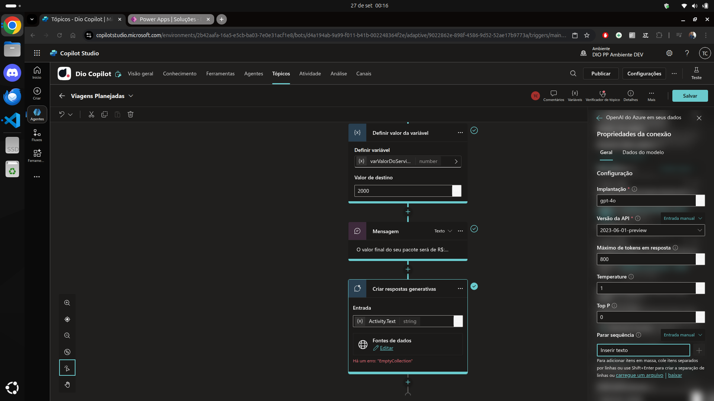

# 10 .Criando respostas generativas com IA no Microfost Copilot Studio
## Sumário 
- [O que é resposta generativa ?](#1-o-que-é-resposta-generativa)
- [Como encontrar essa configuração no Copilot Studio ?](#2-como-encontrar-essa-configuração-no-copilot-studio)
- [Conceitos importantes de GenAI no Copilot](#3-conceitos-importantes-de-genai-no-copilot)
- [Como definir as melhores configurações para resposta apropriada ?](#4-como-definir-as-melhores-configurações-para-resposta-apropriada)
- [O que são Knowledge Souces ?](#5-o-que-são-knowledge-souces)
---
## 1. O que é resposta generativa 
As respostas generativas são um conteúdo que é adicionado. Conforme descrito pela própria Microsoft o que são e como utilizar respostas generativas dentro do Copilot Studio: 
> "Habilite o bate-papo multi-turno em suas próprias fontes de conhecimento internas e externas com sites de respostas generativas. Os agentes podem responder milhares de perguntas imediatamente em segundos. Você pode extrair dados de uma API ou outro sistema de Back-end e habilitar o bate-papo generativo sobre ele "

No contexto do Microsoft Copilot Studio, podemos criar um agente de inteligencia artificial com base em dados próprios, sejam eles uma planilha do Excel, um site do SharePoint ou até mesmo um banco de dados, isso é denominado como _base de conhecimento_ do agente, caso não possua por padrão ele irá utilizar um `LLM` para gerar sua resposta. 

Já quando falamos sobre o carregamento dos arquivos, conforme descrito pela Microsoft: 
> "Carregue os arquivos para o uso com o Gernerative Answeres para o Dataverse com segurança. DOcumentos baseados em texto hospedado e indexados para uso com o Gen Answeres. Suporte para vários formatos, como `Word, Excel, PowerPoint, PDF, TXT, CSV, XML, EPUB, RTF, JSON` e muitos outros. com controle em nível de nó."

E importante lembrar que por exemplo diferente do que são feitos com `LLM'S` a base de conhecimento utilizam uma estrutura para obtenção de base de conhecimento de hack, ou seja ele consome o arquivo e gerar respostas com aproximação de sintaxe, o que implica por exemplo que ele não fara cálculos encima de dados da base de conhecimento a não ser que sejam feitos inputs específicos.   
É importante lembrar que uma vez que o for publicado o copiloto e compartilhado, será possível por esse usuário que o mesmo consuma todos aqueles arquivos que foram carregados de forma ilimitada, o que implica em situações de por exemplo base de conhecimento com informações confidenciais, podem ser acessadas por pessoas ou clientes que tenham acesso ao seu copiloto. 

Outra para que podemos citar também condiz com a parte de ações e plugins, mais uma vez parafraseando o painel da Microsoft:  
>"Adicione plugins para permitir que seu agente converse por meio de suas APIS. Adicione plugins com base em mais de 1.000 conectores pré-criados ou crie plugins para suas APIs personalizadas. Ou combine-os em fluxos de trabalho complexos. A conversa é gerada automaticamente para preencher as entradas necessárias para executar plugins, Chame um plugin explicitamente de um Tópico ou use a nova visualização pública de Ações Generativas para permitir que seu agente escolha quando chamar um plugin"

As ações e plugins em certo modo podem ser definidas como uma evolução dos tópicos, onde uma vez criamos um conteúdo de ramificação fixa com os tópicos, com as ações e plugins temos um dinamismo maior conforme a conversação. 

---
## 2. Como encontrar essa configuração no Copilot Studio
Por padrão dentro do nosso Copilot Studio temos os tópicos, podendo ser eles tópicos customizados ou tópicos de sistema. Temos um tópico de sistema denominado de Melhora da conversa. Ao acessarmos esse tópico podemos criar novos nós que utilizaram como base as respostas generativas de I.A.   
Ese tópico normalmente é utilizado quando o bot não reconhece alguma informação advinda dos tópicos criados ou padrões de sistema, esse tópico é ativado. Dentro desse tópico temos a opção de por exemplo adicionar uma resposta generativa como nó. 
<table style="text-align: center; width: 100%;"> 
<tr>
    <td style="text-align: center;">
    
    </td>
</tr>
</table>

Onde seu input será uma variável com um texto, e ainda sendo possível realizar a adição das bases de conhecimento para aquela saída. Nesse tópico temos um nó criado chamado de `Criar respostas generativas`, onde como sua variável de input está definida como _`System.Activity.Text`_ ou seja essa variável de sistema define a mensagem corrente do usuário. 
Dentro das configurações das respostas generativas é possível fazer com que não seja enviado uma resposta ao usuário que está interagindo, e sim salva-la diretamente como variável, basta desabilitar a opção de enviar mensagem nas propriedades do nó. 

<table style="text-align: center; width: 100%;"> 
<tr>
    <td style="text-align: center;">
    
    </td>
</tr>
</table>

Além desse tópico em especifico também é possível realizar a adição desse nó em outros tópicos e fluxos, basta realizar o mesmo passo de adição de resposta generativa descrito acima. 
O modo de habilitar uma resposta generativa, caso essa não esteja ativa para o seu copiloto é através das configurações do copiloto, onde teremos a opção no painel a esquerda da tela denominado de `IA Generativa`, nesse menu de configurações temos opções como o nível de moderação da I.A onde temos os níveis baixo, médio e alto por assim dizer, esse modos podem definir como a I.A irá se comportar quanto a resposta. 
Quando habilitado as respostas generativas, podemos visualizar dentro do nosso agente uma aba de `Atividade` onde é possível realizar o rastreio das informações que são geradas durante a interação com o boot.   
Atualmente o processo de criação de conexões e plugins são feitas através da aba de `ferramentas` 

--- 
## 3. Conceitos importantes de GenAI no Copilot
Antes de realizar esse processo como um todo precisamos nos ater a certas configurações, uma delas é o __`Balanceamento de Conteúdo`__  tal processo pode ser feito tanto pelas configurações do agente, como também diretamente nas `propriedades do nó`. 
<table style="text-align: center; width: 100%;"> 
<tr>
    <td style="text-align: center;">
    
    </td>
</tr>
</table>

Outro ponto e dentro da configuração do nó do tópico, temos um limite de Tokens e nessa configuração podemos criar ou customizar o prompt para aquela resposta que está sendo gerada, ou seja ao invés de gerar o prompt na parte de formulas podemos gerar um prompt customizado para aquela resposta que está sendo gerada. Ainda dentro das configurações do nó temos a opção de `Permitir que a IA use seus próprios conhecimentos gerais (versão preliminar)` uma vez que esse parâmetro seja desabilitado impossibilita que a I.A gere respostas com base na web, forçando-o a buscar tais informações com base no conhecimento local. Ainda sobre as configurações tempos a opção de completo, quando habilitada a reposta não será somente textual e sim toda a estrutura por trás como por exemplo o JSON, essa informação caso não seja apresentada na conversa poderá ser capturada através do monitoramento de variáveis.  

--- 
## 4. Como definir as melhores configurações para resposta apropriada
Uma das boas práticas para além das configurações que foram citadas anteriormente, trata-se da adição de base de conhecimento para sua resposta, ou seja quando estamos configurando uma resposta customizada, podemos adicionar exclusivamente ao Nó uma ou mais bases de conhecimento desejadas, para que a resposta seja mais precisa e coesa com o contexto, além de claro desativar a opção de `Permitir que a IA use seus próprios conhecimentos gerais (versão preliminar)`, para além dos tipos de arquivos válidos que foram citados, caso possuirmos um site publico da WEB é possível parametrizar a resposta de nó com base nesse site publico.  
Para além desse processo podemos também realizar uma conexão exclusiva com o Azure Open I.A onde é possível realizar a adição de um modelo especifico limitar os tokens por mensagem, sua versão de release, também temos a opção de configuração de temperatura quanto mais próximo de 0 menor a criatividade. 

<table style="text-align: center; width: 100%;"> 
<tr>
    <td style="text-align: center;">
    
    </td>
</tr>
</table>

Um ponto importante que foi destacado é que os campos de temperatura e TOP, é recomendável que sejam inversamente proporcionais.  

--- 
## 5. O que são Knowledge Souces 
Essa parte foi adicionada pela Microsoft, para realizar a parte de treinamento da sua I.A através dessa configuração não nos limitamos a somente respostas generativas pelos modelos de `LLM` existentes, podemos realizar a adição de base de conhecimentos próprios para o treinamento desse chat. 
Para sua configuração dentro do agente 

<table style="text-align: center; width: 100%;"> 
<tr>
    <td style="text-align: center;">
    
    </td>
</tr>
</table>

Dentro dessa aba em questão quando realizamos a ação de adição de base de conhecimentos, temos algumas opções disponíveis. 

<table style="text-align: center; width: 100%;"> 
<tr>
    <td style="text-align: center;">
    
    </td>
</tr>
</table>

Podemos por exemplo realizar a adição de sites da web específicos, quando realizamos esse passo podemos confirmar a autoria de tal site. 
outro ponto é que quando adicionamos um Site, o agente é capaz de realizar a busca por níveis ou seja quando adicionamos um tópico especifico de um site, todos os seu sub-tópicos serão adicionados também, porém o que vem para traz não será adicionado. Quando realizamos esse tipo de adição o agente é capaz de realizar a adição de tópicos e referências das respostas.  
Quando realizamos a adição manual de arquivos, é importante lembrar que como os arquivos serão armazenados no dataverse da microsoft, isso implica em espaço de armazenamento do mesmo, então é de suma vália avaliar sua necessidade. 

Por fim quando realizamos a adição através dessa opção, quando adicionarmos um tópico de respostas generativas, será possível selecionar quais serão as bases de conhecimento a serem utilizadas, para aquela resposta. 

--- 
### Links Uteis
- [Microsoft Copilot Studio](https://www.microsoft.com/pt-br/microsoft-copilot/microsoft-copilot-studio)

---
As respostas da aula 10 estão [aqui](imgs/prova/)

s---
<table style="text-align: center; width: 100%;"> 
<caption><b>Skils do projeto </b></caption>
<tr>
    <td style="text-align: center;">
    
    </td>
    <td style="text-align: center;">
    
    </td>
<tr> 
</table>

---
Titulo: 10 .Criando respostas generativas com IA no Microfost Copilot Studio 

Autor: Thierry Lucas Chhaves

Data criacao: 05/09/2025

Data modificacao: 27/09/2025

Versao: 1.0  

---