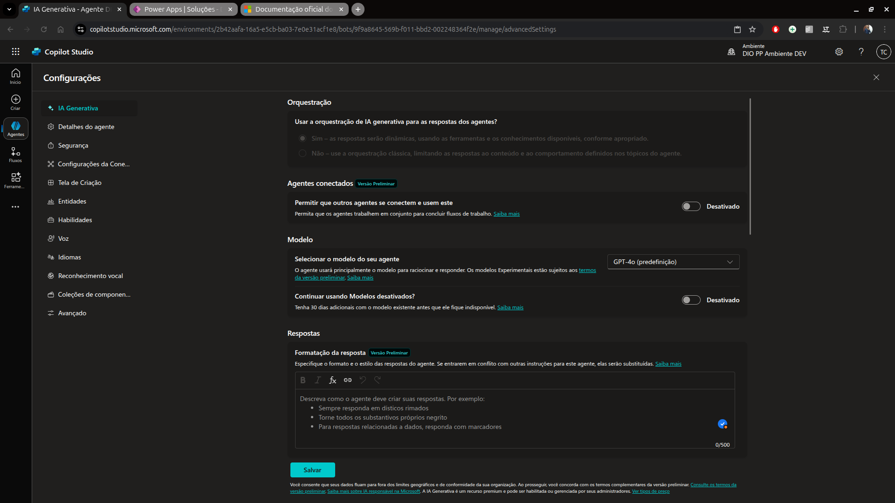

# 11 .Criando um copiloto com fluxo de conversa personalizado no Microfost Copilot Studio
## Sumário 
- [Criar um Copilot em branco](#1-criar-um-copilot-em-branco)
- [Customizar um tópico](#2-customizar-um-tópico)
- [Personalizar uma mensagem de erro de um tópico](#3-personalizar-uma-mensagem-de-erro-de-um-tópico)
- [Aumentar e diminuir a qualidade da resposta com GenAI ](#4-aumentar-e-diminuir-a-qualidade-da-resposta-com-genai)
- [Entendendo o desafio](#5-entendendo-o-desafio)

---
## 1. Criar um Copilot em branco
Dentro do [Microsoft Copilot Studio](https://www.microsoft.com/pt-br/microsoft-copilot/microsoft-copilot-studio), iremos acessar a parte de agentes, e clicar sobre a opção de `Novo agente`, seremos apresentados a parte de configuração do agente, essa podendo ser tanto com auxilio de um prompt de I.A, quanto pela parte de configuração, e essa será a que iremos escolher.

<table style="text-align: center; width: 100%;"> 
<tr>
    <td style="text-align: center;">
    
    </td>
</tr>
</table>

Por mais que o nosso agente seja um agente a ser criado em branco e recomendável que seja realizado a adição de um prompt de para melhor definição, e celeridade para criação desse agente, esse passo deve ser feito através do tópico de instruções disponíveis na configuração do agente. ficando assim da seguinte maneira. 

<table style="text-align: center; width: 100%;"> 
<tr>
    <td style="text-align: center;">
    
    </td>
</tr>
</table>

E importante também durante tal configuração realizar o processo de configurações avançadas, para que possamos melhor gerenciar esse agente esse passo é importante para manutenção, transposição e demais fluxos que podem ser feitos com agente, para tal clicaremos no ícone de `...` e escolheremos a opção de Atualizar configurações avançadas, onde podemos redefinir qual será a solução pertencente para aquele agente. 

<table style="text-align: center; width: 100%;"> 
<tr>
    <td style="text-align: center;">
    
    </td>
</tr>
</table>

--- 
## 2. Customizar um tópico
Após a configuração inicial realizada anteriormente iremos dar inicio ao processo de criação e configuração de um tópico personalizado. 
Quando realizamos apenas a configuração inicial de um novo agente, esse terá como seu comportamento padrão gerar respostas com base nas instruções fornecidas durante sua configuração. 
Para adição de um _`"Tópico customizado"`_ devemos selecionar a aba de tópicos dentro do nosso agente e adicionar um novo tópico, após localização da aba em questão teremos a opção de adicionar um tópico, na  qual teremos duas opções, sendo elas 
1. A partir de documento em branco 
2. Adicionar a partir da descrição com o Copilot  
> Para esse processo adicionaremos um tópico em branco. 

<table style="text-align: center; width: 100%;"> 
<tr>
    <td style="text-align: center;">
    
    </td>
</tr>
</table>

Como padrão recente da plataforma, o fluxo será iniciado com `nó` de gatilho, onde devemos passar em sua instrução abaixo quais frases, ou quais instruções irão disparar o fluxo daquele tópico. 

<table style="text-align: center; width: 100%;"> 
<tr>
    <td style="text-align: center;">
    
    </td>
</tr>
</table>

Como o foco é realizar um tópico com utilização de respostas generativas iremos utilizar a adição de um `nó com respostas generativas` 

<table style="text-align: center; width: 100%;"> 
<tr>
    <td style="text-align: center;">
    
    </td>
</tr>
</table>

  <strong style="color: red;">Importante!</strong>
  
 Como o foco desse agente é responder dúvidas sobre a plataforma <b>Microsoft Copilot Studio</b>, foi realizado a adição de base de conhecimento
  utilizando a documentação oficial da Microsoft.  
  Para que seja de utilização geral dentro do agente foi carregado essa base de conhecimento previamente dentro da aba de conhecimento fornecendo o link da referida documentação. 

  <table style="text-align: center; width: 100%;"> 
  <tr>
    <td style="text-align: center;">
    
    </td>
  </tr>
  </table>

Com base no prompt descrito iremos adicionar mais 2 nós apenas para demarcação de entrada de tópico, e finalização de conversa. 
deixando o fluxo de nosso tópico da seguinte forma:  

<table style="text-align: center; width: 100%;"> 
<tr>
  <td style="text-align: center;">
  
  </td>
</tr>
</table>

Após configurar nosso tópico devemos nomeá-lo caso ainda não tenha feito , e clicar em salvar.   

  <strong style="color: red;">IMPORTANTE LEMBRAR !</strong>
  
 Sempre que criar ou editar um tópico, devemos salva-lo e testa-lo no chat. 
  E sempre que realizarmos um teste é importante reiniciar a conversação. 

Conforme montado o fluxo, podemos verificar que após a interação realizando o questionamento na parte de teste do tópico o mesmo entrou no fluxo, isso pode ser visto pois foi exibido a mensagem de confirmação após a resposta generativa gerada.   

<table style="text-align: center; width: 100%;"> 
<tr>
  <td style="text-align: center;">
  
  </td>
</tr>
</table>

--- 
## 3. Personalizar uma mensagem de erro de um tópico. 
O melhor cenário para otimizar as mensagens de erro seria através de 2 tópicos já existentes, sendo eles 
- `Melhora da conversa` Onde através desse tópico caso a resposta não esteja em branco porém não for reconhecida pelo chat será acionada.

<table style="text-align: center; width: 100%;"> 
<tr>
  <td style="text-align: center;">
  
  </td>
</tr>
</table>

- `Fallback` Esse também é um tópico próprio de erros, onde caso não seja encontrado respostas para a interação será acionado esse tópico. 

<table style="text-align: center; width: 100%;"> 
<tr>
  <td style="text-align: center;">
  
  </td>
</tr>
</table>

Como em nosso caso realizamos a ativação através de respostas generativas, um dos tópico que provavelmente será ativo seria o tópico de `Melhora da conversa`. 
Apesar de ser um tópico do sistema podemos customiza-los, e assim como foi feito para o tópico personalizado, adicionaremos mais um nó dentro da melhoria da conversa para exibir uma mensagem customizada, para validar se esse tópico esta sendo acionado em caso de não encontrar informações sobre a dúvida do usuário. 

<table style="text-align: center; width: 100%;"> 
<tr>
  <td style="text-align: center;">
  
  </td>
</tr>
</table>

--- 
## 4. Aumentar e diminuir a qualidade da resposta com GenAI 
Dentro dos tópicos que foram construídos, sejam eles de sistema sejam eles customizados, podemos realizar a customização da qualidade da resposta 
Conforme já descrito anteriormente podemos melhorar a acurácia das informações sejam, seja elas pelo nó especifico conforme já mostramos anteriormente. Como também dentro das configurações do seu agente. 
Para o seu acesso bastam acessar o botão de configurações dentro do seu agente, sobre a opção de I.A generativa. 
Nessa configuração, definiremos o comportamento geral da I.A para esse agente, podendo  definir prompts para formatação da resposta, o nível de moderação da busca das informações, lembrando sempre que quanto mais baixo mais criativa será a resposta porém dentem a ser mais propensas ao erro. Dentro dessa configuração também podemos definir questão sobre a busca de informações para além da base de conhecimento fornecida, se irá ou não buscar fontes da WEB para gerar respostas. 

<table style="text-align: center; width: 100%;"> 
<tr>
  <td style="text-align: center;">
  
  </td>
</tr>
</table>

A grande diferença dessas configurações são em quanto sua utilização, quando realizamos a configuração em um nó de um tópico aquela configuração para a resposta generativa ficara como de escopo, ou seja será limitada apenas aquele tópico ou aquele nó em especifico, já na configuração de IA ele irá determinar o tom geral das respostas geradas pela I.A para o agente sempre que for utilizado respostas por intermédio de I.A generativa. 

---
## 5. Entendendo o desafio.
O objetivo deste desafio é criar um Copiloto com Fluxo de Conversa Personalizado no Microsoft Copilot Studio.

O que fazer?
Explore a demonstração apresentada no conteúdo prático e faça um resumo do que aprendeu neste conteúdo. Em seguida armazene em um repositório no GitHub e compartilhe o link na entrega do desafio.

Orientações para Entrega
Crie um repositório no GitHub.
Envie em "Entregar Projeto", o link do seu repositório no GitHub.

---
### Links Uteis
- [Microsoft Copilot Studio](https://www.microsoft.com/pt-br/microsoft-copilot/microsoft-copilot-studio)

---
<table style="text-align: center; width: 100%;"> 
<caption><b>Skils do projeto </b></caption>
<tr>
    <td style="text-align: center;">
    
    </td>
    <td style="text-align: center;">
    
    </td>
<tr> 
</table>

---
Titulo: 11 .Criando um copiloto com fluxo de conversa personalizado no Microfost Copilot Studio 

Autor: Thierry Lucas Chhaves

Data criacao: 05/09/2025

Data modificacao: 27/09/2025

Versao: 1.0  

---