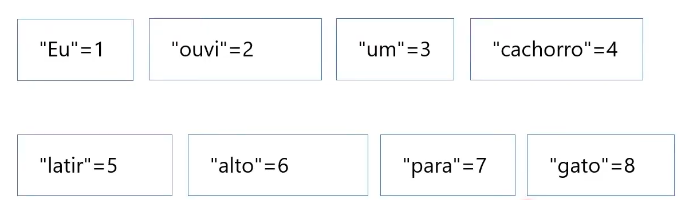
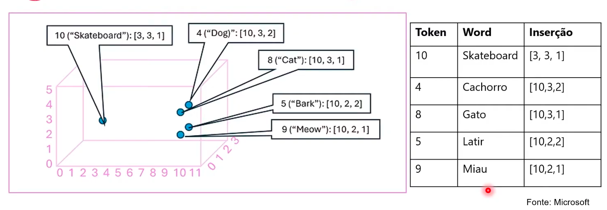
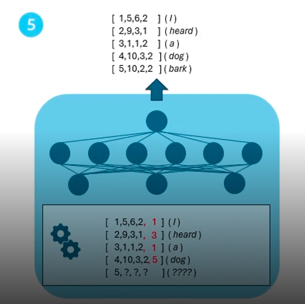

# 1 .Fundamentos da IA Generativa
## Sumário 
- [Conceitos Básicos de IA Generativa ](#1-conceitos-básicos-de-ia-generativa)
- [O que é IA Generativa](#2-o-que-é-ia-generativa)
- [Modelos de linguagem grandes](#3-modelos-de-linguagem-grandes)
  - [Transformador PT.1](#31-modelos-de-linguagem-grandes-transformador-pt1)
    - [Transformador PT.2](#311-modelos-de-linguagem-grandes-transformador-pt2)
  - [Tokenização](#32-modelos-de-linguagem-grandes-tokenização)
  - [Inserções](#33-modelos-de-linguagem-grandes-inserções)
  - [Atenção](#34-modelos-de-linguagem-grandes-atenção)
- [Conceitos básicos de IA Generativas: Copilotos](#4-conceitos-básicos-de-ia-generativas-copilotos)
  - [Engenharia de prompts](#41-conceitos-básicos-de-ia-generativas-engenharia-de-prompts)
---
## 1. Conceitos Básicos de IA Generativa 
A agenda do curso consiste em :
- Conceitos básicos de IA generativa 
- Conceitos básicos do Serviço OpenAI do Azure
- Explore a IA generativa de forma responsável. 

---
## 2. O que é IA Generativa
__IA:__ imita o comportamento humano usando aprendizado de máquina para interagir com o ambiente e executar tarefas sem instruções explícitas sobre o que gerar. 

__IA generativa:__ cria conteúdo original, como IA gerativa que foi incorporada a aplicativos de chat. Os aplicativos de IA gerativa usam entrada em linguagem natural e retornam respostas apropriadas em uma variedade de formatos:  
- Geração de linguagem natural 
  - Muito utilizada, quando desejamos trazer uma instrução, seja para construção de textos, formatação correção etc...
- Geração de código 
  - Muito utilizada por exemplo em processos de aprendizado, confecção de códigos do 0 etc..
- Geração de imagem 
  - Muito utilizada por exemplo para gerar um imagem a partir de inputs de comandos via linguagem natural
--- 
## 3. Modelos de linguagem grandes
Os aplicativos de IA gerativa são alimentados por __LLMs (modelos de linguagem grandes),__ que são um tipo especializado de modelo de machine learning que você pode usar para executar tarefas de __PNL (processamento de linguagem natural)__, incluindo:

- Determinar sentimento ou classificar de outra forma o texto em idioma natural. 
- Resumir um texto 
- Comparar várias fontes de texto quanto à similaridade semântica. 
- Geração de nova linguagem natural. 

--- 
## 3.1. Modelos de linguagem grandes: Transformador PT.1
A arquitetura do modelo do transformador consiste em dois componentes principais, ou blocos.   
Esse modelo em questão tem como sua premissa: _"trazer um cenário avançado com base no vocabulário"_.  
No contexto de LLMs é uma premissa que esses modelos tenham repositórios ou acesso um repositório de informações, e a partir desse repositório serão feitas o processamento dessa informações, extraindo por exemplo analise de sentimento, resumo de texto etc..  
Esse modelo em questão seria basicamente qual seria o _"próximo passo"_ desses processamentos, em um exemplo quando estamos escrevendo algo e algum aplicativo que contenha a utilização de um I.A e a medida que vamos escrevendo o aplicativo vai sugerindo palavras para completar a frase com base no contexto. Então esse modelo transformador busca dentre muitas outras coisas também trazer relações determinando uma sequência provável no texto que está sendo escrito, esse modelo em sí possui 2 componentes principais ou  blocos para sua definição.   
- `Um bloco codificador` que cria representações semânticas do vocabulário de treinamento. 
- `Um bloco decodificador` que gera novas sequências de linguagem. 

--- 
## 3.1.1 Modelos de linguagem grandes: Transformador PT.2
Ainda seguindo falando sobre esse modelo, temos alguns outros pontos:  
- O texto é `_tokenizado_` para que cada palavra ou frase seja representada por um token numérico exclusivo. 
- `Inserções` (valores de vetor com várias dimensões) são atribuídas aos tokens
- As camadas de atenção examinam cada token por vez e determinam valores incorporados que refletem os relacionamentos semânticos entre os tokens.
- No decodificador, essas relações são usadas para prever as sequências mais provável de tokens. 

A utilização desse token em LLM podemos dizer que servem de certo modo como um particionamento da informação, então com base nas informações dispostas para o treinamento e compartimentalizando essa informações por tokens podem se fazer probabilidades referentes aquele contexto. Abaixo temos um diagrama de utilização desse modelo transformador:  

<table style="text-align: center; width: 100%;"> 
<tr>
  <td style="text-align: center;">
  
  </td>
</tr>
</table>

---
## 3.2. Modelos de linguagem grandes: Tokenização
Etapa um: Tokenização
---
- A primeira etapa no treinamento de um modelo de transformador é decompor o texto de treinamento em tokens.
Quando estamos trabalhando nesse cenário de transformação estamos nos referindo diretamente a parte do modelo em que estamos particionando a informação, como se pegássemos a frase ou a informação como um todo, e _"enumeraremos"_ conforme seu grau de importância. esse particionamento e feito em blocos de informação, para melhor entendimento do contexto do texto.   
Exemplificando em uma frase: __Eu ouvi um cachorro latir alto para um gato.__

<table style="text-align: center; width: 100%;"> 
<tr>
  <td style="text-align: center;">
  
  </td>
</tr>
</table>

Através dessa decomposição e parse de valores, para cada palavra da frase conforme ilustrado acima, temos então o seguinte.
- A frase agora é representada com tokens: __`[1 2 3 4 5 6 7 8]`__
- Observe quem _"um"_ é tokenizado como 3 apenas uma vez
- Da mesma forma, a frase _"Eu ouvi um gato"_ poderia ser representada com as fichas __`[1 2 3 8]`__.
Então conforme descrito no ultimo ponto a ideia da tokenização para além de realizar uma atribuição de valores para palavras, o que no caso a base de conhecimento para treinamento foi a frase de _Eu ouvi um cachorro latir alto para um gato._, poderíamos substituir cada palavra por um token e a partir de então criar novas frases com tais tokens, no ultimo exemplo como a frase estava tokenizada, por esse método ao trocar o token 4 pelo 8 trocamos uma frase ainda aproveitando sua estrutura, assim como não foi realizado a repetição de um mesmo palavra para diferentes tokens, como no caso da palavra _"um"_, desta forma o modelo de teste e probabilidade fica mais fácil de ser feito· 

--- 
## 3.3. Modelos de linguagem grandes: Inserções
Etapa dois: Inserção.
---
- As relações entre tokens são capturadas como vetores, conhecidos com inserções. 
Essa etapa não se trata apenas de probabilidade, ou seja não se limita apenas a um calculo matemático probabilístico, para além dessa parte de decomposição e probabilidade e de dar sentindo a frase que será completada, então e como se olhássemos o contexto da frase que foi particionado/tokenizado e posteriormente tentássemos encaixar de _"forma semântica"_ qual seria a próxima palavra da frase. 

<table style="text-align: center; width: 100%;"> 
<tr>
  <td style="text-align: center;">
  
  </td>
</tr>
</table>

Então quando tratamos de inserção estamos fazendo um vetor multidimensional por proximidade. 

--- 
## 3.4 Modelos de linguagem grandes: Atenção
Etapa três: Atenção 
---
- Capture a força das relações entre tokens usando a técnica de atenção. 
Nesse passo ainda estamos tratando dentro de um contexto de tokens, sobre a probabilidade de algo acontecer, nesse parte do processo estamos falando com maior enfase sobre `codificador e decodificador`, pois teremos um modelo transformador em cima  de várias camadas de dados uma _"rede neural"_, ou seja essa etapa será da utilização de uma técnica para examinar a sequência de tokens (probabilidades), e isso tudo é feito através de treinamento. Exemplo:
- Meta: prever o token após __"cachorro"__
- Represente __"Ouvi um cachorro"__ como vetores. 
- Atribua mais peso a __"ouvi"__ e __"cachorro"__.
- Vários tokens possíveis podem vir depois de cachorro. 
- O token mais provável é adicionado à sequência, nesse caso __"latir"__.

<table style="text-align: center; width: 100%;"> 
<tr>
  <td style="text-align: center;">
  
  </td>
</tr>
</table>

---
## 4. Conceitos básicos de IA Generativas: Copilotos
Os copilotos são frequentemente integrados a outros aplicativos e fornecem uma maneira para os usuários obterem ajuda com tarefas comuns a partir de um modelo generativo de IA.  
- Os desenvolvedores podem criar copilotos que enviam prompts para grandes modelos de linguagem e geram conteúdo para uso em aplicativos. 
- Os usuários empresariais podem usar copilotos para aumentar sua produtividade e criatividade com conteúdo gerado por IA.

--- 
## 4.1. Conceitos básicos de IA Generativas: Engenharia de prompts
O termo engenharia de prompt descreve o processo de aprimoramento de promtps.
Os desenvolvedores que projetam aplicativos e consumidores que usam aplicativos podem aprimorar a qualidade das respostas da IA gerativa usando linguagem direta, mensagens do sistema, exemplos e/ou dados de fundamentação. 

| | | |
| -- | -- | -- |
| | 
Descrição
| 
Exemplo
 |
| <h4>Linguagem direta</h3>|Você pode obter suas conclusões mais úteis sendo explicito sobre o tipo de resposta desejada.| "<b>Crie uma lista</b> de 10 coisas para fazem em Edimburgo durante o mês de agosto". |
| <h3>Mensagens do sistema</h3>| Descreva como o chat deve funcionar| "Você é um assistente <b>útil</b> que <b>responde de maneira alegre e</b> amigável".|
| <h3>Fornecer exemplos</h3>| As LLMs geralmente são suporte ao aprendizado zero-shot no qual as respostas podem ser geradas sem exemplos anteriores. No entanto, você também pode fornecer algumas respostas de exemplo, conhecidas como aprendizado de poucas capturas.| "Visite o castelo pela manhã, antes que as multidões cheguem"|
| <h3>Dados Básicos</h3>| Os prompts podem incluir dados de fundamentação para fornecer contexto.| Incluindo <b> o texto de email</b> com a mensagem "Resumir meu email".|

--- 
### Links Uteis
- [Módulo 5 - IA Generativa](https://academiapme-my.sharepoint.com/:p:/g/personal/nubia_dio_me/Ef88qA-boB1GuImGg67P-IQBAQP0mfwtVB0RjBnabfvdPw?rtime=J6NJiev93Ug)

---
As respostas da aula 1 estão [aqui](imgs/prova/)

---
<table style="text-align: center; width: 100%;"> 
<caption><b>Skils do projeto </b></caption>
<tr>
    <td style="text-align: center;">
    
    </td>
    <td style="text-align: center;">
    
    </td>
<tr> 
</table>

---
Titulo: 1 .Fundamentos da IA Generativa 

Autor: Thierry Lucas Chaves

Data criacao: 27/09/2025

Data modificacao: 27/09/2025

Versao: 1.0  

---