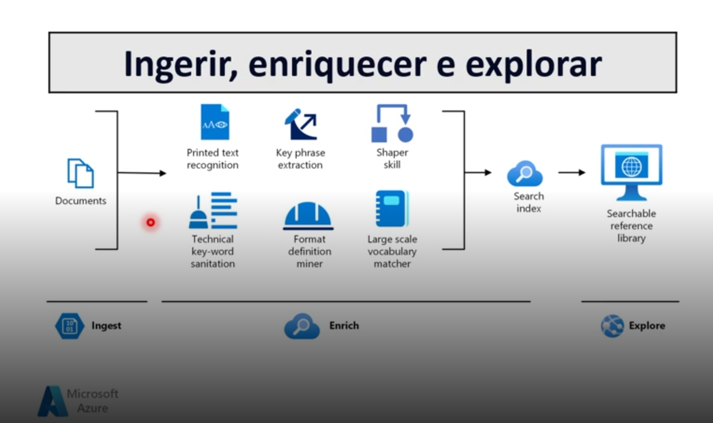
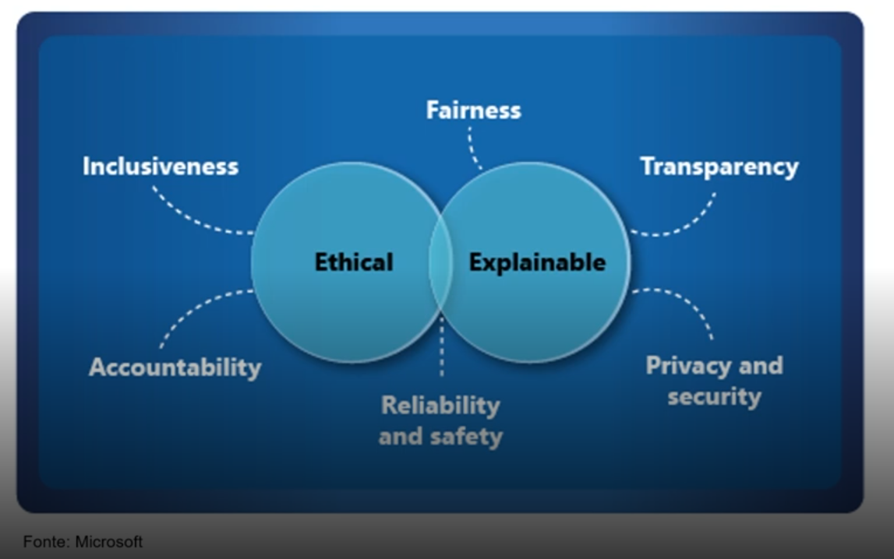

# 2 .Conceitos Fundamentais de IA
## Sumário 
- [O que é inteligência Artificial](#1-cargas-de-trabalho-comuns-de-ia-o-que-é-inteligência-artificial)
- [Machine Learning](#2-cargas-de-trabalho-comuns-de-ia-machine-learning)
- [Visão Computacional](#3-cargas-de-trabalho-comuns-de-ia-visão-computacional)
- [Processamento de linguagem natural](#4-cargas-de-trabalho-comuns-de-ia-processamento-de-linguagem-natural)
- [Inteligência de Documentos](#5-cargas-de-trabalho-comuns-de-ia-inteligência-de-documentos)
- [Mineração de conhecimento](#6-cargas-de-trabalho-comuns-de-ia-mineração-de-conhecimento)
- [IA Generativa](#7-cargas-de-trabalho-comuns-de-ia-ia-generativa)
- [Princípios de IA responsável](#8-princípios-de-ia-responsável)

# Objetivo geral
O objetivo geral da aula abaixo será listado abaixo 
- Inteligência artificial definirá a próxima geração de soluções de software.
- Este curso apresenta a IA e o serviços da Microsoft que podem ser usados para criar soluções de I.A
- Você poderá identificar e descrever os principais conceitos de IA e os principais serviços de IA e machine Learning no Microsoft Azure. 

Pré-requisitos
---
- Experiência com computadores e com a Internet.
- Interesse em casos de uso para aplicativos de IA e modelos de machine learning. 
- Disposição para aprender por meio da exploração prática

---
## 1. Cargas de trabalho comuns de IA: O que é inteligência Artificial 

- Prever resultados e reconhecer padrões com base em dados históricos. 
- Extrair informações de fontes para obter conhecimento 
- Compreender a linguagem e participar de conversas. 
- Reconhecer eventos anormais e tomar decisões.
- Interpretando informações visuais. 
---
## 2. Cargas de trabalho comuns de IA: Machine Learning

Modelos preditivos baseados em dados e estatísticas, quando estamos trabalhando nesse conceito de machine learning estamos trabalhando mais especificamente com ciência de dados e um pouco de engenharia de software, pois quando falamos com aprendizado um dos passos comuns desses tipo de trabalho envolve a criação de um modelo que será "inserido" dentro do software, para que possa ser treinado com aplicação, um dos desafios mais comuns desse processo envolve "descobrir" como serão fornecidos os dados para aquele modelo ex _(Dados do senso,dados históricos)_. Outro ponto que envolve esse trabalho é de saber como será realizado o treinamento para aquele modelo, pois um ponto crucial desse tipo de trabalho é que ele é oriundo da estatística e por tanto seu funcionamento carece de uma base de dados que serão analisados e a partir dessa coletânea das informações serão vistos os comportamentos para que se possa predizer algo.  
Então a partir disso podemos concluir que o processo de Machine Learning, pode ser denominado como uma função da inteligência artificial que tem como funcionalidade ou seu cerne, realizar previsões com base nas informações que esta sendo passada, ou seja depende de um contexto, como por exemplo previsão de vendas de um determinado produtos, para realizar um treinamento precisamos saber qual produto, qual publico alvo , histórico de vendas etc..  

--- 
## 3. Cargas de trabalho comuns de IA: Visão Computacional 
- Capacidades da IA para interpretar o mundo visualmente por meio de câmeras, vídeos e imagens. 
Esse conceito diz respeito a propriedade a I.A de reconhecer imagens, vídeos etc.. ou seja trata-se do processo de realizar a transcrição de um objeto através de uma imagem, assim como feito no processo de Machine Learning, também e necessário uma serie de dados que no caso podem ser denominados como banco de imagens, entretanto esse banco de imagens não conterá nenhuma descrição.   
Então a ideia aqui é detectar um imagens ou um objeto, detectar e transcrever certas características daquela imagem , classificar aquilo e trazer uma legenda. 
No Microsoft IA a ferramenta é conhecida como `Visio studio` .  

--- 
## 4. Cargas de trabalho comuns de IA: Processamento de linguagem natural
- Capacidades da IA para que um computador interprete a linguagem escrita ou falada e responda adequadamente.   
Dentro desse cenário é preciso realizar a detecção de tudo o que está escrito como também aquilo que é falado dentro das aplicações.  
Outra funcionalidade muito utilizada nesse modelo de trabalho e chamada de analise de sentimentos, quando estamos tratando por exemplo em um cenário de redes sociais, temos alguém que escreve algo, então nesse processo teremos informações como quem é o publicador do post, qual contexto daquele post, qual a mensagem que está sendo passada, esse mesmo conceito também é utilizado por exemplo por propagandas publicitárias, utilizando esse conceito por exemplo se será o momento ou não de um determinado produto ser lançado. 

--- 
## 5. Cargas de trabalho comuns de IA: Inteligência de Documentos
- Capacidades de IA que lidam com o gerenciamento, processamento e uso de grandes volumes de dados encontrado em formulários e documentos.  
Dentro desse cenários trata-se da capacidade para além do processo de escanear um documento e saber seu conteúdo, abrange também a extração daquela informação e adicionar consecutivamente em uma aplicação apartada. 
Então nesse cenário por exemplo podemos escanear um determinado documento, extrair aquela informação e conseguir utilizar essa informação em outros contextos, então em sintaxe esse modelo de I.A realiza a identificação das informações contidas em um documento e o transcreve. 

--- 
## 6. Cargas de trabalho comuns de IA: Mineração de conhecimento
- Capacidades da IA para extrair informações de grandes volumes de dados muitas vezes não estruturados para criar um armazenamento de conhecimento pesquisáveis.   
Dentro desse processo, trabalhamos com cenários onde termos diversas fontes de informação, e precisamos extrair esses pontos para realizar o treinamento de uma I.A ou outra finalidades. Dentro desse processo temos definidos 3 etapas sendo elas.  
1. Ingerir 
  - Nessa etapa, realizamos o processo de consumo das informações que podem estar em diferentes fontes (Banco de dados, pdf's, vídeos...), ou seja todo tipo de informação próprio ou até mesmo de terceiros, ou seja iremos alimentar o repositório com essas informações que desejamos torna-las úteis. 
2. Enriquecer
  - Após a extração dessas informações, faremos o passo de extração das informações dessas fontes, encontrar um tipo de padrão e trabalhar com um tipo de compreensão daquelas informações, ou seja o que se deseja fazer com aqueles dados etc.. ou seja trabalhar esses dados com os modelos cognitivos.. E a parte de tomada de decisão para saber quais informações desejamos extrair daqueles dados. 
3. Explorar 
  - E a ultima etapa do processo de mineração, após a carga e extração da informações através da etapa de enriquecimento da informação, deixando as passíveis de exploração, podendo ser utilizadas em painéis, boots etc.. de forma que essas informações sejam uteis. 

<table style="text-align: center; width: 100%;"> 
<tr>
    <td style="text-align: center;">
    
    </td>
</tr>
</table>

--- 
## 7. Cargas de trabalho comuns de IA: IA Generativa
- Recursos de IA que criam conteúdo original em vários formatos, incluindo linguagem natural, imagem, código e muito mais.   
Dentro desse processo, estamos tratando de uma Inteligência artificial que imita o comportamento humano, esse processo também utiliza O `APRENDIZADO DE MAQUINA`, mas não se limita a respostas prontas ou algo do tipo, e sim realiza a imitação do comportamento humano, aprendendo e gerando respostas mais elaboradas. 

--- 
## 8. Princípios de IA responsável
Os princípios da IA responsável . 
<table style="text-align: center; width: 100%;"> 
<tr>
    <td style="text-align: center;">
    
    </td>
</tr>
</table>

| | | |
| -- | -- | --|
|  | Desafio ou Risco | Exemplo 
| <b>Imparcialidade </b>| O preconceito pode afetas os resultados. | Um modelo de aprovação de empréstimos que discrimina por gênero devido ao preconceito nos dados com os quais foi treinado. |
| <b> Confiabilidade e segurança </b>| Erros podem causar danos. | Um veículo autônomo sofre uma falha no sistema e causa uma colisão. |
| <b> Privacidade e segurança </b>| Dados privados podem ser expostos. | Um boot de diagnóstico médico é treinado usando dados confidenciais de pacientes, que são armazenados de forma insegura. |
| <b> Inclusão </b>| As soluções podem não funcionar para todos. | Um aplicativo preditivo não fornece saída de áudio para usuários com deficiência visual. |
| <b> Transparência </b>| Os usuários devem confiar em um sistema complexo | Uma ferramenta financeira baseada em IA faz recomendações de investimento em que se baseiam ? |
| <b> Responsabilidade </b>| Quem é responsável pelas decisões baseadas na IA ?| Uma pessoa inocente é condenada por um crime com base em prova de reconhecimento facial - Quem é o responsável? |

--- 
### Links Uteis
- [PPT DA AULA](https://academiapme-my.sharepoint.com/personal/nubia_dio_me/_layouts/15/Doc.aspx?sourcedoc=%7B11e44f57-c647-4ab2-8010-731622bf5103%7D&action=default&slrid=5b24cca1-6084-a000-6709-40da0952e52c&originalPath=aHR0cHM6Ly9hY2FkZW1pYXBtZS1teS5zaGFyZXBvaW50LmNvbS86cDovZy9wZXJzb25hbC9udWJpYV9kaW9fbWUvRVZkUDVCRkh4ckpLZ0JCekZpS19VUU1CV3Y0TkFLWGFNcDRxa1p5bDI3TGFXdz9ydGltZT00WUdidzJRRDNrZw&CID=abb2f972-5acc-44b4-beb2-c2eed2052dea&_SRM=0:G:130&file=M%C3%B3dulo%201%20-%20IA%20Overview.pptx)

---
As respostas da aula 2 estão [aqui](imgs/prova/)

---
<table style="text-align: center; width: 100%;"> 
<caption><b>Skils do projeto </b></caption>
<tr>
    <td style="text-align: center;">
    
    </td>
    <td style="text-align: center;">
    
    </td>
<tr> 
</table>

---
Titulo: 2 .Conceitos Fundamentais de IA 

Autor: Thierry Lucas Chaves

Data criacao: 27/09/2025

Data modificacao: 04/10/2025

Versao: 1.0  

---