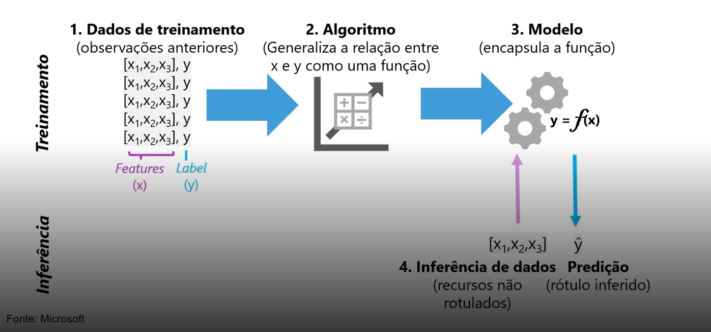
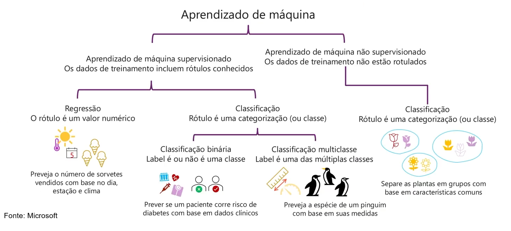
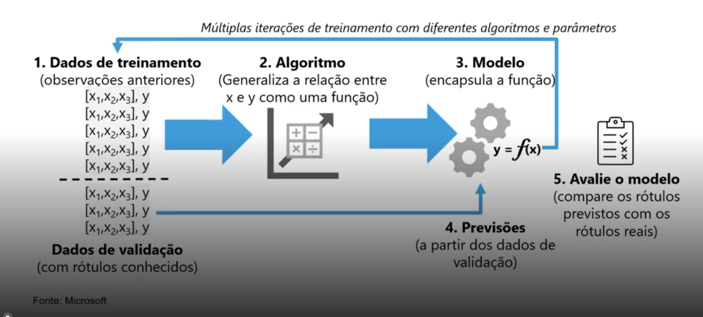
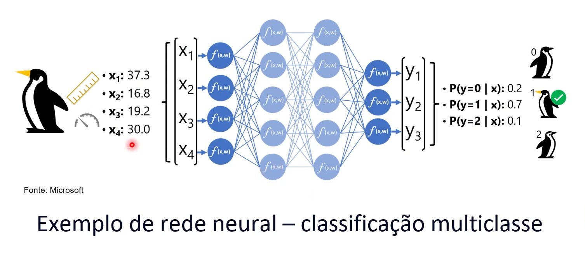

# 3 .Fundamentos do Aprendizado de Máquina
## Sumário 
- [Tipos de aprendizado de máquina](#1tipos-de-aprendizado-de-máquina)
- [Treinamento e avaliação de modelo](#2-treinamento-e-avaliação-de-modelo)
- [Aprendizado profundo](#3-aprendizado-profundo)
---
## 1.Tipos de aprendizado de máquina
O que é aprendizado de máquina ?
---
<table style="text-align: center; width: 100%;"> 
<tr>
    <td style="text-align: center;">
    
    </td>
</tr>
</table>

Quando estamos trabalhando com o aprendizado de máquina, estamos trabalhando com a intersecção de duas disciplinas bem importantes, sendo elas a ciência de dados (que é _"responsável"_, pela parte de trabalhar com diversas fontes de dados diferentes, tipos diferentes), e também iremos utilizar com a engenharia de software(que é  _"responsável"_, pois precisamos manipular todas as informações coletadas de forma a produzir algo compreensível para o usuário final a partir de uma aplicação).   
Então tudo que dizemos sobre o modelo de aprendizagem de máquinas devemos nos ater a o que é esse modelo preditivo, onde é traduzido como um treinamento. 
Outro ponto ilustrado na imagem acima trata-se da inferência de dados que condiz com o processo de predição desses novos valores, pois podemos traduzir esse processo de aprendizagem de máquina como uma função que a partir de um ou mais input de dados teremos a saída dos dados.   

<table style="text-align: center; width: 100%;"> 
<tr>
    <td style="text-align: center;">
    
    </td>
</tr>
</table>

A imagem acima trás uma especie de caminho padrão para o aprendizado de maquina, onde a esquerda temos os módulos de aprendizado de máquina supervisionado, e a direita o não supervisionado.  
Quando trabalhamos com o processo supervisionado, quando tratamos os dados de treinamento tem valores de recursos e esses são conhecidos como rótulos, quando falamos do modelos temos alguns que podem ser listados que estão presentes na imagem acima. 
- Regressão 
  - Nesse modelo o rótulo utilizado sera um valor numérico , ou seja nesse modelo em questão o rótulo previsto sera um valor quantitativo. 
- Classificação 
  - Nesse modelo o rótulo é uma categorização ou classe, então nesse modelo teremos 2 cenários `classificação binária` ou `classificação multiclasse` 
    - Classificação binária, nesse modelo o rótulo utilizado determina se algo é ou não um instância dessa classe especifica. 
    - Classificação multiclasse, nesse modelo o rótulo de certa forma ira prever outras classes possíveis.   

Já quando estamos trabalhando com o modelo `não supervisionado` será com base em recursos em rótulos nao conhecidos, em suam maioria esse modelo de aprendizado de máquina trabalhara com modelos de classificação, ou seja irá ser treinado para reconhecer similaridade dos dados que foram passados.    
E quando devemos utilizar um ou outro ?  
podemos levar como uma máxima o seguinte:  
- Supervisionado - Sempre que for necessário tratar valores, especies, ou ainda é necessário um passo de tomada de decisão utilizaremos o supervisionado.
- Não supervisionado  - Sempre que for preciso rotular coisas de forma idênticas, ou seja similaridades usaremos o não supervisando 

---
## 2. Treinamento e avaliação de modelo

<table style="text-align: center; width: 100%;"> 
<tr>
    <td style="text-align: center;">
    
    </td>
</tr>
</table>

Acima temos a imagem ilustrando o fluxo de treinamento de máquina, onde temos 5 passos sendo eles 
1. Dados do treinamento 
2. Algorítimo  aplicado em cima dos dados. 
3. Modelo a ser utilizado ou a função encapsulada.
4. A previsão com base na função. 
5. Por fim avaliação do resultado desse processo. 

Com base na avaliação do modelo poderemos comparar se temos algum ponto fora da curva, ou qual acuracidade daquela modelo treinado. 

--- 
## 3. Aprendizado profundo

A ideia do aprendizado profundo é que as redes neurais artificiais, busquem um modelo de aprendizagem tentando emular ao máximo como funciona um modelo humano. 
Quando estamos falando da rede neural humana temo um fluxo similar ao modelo abaixo. 
- Neurônios disparam em respostas a estímulos eletroquímicos 
- Quando disparado, o sinal é passado para neurônios conectados. 

Já quando estamos tratando do processo neural artificial, é um replica guardado as devidas proporções, teremos em uma rede neural artificial várias camadas de _"neurônios"_ que é definido por funções, onde cada nó dessa rede neural tivesse uma função que simula estrategias opções ou coisas que podem ser desencadeadas, esse processo é conhecido como __`DNNs`__. 
- Cada neurônio é uma função que opera com um valor de entrada (x) e um peso (W)
- A função é envolvida em uma função de ativação que determina se a saída deve ser transmitida. 
Como um exemplo de modelo de aprendizado profundo podemos citar a estrategia de treinamento de multiclasse, conforme ilustrado abaixo:

<table style="text-align: center; width: 100%;"> 
<tr>
    <td style="text-align: center;">
    
    </td>
</tr>
</table>

--- 
### Links Uteis
- [Azure ML](https://ml.azure.com)

---
As respostas da aula 3 estão [aqui](imgs/prova/)

---
<table style="text-align: center; width: 100%;"> 
<caption><b>Skils do projeto </b></caption>
<tr>
    <td style="text-align: center;">
    
    </td>
    <td style="text-align: center;">
    
    </td>
<tr> 
</table>

---
Titulo: 3 .Fundamentos do Aprendizado de Máquina 

Autor: Thierry Lucas Chaves

Data criacao: 27/09/2025

Data modificacao: 04/10/2025

Versao: 1.0  

---