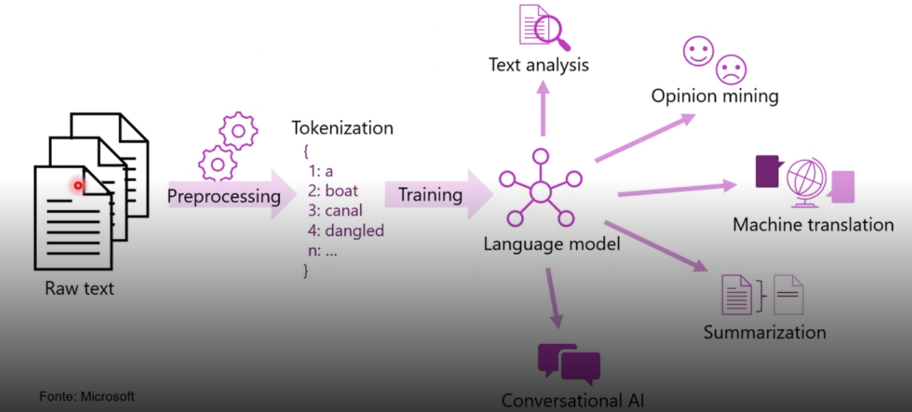
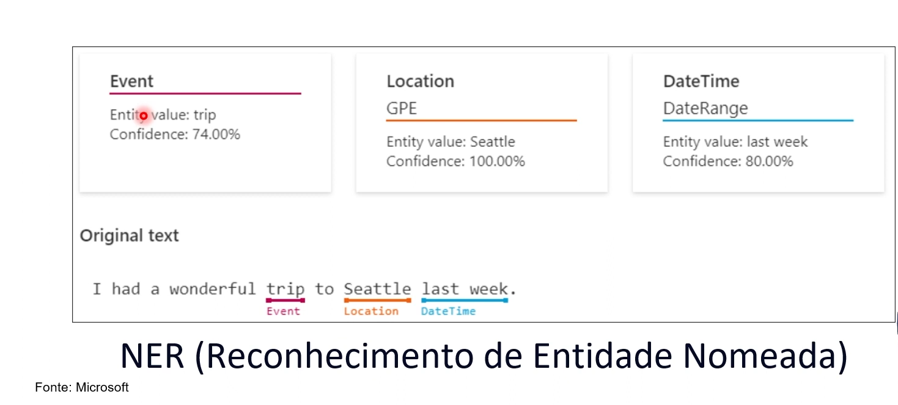
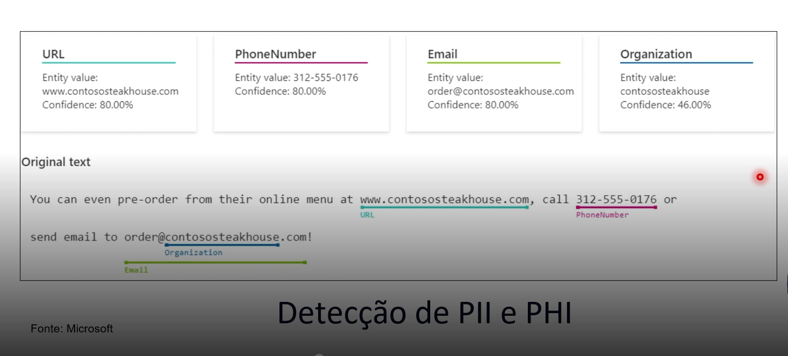
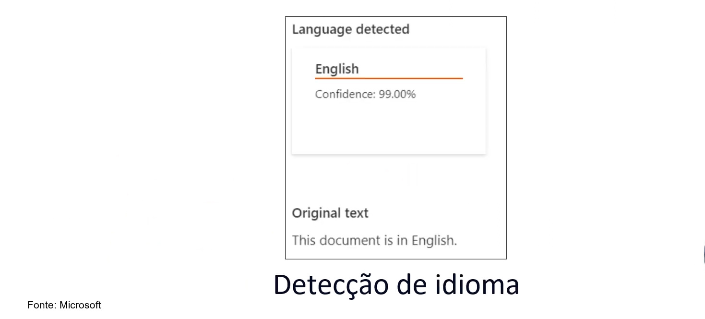
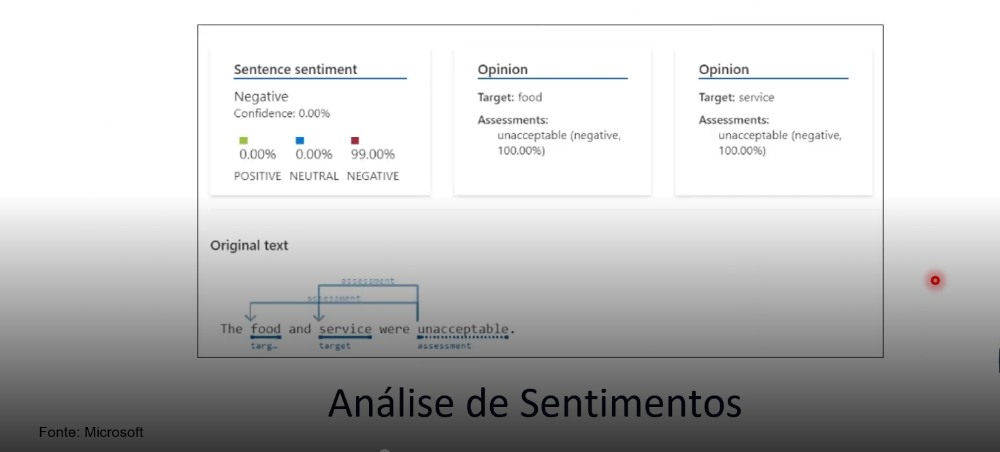
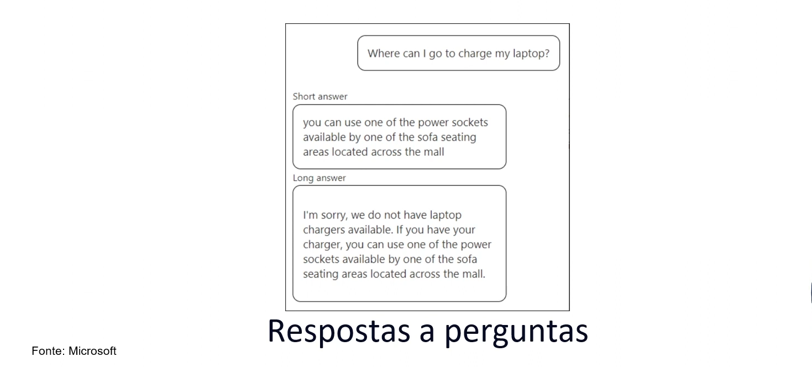

# 4 .Conceitos de Processamento de Linguagem Natural 
## Sumário 
- [Conceitos da linguagem natural](#1-conceitos-da-linguagem-natural)
- [O que é processamento de linguagem natural](#2-o-que-é-processamento-de-linguagem-natural)
- [Processamento de linguagem natural e IA conversacional no Azure](#3-processamento-de-linguagem-natural-e-ia-conversacional-no-azure)
  - [Análise de sentimento e respostas a perguntas](#31-análise-de-sentimento-e-respostas-a-perguntas)
  - [Fala](#32-fala)
  - [Tradução](#33--tradução)
---
## 1. Conceitos da linguagem natural 
### Objetivos de aprendizado
- Reconhecer quando o processamento de linguagem natural e a IA conversacional podem ser usados.
- Identificar os serviços de IA do Azure que incluem processamento de linguagem natural. 
- Use a análise de texto para você mesmo. 
---
## 2. O que é processamento de linguagem natural 

<table style="text-align: center; width: 100%;"> 
<tr>
    <td style="text-align: center;">
    
    </td>
</tr>
</table>

Nesse modelo de linguagem natural é importante salientar que como seu cerne temos o modelo de linguagem que será utilizado. Porém quando destrinchamos melhor a imagem acima temos um fluxo padrão;

--- 
## 3. Processamento de linguagem natural e IA conversacional no Azure
É importante salientar que quando estamos trabalhando com o processamento de linguagem natural dentro da Azure ela será embasada em recursos chamados de `nlp`, e através da plataforma da azure studio utilizaremos o `Azure Language Studio` como a ferramenta que nos auxiliara a fazer esse processo. 
Uma das estrategia possíveis dentro do Azure Studio, temos a estrategia de reconhecimento de entidade nomeada, que nos ajuda a categorizar quais são essas identidade presentes no texto, conforme ilustra a imagem abaixo.  

<table style="text-align: center; width: 100%;"> 
<tr>
    <td style="text-align: center;">
    
    </td>
</tr>
</table>

Outra estrategia possível de ser realizada na plataforma é a Detecção de PII e PHI, através desse recurso que ira auxiliar nas questões de documentos, transcrição de conversas, entender número de telefone e outras  formas de identificação, conforme ilustra a imagem abaixo:

<table style="text-align: center; width: 100%;"> 
<tr>
    <td style="text-align: center;">
    
    </td>
</tr>
</table>

Outra estrategia presente é de detecção de idioma, com ela podemos detectar variações linguísticas, dialéticos, conforme ilustra a imagem abaixo

<table style="text-align: center; width: 100%;"> 
<tr>
    <td style="text-align: center;">
    
    </td>
</tr>
</table>

## 3.1. Análise de sentimento e respostas a perguntas
Outro recurso presente é a estrategia de análise de sentimentos, com essa estrategia podemos realizar uma especie de mineração através do texto, conseguindo adiantar ao usuário palavras que indicam tanto sentimentos positivos quanto negativos, e como pode ser feito essa associação, conforme ilustra a imagem abaixo: 

<table style="text-align: center; width: 100%;"> 
<tr>
    <td style="text-align: center;">
    
    </td>
</tr>
</table>

Nesse modelo temos uma estrategia de realizar um recurso personalizado ou não, como por exemplo um boot quer irá realizar uma especie de conversação com um boot conforme ilustrado abaixo:

<table style="text-align: center; width: 100%;"> 
<tr>
    <td style="text-align: center;">
    
    </td>
</tr>
</table>

---
## 3.2. Fala
Mais um do recurso que é muito utilizado dentro do processo de linguagem conversacional é o modelo de fala como por exemplo o recurso de texto para fala. 
ou inverso que é a conversão da fala para o texto, e ainda dentro desse processo temos o processo de tradução de fala.

--- 
## 3.3.  Tradução
Sobre a tradução temos 3 cenários principais de utilização, sendo eles. 
1. Tradução do texto 
2. Tradução de documentos
3. Tradução personalizada. 

Existe uma diferença crucial entre o contexto da fala e entre o contexto de tradução, pois quando tratamos de fala estamos falando por exemplo  de uma tradução em tempo real, que pode ser para diversos idiomas. 
Nesse cenário da tradução propriamente dita podemos ter por exemplo a tradução de um texto em português para inglês por exemplo.

---
As respostas da aula 4 estão [aqui](imgs/prova/)
---
<table style="text-align: center; width: 100%;"> 
<caption><b>Skils do projeto </b></caption>
<tr>
    <td style="text-align: center;">
    
    </td>
    <td style="text-align: center;">
    
    </td>
<tr> 
</table>

---
Titulo: 4 .Conceitos de Processamento de Linguagem Natural  

Autor: Thierry Lucas Chaves

Data criacao: 27/09/2025

Data modificacao: 04/10/2025

Versao: 1.0  

---