# 5 .Análise de Sentimentos com Language Studio no Azure IA
## Sumário 
- [Análise de texto e resposta a perguntas](#1-análise-de-texto-e-resposta-a-perguntas)
- [Serviços de bot do Azure](#2-serviços-de-bot-do-azure)
- [Conhecendo o estúdio de fala](#3-conhecendo-o-estúdio-de-fala)
- [Conhecendo o Language Studio](#4-conhecendo-o-language-studio)
- [Entendendo o desafio](#5-entendendo-o-desafio)
---
## 1. Análise de texto e resposta a perguntas 
Capacidades de processamento de linguagem Natural no Azure
---
Para tal utilizaremos o language studio, que seu proposito primário e ter um conjunto de ferramentas baseado no cenário de interface de usuário, que nos possibilite explore integre e crie  recursos de linguagem, através daquilo que é escrito , conforme ilustrado abaixo: 

<table style="text-align: center; width: 100%;"> 
<tr>
  <td style="text-align: center;">
  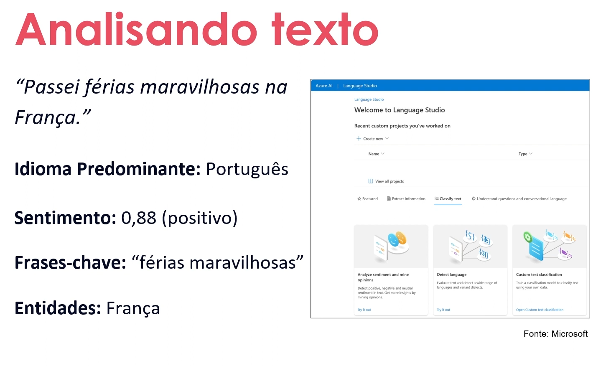
  </td>
</tr>
</table>

Ao utilizarmos essa ferramenta, ele nos auxilia a criar um classificação daquele texto com base na compreensão do idioma e na classificação personalizada.Onde através desse cenário conseguimos criar um recurso de diversos cenários possibilitando assim a metrificação, como por exemplo a localidade do texto, o sentimento passado pelo texto, o idioma e etc..
Nesse cenário ainda podemos inserir perguntas e respostas, definindo uma base de conhecimento de pares de perguntas e respostas:
- Ao inserir perguntas e respostas
- De um documento de perguntas e respostas existente
- Usando bate-papo integrado. 

---
## 2. Serviços de bot do Azure
O serviço de bot, talvez seja o mais conhecido devido a vasta utilização recente dessa ferramenta, quando por exemplo precisamo acessar um serviço de SAC, responder algum E-mail etc.., porém com o diferencial da utilização de uma I.A através dos serviços do azure, e onde se diverge esse serviço de boot de um serviço comum anteriormente feito, quando falamos em um cenário de ampla gama de informações, ele irá utilizar uma base maior de repositório de dados. 

<table style="text-align: center; width: 100%;"> 
<tr>
  <td style="text-align: center;">
  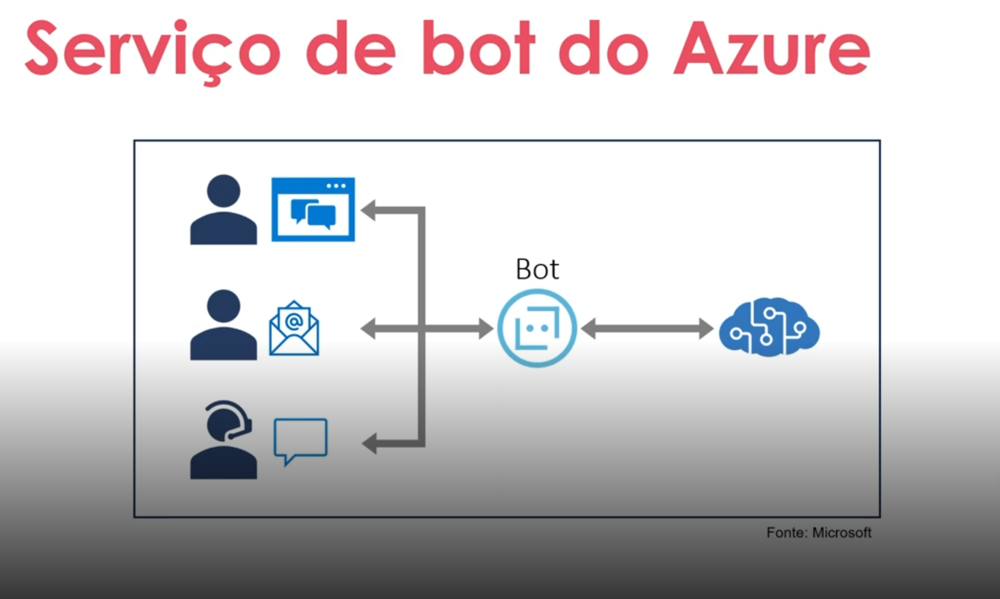
  </td>
</tr>
</table>

- Plataforma baseada em nuvem para desenvolvimento e gerenciamento de bots
- Integração com IA language e outros serviços
- Conectividade através de vários canais. 
---
Compreensão da linguagem coloquial 
---
Quando falamos sobre linguagem coloquial, ele é formado por 3 componente principais, sendo eles: 
1. Declaração - Ou seja uma declaração no contexto de o que pode ser feito o que quer que seja feito 
2. Entidade  - Podemos dizer como sendo um item especifico 
3. Intenção - E responsável por identificar o ponto que está sendo proposto 

<table style="text-align: center; width: 100%;"> 
<tr>
  <td style="text-align: center;">
  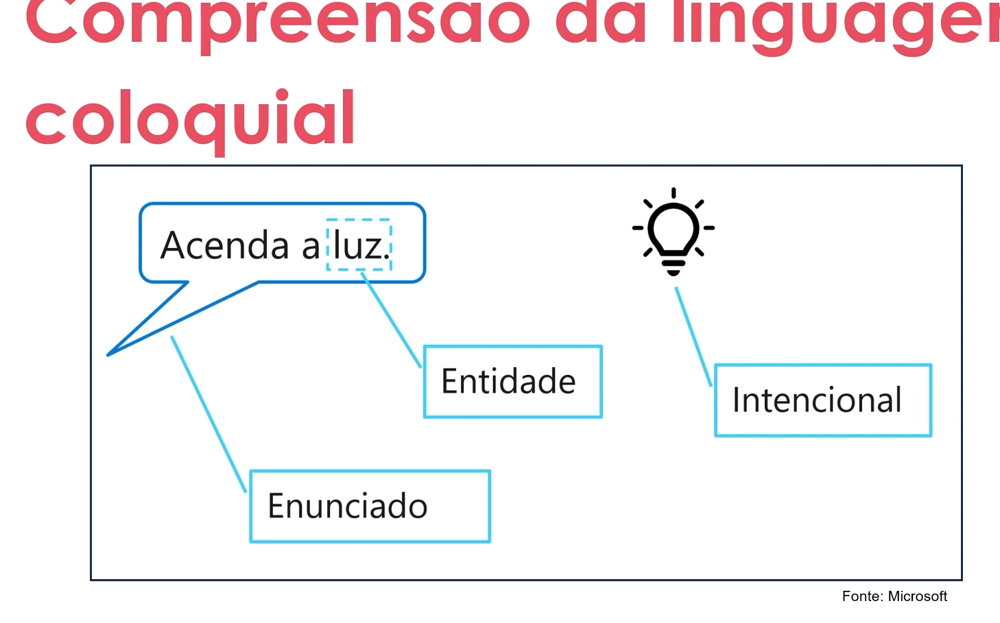
  </td>
</tr>
</table>

Ainda temos por fim o reconhecimento o sintaxe da fala
<table style="text-align: center; width: 100%;"> 
<tr>
  <td style="text-align: center;">
  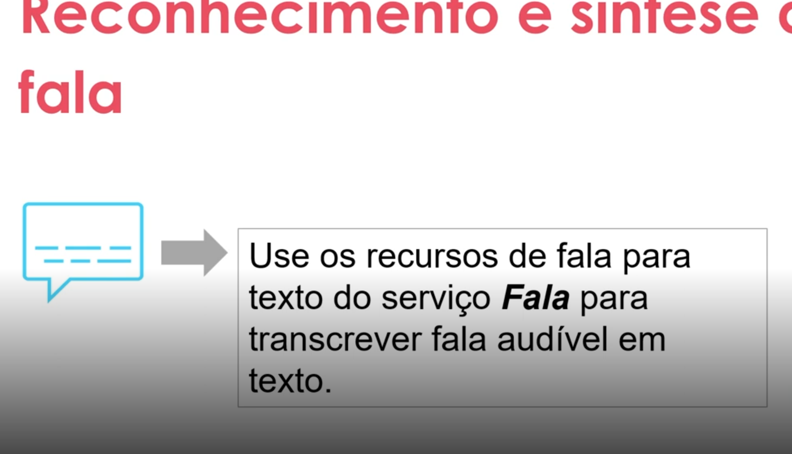
  </td>
</tr>
</table>

---
## 3. Conhecendo o estúdio de fala  
Através do portal do Azure AI iremos acessar o recurso de fala disponível 
<table style="text-align: center; width: 100%;"> 
<tr>
  <td style="text-align: center;">
  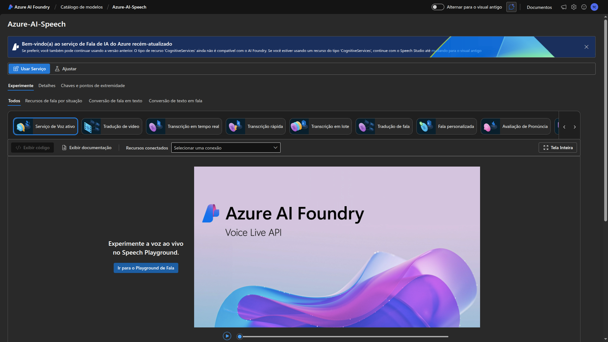
  </td>
</tr>
</table>

Ao acessarmos o estúdio em questão iremos, daremos sequencia na utilização clicando sobre a aba de conversão em texto utilizaremos , escolhendo a opção de `conversão de fala em texto em tempo real`, onde teremos a apresentação do menu abaixo:
<table style="text-align: center; width: 100%;"> 
<tr>
  <td style="text-align: center;">
  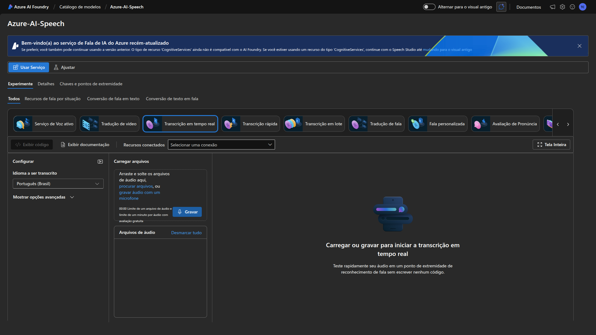
  </td>
</tr>
</table>

No painel temos a opção de realizar tanto a gravação quanto a procura de um áudio nos arquivos, ao utilizarmos uma das  opções teremos a transcrição desse audio diretamente na tela em tempo real, tanto em formato de texto quanto `Json`.   
E de suma importância que antes de realizar esse processo seja realizado a escolha do idioma de transcrição.

<table style="text-align: center; width: 100%;"> 
<tr>
  <td style="text-align: center;">
  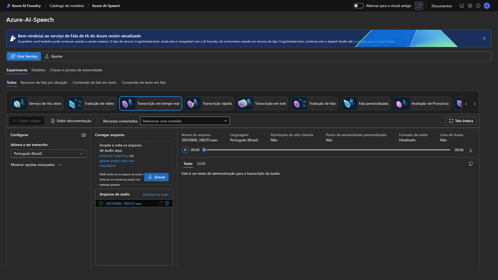
  </td>
</tr>
</table>

Após realizar esse processo temos as próxima etapas nas quais teremos algumas opções de utilização conforme ilustrado abaixo

<table style="text-align: center; width: 100%;"> 
<tr>
  <td style="text-align: center;">
  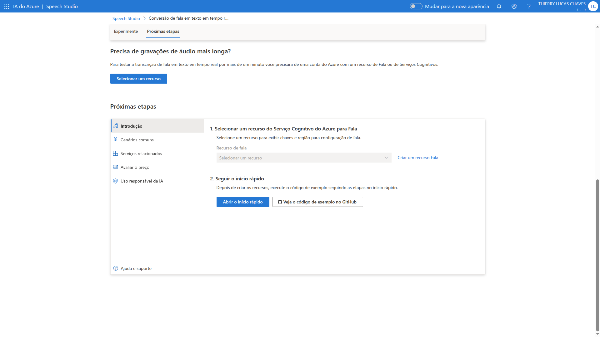
  </td>
</tr>
</table>

--- 
## 4. Conhecendo o Language Studio
Para esse processo utilizaremos o  [Azure Studio](https://portal.azure.com)
Onde iremos criar um recuso de fala, na plataforma, conforme ilustrado abaixo:  

<table style="text-align: center; width: 100%;"> 
<tr>
  <td style="text-align: center;">
  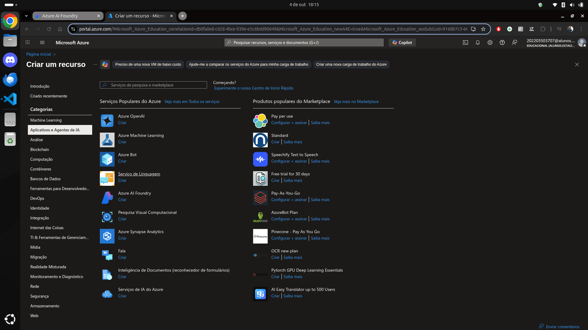
  </td>
</tr>
</table>

Após a criar e provisionar o recurso iremos criar-lo conforme ilustrado 

<table style="text-align: center; width: 100%;"> 
<tr>
  <td style="text-align: center;">
  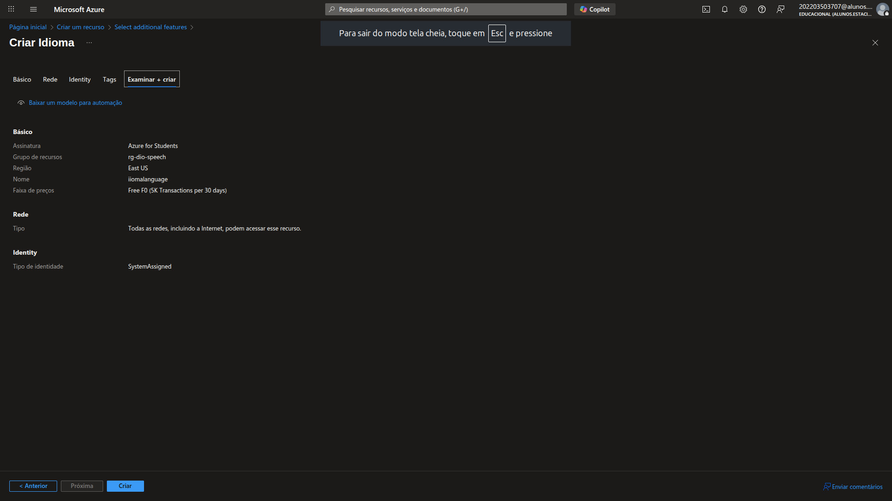
  </td>
</tr>
</table>

Com o recurso criado, iremos acessar o [Language cognitive](https://language.cognitive.azure.com/), para realizar o processo de informação de credenciais e recursos 

<table style="text-align: center; width: 100%;"> 
<tr>
  <td style="text-align: center;">
  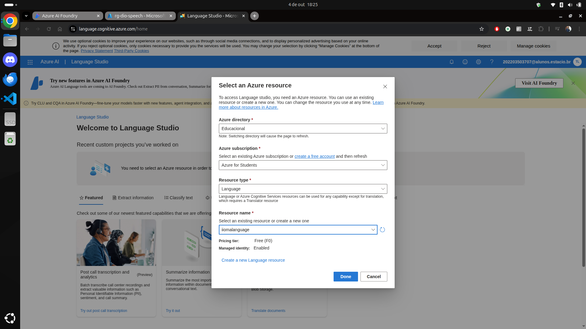
  </td>
</tr>
</table>

Após o provisionamento de recursos e configurações, iremos selecionar a aba de classificação de texto, e escolheremos a ferramento de analise de sentimentos. 

<table style="text-align: center; width: 100%;"> 
<tr>
  <td style="text-align: center;">
  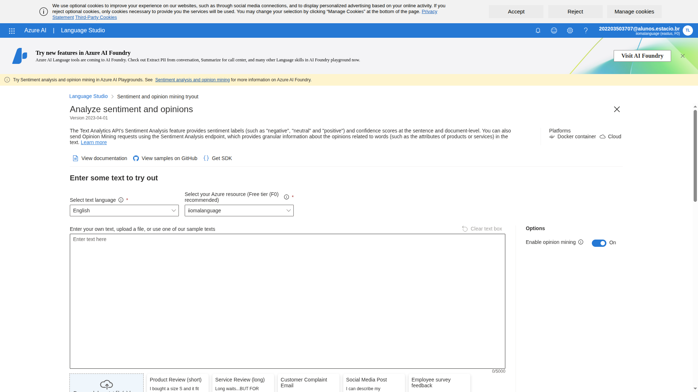
  </td>
</tr>
</table>

Após a inserção do texto no campo, podemos visualizar o resumo através da pagina conforme ilustramos abaixo:

<table style="text-align: center; width: 100%;"> 
<tr>
  <td style="text-align: center;">
  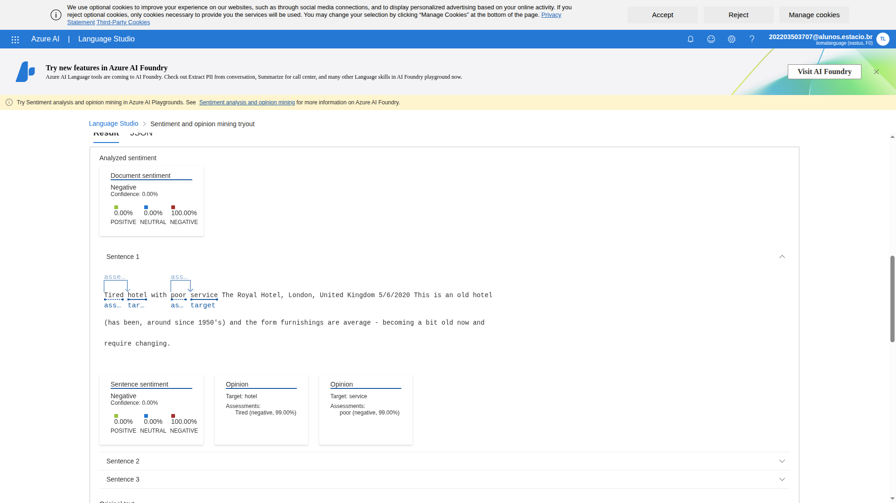
  </td>
</tr>
</table>

--- 
## 5. Entendendo o desafio
Entendendo Desafio 
Agora é a sua hora de brilhar e construir um perfil de destaque na DIO! Explore todos os conceitos abordados até aqui, aplique os conhecimentos adquiridos nas aulas e documente sua experiência para demonstrar sua compreensão dos temas discutidos.

Descrição do Desafio
Este laboratório tem como objetivo praticar e aprofundar o uso das ferramentas Azure Speech Studio e Language Studio, focando na análise de fala e linguagem natural. O objetivo é desenvolver habilidades práticas na criação de soluções baseadas em inteligência artificial voltadas para voz e linguagem. O entregável é um repositório organizado contendo anotações e insights adquiridos durante a prática, servindo como material de apoio para estudos e futuras implementações.

Objetivos de Aprendizagem 
Ao concluir este desafio, você será capaz de: 

Aplicar os conceitos aprendidos em um ambiente prático;
Documentar processos técnicos de forma clara e estruturada; 
Utilizar o GitHub como ferramenta para compartilhamento de documentação técnica. 
Entrega do Desafio 
Para concluir este desafio, você deverá: 

Assistir a todas as vídeo-aulas
Não pule nenhuma etapa! As aulas contêm informações essenciais para o sucesso do seu projeto. 

Criar um repositório público no GitHub contendo: 
Um arquivo README.md detalhado 
Quaisquer arquivos adicionais que sejam relevantes para documentar sua experiência 
Opcionalmente, capturas de tela relevantes organizadas em uma pasta /images 

Enviar o link do seu repositório e uma breve descrição clicando no botão “Entregar Projeto” 

---
### Links Uteis
- [Speech Studio](https://speech.microsoft.com/portal)

---
<table style="text-align: center; width: 100%;"> 
<caption><b>Skils do projeto </b></caption>
<tr>
    <td style="text-align: center;">
    
    </td>
    <td style="text-align: center;">
    
    </td>
<tr> 
</table>

---
Titulo: 5 .Análise de Sentimentos com Language Studio no Azure IA 

Autor: Thierry Lucas Chaves

Data criacao: 27/09/2025

Data modificacao: 04/10/2025

Versao: 1.0  

---