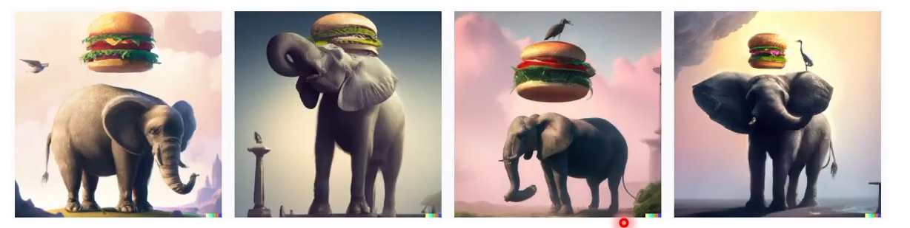

# 6 .Trabalhando com Serviços Azure OpenAI
## Sumário 
- [O que é OpenAi do Azure](#1-o-que-é-openai-do-azure)
- [Como usar o OpenAi Azure](#2-como-usar-o-openai-azure)
- [Funcionalidade de linguagem natural do OpenAI do Azure](#3-funcionalidade-de-linguagem-natural-do-openai-do-azure)
---
## 1. O que é OpenAi do Azure
O __Serviço OpenAI do Azure__ é uma solução de nuvem da Microsoft para implantar, personalizar e hospedar modelos de linguagem grandes. 
O serviço OpenAi do Azure consiste em :
- Modelos de IA gerativa predefinidos. 
- Funcionalidades de personalização.
- Ferramentas integradas para detectar e mitigar casos de uso prejudicais para que os usuários possam implementar a IA com responsabilidade 
- Segurança corporativa com `RBAC` (Controle de acesso baseado em função) e redes privadas. 

Você pode usar vários métodos para desenvolver soluções do Azure OpenAi:
- Estúdio de IA do Azure
- API  REST,
- SDKs com suporte a CLI do Azure.

A quais modelos o OpenAI do Azure dá suporte?
---
| | |
| -- | -- |
|O azure OpenAI dá suporte a muitos LLMS: | Descrição |
| GPT- 4 | Um conjunto de modelos que melhoram o GPT-3.5 e podem compreender e gerar linguagem e código naturais. |
| GPT- 3.5 | Um conjunto de modelos que melhoram o GPT-3 e  podem compreender e gerar linguagem e código naturais. |
| Incorporações | Um conjunto de modelos que podem converter texto em um formulário de vetor numérico para facilitar a similaridade de texto. |
| DALL-E (visualização) | Uma série de modelos em pré-visualização que podem gerar imagens originais a partir de linguagem natural |
---
## 2. Como usar o OpenAi Azure
Estúdio Azure OpenAi:
- Crie e implante modelos de IA para aplicativos de software
- Alimentado por modelos generativos de IA otimizados para diversas tarefas
- Modelos Azure OpenAi incluem: __modelos GPT- 4 , GPT-3.5, Embeddings e DALL-E__

Playground:
- Experimente modelos Azure OpenAI sem codificação
- Use a configuração do assistente para instruir o modelo sobre como ele deve se comportar.

--- 
## 3. Funcionalidade de linguagem natural do OpenAI do Azure

Os modelos de GPT(Transformadores pré-treinados generativos) são excelentes para entender e criar linguagem natural. Por exemplo, dado um prompt onde o usuário digita um texto solicitando uma receita culinária. 
```txt
Escreva instruções de receita para uma torta de frutas com base nestes ingredientes:
Strawberries
Blueberries
Farinha
Ovos 
Leite
```
Exemplo da resposta gerada pelo Azure OpenAI:
```txt
Instruções
1. Pré-aqueça seu forno a 350 graus. 
2. Em uma tigela média, misture 1 xícara de farinha e 1 ovo até formar uma massa. 
3. Unte um prato de torta de 9 polegas com manteiga ou spray de cozinha antiaderente. 
4. Enrole a massa e coloque-a no prato de torta. 
5. Em uma tigela separada, misture 1 xícara de morangos, 1 xícara de mirtilos e 1 xícara de leite.
6. Despeje a mistura de frutas no prato de torta.
7. Gerar
```
Os modelos GPT traduzem linguagem natural ou trechos de código em código.   
A geração de código vai além de apenas escrever código a partir de prompts em linguagem natural. 
Considerando o seguinte código, ele pode gerar teste de unidade, conforme mostrado à seguir:
```py 
#Python 3 
def mult_numbers(a,b):
    return a * b

# Unit Test
def test_mult_numbers():
  assert mult_numbers(3,4) ==12
  assert mult_numbers(0,10) == 0 
  assert mult_numbers(4,0) == 0 

# Unit Test
def test_mult_numbers_negative():
  assert mult_numbers(-1,10) == -10 
  assert mult_numbers(10, -1) == -10
```
Os modelos de IA gerativa podem editar e criar imagens. O modelo que funciona com imagens é chamado de DELL-E, que dá suporte à criação de imagem edição de imagem e criação de variações de imagem. 
- __Geração de imagens:__ Com o DELL-E você pode até solicitar uma imagem em um determinado estilo. Os estilos também podem ser usados para edições e variações. 
- __Editando uma image:__ DALL-E pode editar a imagem conforme solicitado, alterando seu estilo, adicionando ou removendo itens ou gerando novo conteúdo para adicionar. 
- __Variação de imagem:__ Variações de imagem podem ser criadas fornecendo uma imagem e especificando quantas variações da imagem você deseja. 

__Prompt__ "Crie quadro variações da imagem de um elegante com um hambúrguer." 
<table style="text-align: center; width: 100%;"> 
<tr>
  <td style="text-align: center;">
  
  </td>
</tr>
</table>

---
As respostas da aula 6 estão [aqui](imgs/prova/)

---
<table style="text-align: center; width: 100%;"> 
<caption><b>Skils do projeto </b></caption>
<tr>
    <td style="text-align: center;">
    
    </td>
    <td style="text-align: center;">
    
    </td>
<tr> 
</table>

---
Titulo: 6 .Trabalhando com Serviços Azure OpenAI 

Autor: Thierry Lucas Chaves

Data criacao: 27/09/2025

Data modificacao: 04/10/2025

Versao: 1.0  

---